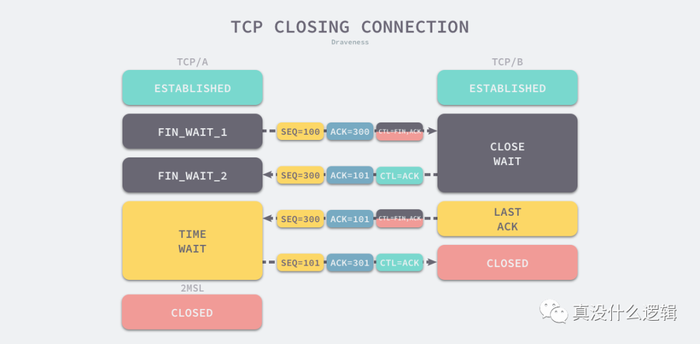
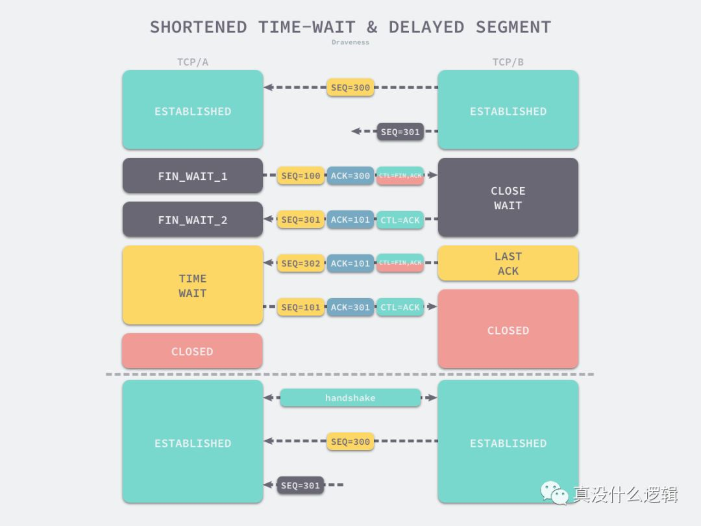
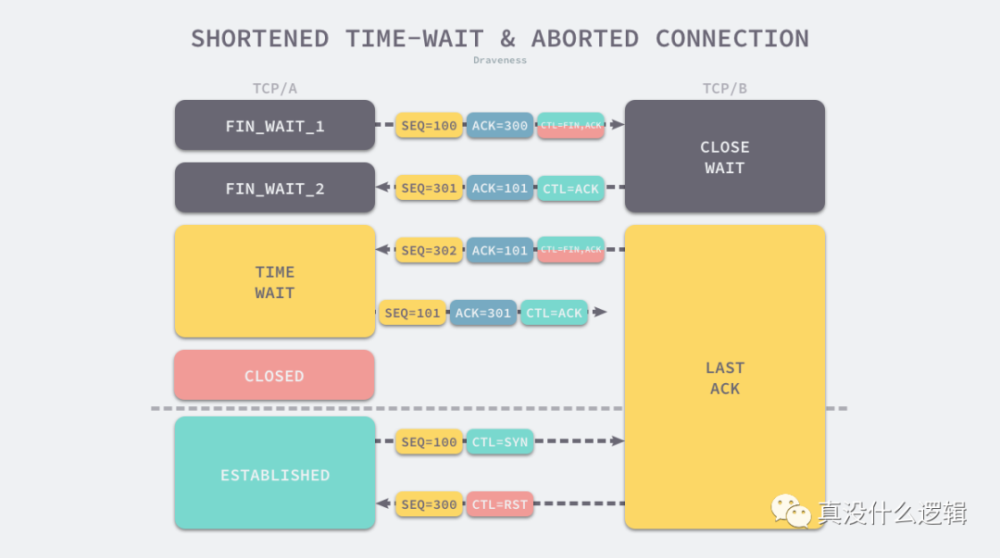

> 为什么需要 TIME_WAIT 状态？

主动发起关闭连接的一方，才会有 `TIME-WAIT` 状态。

需要 TIME-WAIT 状态，主要是两个原因：

- 防止具有相同「四元组」的「旧」数据包被收到；
- 保证「被动关闭连接」的一方能被正确的关闭，即保证最后的 ACK 能让被动关闭方接收，从而帮助其正常关闭；

*原因一：防止旧连接的数据包*

假设 TIME-WAIT 没有等待时间或时间过短，被延迟的数据包抵达后会发生什么呢？

接收到历史数据的异常

- 如上图黄色框框服务端在关闭连接之前发送的 `SEQ = 301` 报文，被网络延迟了。
- 这时有相同端口的 TCP 连接被复用后，被延迟的 `SEQ = 301` 抵达了客户端，那么客户端是有可能正常接收这个过期的报文，这就会产生数据错乱等严重的问题。

所以，TCP 就设计出了这么一个机制，经过 `2MSL` 这个时间，**足以让两个方向上的数据包都被丢弃，使得原来连接的数据包在网络中都自然消失，再出现的数据包一定都是新建立连接所产生的。**

*原因二：保证连接正确关闭*

在 RFC 793 指出 TIME-WAIT 另一个重要的作用是：

*TIME-WAIT - represents waiting for enough time to pass to be sure the remote TCP received the acknowledgment of its connection termination request.*

也就是说，TIME-WAIT 作用是**等待足够的时间以确保最后的 ACK 能让被动关闭方接收，从而帮助其正常关闭。**

假设 TIME-WAIT 没有等待时间或时间过短，断开连接会造成什么问题呢？

没有确保正常断开的异常

- 如上图红色框框客户端四次挥手的最后一个 `ACK` 报文如果在网络中被丢失了，此时如果客户端 `TIME-WAIT` 过短或没有，则就直接进入了 `CLOSE` 状态了，那么服务端则会一直处在 `LASE-ACK` 状态。
- 当客户端发起建立连接的 `SYN` 请求报文后，服务端会发送 `RST` 报文给客户端，连接建立的过程就会被终止。

如果 TIME-WAIT 等待足够长的情况就会遇到两种情况：

- 服务端正常收到四次挥手的最后一个 `ACK` 报文，则服务端正常关闭连接。
- 服务端没有收到四次挥手的最后一个 `ACK` 报文时，则会重发 `FIN` 关闭连接报文并等待新的 `ACK` 报文。

所以客户端在 `TIME-WAIT` 状态等待 `2MSL` 时间后，就可以**保证双方的连接都可以正常的关闭。**


------

## 为什么 TCP 协议有 TIME_WAIT 状态

[2020-12-14](https://www.moregeek.xyz/i/875200837190) category: [其他](https://www.moregeek.xyz/category/其他) tag: [tcp 协议](https://www.moregeek.xyz/tag/tcp+协议) category: [网络/安全](https://www.moregeek.xyz/category/网络%2F安全)


今天要分析的问题是为什么 TCP 协议需要 `TIME_WAIT` 状态以及该状态的作用究竟是什么。

TCP 协议中包含 11 种不同的状态，TCP 连接会根据发送或者接收到的消息转换状态，如下图所示的状态机展示了所有可能的转换，其中不仅包含了正常情况下的状态转换过程，还包含了异常状态下的状态转换：


**图 1 - TCP 协议状态**

使用 TCP 协议通信的双方会在关闭连接时触发 `TIME_WAIT` 状态，关闭连接的操作其实是告诉通信的另一方**自己没有需要发送的数据**，但是它仍然**保持了接收对方数据的能力**，一个常见的关闭连接过程如下[^1]：

1. 当客户端没有待发送的数据时，它会向服务端发送 `FIN` 消息，发送消息后会进入 `FIN_WAIT_1` 状态；
2. 服务端接收到客户端的 `FIN` 消息后，会进入 `CLOSE_WAIT` 状态并向客户端发送 `ACK` 消息，客户端接收到 `ACK` 消息时会进入 `FIN_WAIT_2` 状态；
3. 当服务端没有待发送的数据时，服务端会向客户端发送 `FIN` 消息；
4. 客户端接收到 `FIN` 消息后，会进入 `TIME_WAIT` 状态并向服务端发送 `ACK` 消息，服务端收到后会进入 `CLOSED` 状态；
5. 客户端等待**两个最大数据段生命周期**（Maximum segment lifetime，MSL）[^2]的时间后也会进入 `CLOSED` 状态；

**图 2 - TCP 关闭连接的过程**

从上述过程中，我们会发现 `TIME_WAIT` 仅在主动断开连接的一方出现，被动断开连接的一方会直接进入 `CLOSED` 状态，进入 `TIME_WAIT` 的客户端需要等待 2 MSL 才可以真正关闭连接。TCP 协议需要 `TIME_WAIT` 状态的原因和客户端需要等待两个 MSL 不能直接进入 `CLOSED` 状态的原因是一样的[^3]：

- 防止延迟的数据段被其他使用相同源地址、源端口、目的地址以及目的端口的 TCP 连接收到；
- 保证 TCP 连接的远程被正确关闭，即等待被动关闭连接的一方收到 `FIN` 对应的 `ACK` 消息；

上述两个原因都相对比较简单，我们来展开介绍这两个原因背后可能存在的一些问题。

## 阻止延迟数据段

每一个 TCP 数据段都包含唯一的序列号，这个序列号能够保证 TCP 协议的可靠性和顺序性，在不考虑序列号溢出归零的情况下，序列号唯一是 TCP 协议中的重要约定，一旦违反了这条规则，就可能造成令人困惑的现象和结果。为了保证新 TCP 连接的数据段不会与还在网络中传输的历史连接的数据段重复，TCP 连接在分配新的序列号之前需要**至少静默数据段在网络中能够存活的最长时间，即 MSL**[^4]：

> To be sure that a TCP does not create a segment that carries a sequence number which may be duplicated by an old segment remaining in the network, the TCP must keep quiet for a maximum segment lifetime (MSL) before assigning any sequence numbers upon starting up or recovering from a crash in which memory of sequence numbers in use was lost.

**图 3 - TIME-WAIT 较短导致的数据段延迟接收**

在如上图所示的 TCP 连接中，服务端发送的 `SEQ = 301` 消息由于网络延迟直到 TCP 连接关闭后也没有收到；当使用相同端口号的 TCP 连接被重用后，`SEQ = 301` 的消息才发送到客户端，然而这个过期的消息却可能被客户端正常接收，这就会带来比较严重的问题，所以我们**在调整 `TIME_WAIT` 策略时要非常谨慎**，必须清楚自己在干什么。

RFC 793 中虽然指出了 TCP 连接需要在 `TIME_WAIT` 中等待 2 倍的 MSL，但是并没有解释清楚这里的两倍是从何而来，比较合理的解释是 — 网络中可能存在来自发起方的数据段，当这些发起方的数据段被服务端处理后又会向客户端发送响应，所以一来一回需要等待 2 倍的时间[^5]。

RFC 793 文档将 MSL 的时间设置为 120 秒，即两分钟，然而这并不是一个经过严密推断的数值，而是工程上的选择，如果根据服务历史上的经验要求我们改变操作系统的设置，也是没有任何问题的；实际上，较早版本的 Linux 就开始将 `TIME_WAIT` 的等待时间 `TCP_TIMEWAIT_LEN` 设置成 60 秒，以便更快地复用 TCP 连接资源：

```
#define TCP_TIMEWAIT_LEN (60*HZ) /* how long to wait to destroy TIME-WAIT
				  * state, about 60 seconds	*/
```

在 Linux 上，客户端的可以使用端口号 32,768 ~ 61,000，总共 28,232 个端口号与远程服务器建立连接，应用程序可以在将近 3 万的端口号中任意选择一个：

```
$ sysctl net.ipv4.ip_local_port_range
net.ipv4.ip_local_port_range = 3276861000
```

但是如果主机在过去一分钟时间内创建的 TCP 连接数超过 28,232，那么再创建新的 TCP 连接就会发生错误，也就是说如果我们不调整主机的配置，那么每秒能够建立的最大 TCP 连接数为 ~470[^6]。

## 保证连接关闭

从 RFC 793 对 `TIME_WAIT` 状态的定义中，我们可以发现该状态的另一个重要作用，等待足够长的时间以确定远程的 TCP 连接接收到了其发出的终止连接消息 `FIN` 对应的 `ACK`：

> TIME-WAIT - represents waiting for enough time to pass to be sure the remote TCP received the acknowledgment of its connection termination request.

如果客户端等待的时间不够长，当服务端还没有收到 `ACK` 消息时，客户端就重新与服务端建立 TCP 连接就会造成以下问题 — 服务端因为没有收到 `ACK` 消息，所以仍然认为当前连接是合法的，客户端重新发送 `SYN` 消息请求握手时会收到服务端的 `RST` 消息，连接建立的过程就会被终止。

**图 4 - TIME-WAIT 较短导致的握手终止**

在默认情况下，如果客户端等待足够长的时间就会遇到以下两种情况：

1. 服务端正常收到了 `ACK` 消息并关闭当前 TCP 连接；
2. 服务端没有收到 `ACK` 消息，重新发送 `FIN` 关闭连接并等待新的 `ACK` 消息；

只要客户端等待 2 MSL 的时间，客户端和服务端之间的连接就会正常关闭，新创建的 TCP 连接收到影响的概率也微乎其微，保证了数据传输的可靠性。

## 总结

在某些场景下，60 秒的等待销毁时间确实是难以接受的，例如：高并发的压力测试。当我们通过并发请求测试远程服务的吞吐量和延迟时，本地就可能产生大量处于 `TIME_WAIT` 状态的 TCP 连接，在 macOS 上可以使用如下所示的命令查看活跃的连接：

```
$ netstat -tan
Active Internet connections (including servers)
Proto Recv-Q Send-Q  Local Address          Foreign Address        (state)
tcp4       00192.168.50.109.5128447.95.49.174.443       TIME_WAIT
tcp4       00192.168.50.109.5127547.95.49.174.443       TIME_WAIT
...
tcp4       00192.168.50.109.51273203.107.32.116.443     TIME_WAIT
tcp4       00192.168.50.109.51293203.107.32.116.443     TIME_WAIT
tcp4       00192.168.50.109.51297203.107.32.116.443     TIME_WAIT
...
```

当我们在主机上通过几千个并发来测试服务器的压力时，这些用于压力测试的连接会迅速消耗主机上的 TCP 连接资源，几乎所有的 TCP 都会处于 `TIME_WAIT` 状态等待销毁。如果我们真遇到不得不处理**单机上的** `TIME_WAIT` 状态的时候，那么可以通过以下几种方法处理：

1. 使用 `SO_LINGER` 选项并设置暂存时间 `l_linger` 为 0，在这时如果我们关闭 TCP 连接，内核就会直接丢弃缓冲区中的全部数据并向服务端发送 `RST` 消息直接终止当前的连接[^7]；
2. 使用 `net.ipv4.tcp_tw_reuse` 选项，通过 TCP 的时间戳选项允许内核重用处于 `TIME_WAIT` 状态的 TCP 连接[^8]；
3. 修改 `net.ipv4.ip_local_port_range` 选项中的可用端口范围，增加可同时存在的 TCP 连接数上限；

> 需要注意的是，另一个常见的 TCP 配置项 `net.ipv4.tcp_tw_recycle` 已经在 Linux 4.12 中移除[^9]，所以我们不能再通过该配置解决 `TIME_WAIT` 设计带来的问题。

TCP 的 `TIME_WAIT` 状态有着非常重要的作用，它是保证 TCP 协议可靠性不可缺失的设计，如果能通过加机器解决的话就尽量加机器，如果不能解决的话，我们就需要理解其背后的设计原理并尽可能避免修改默认的配置，就像 Linux 手册中说的一样，在修改这些配置时应该咨询技术专家的建议；在这里，我们再重新回顾一下 TCP 协议中 `TIME_WAIT` 状态存在的原因，如果客户端等待的时间不够长，那么使用相同端口号重新与远程建立连接时会造成以下问题：

- 因为数据段的网络传输时间不确定，所以可能会收到上一次 TCP 连接中未被收到的数据段；
- 因为客户端发出的 `ACK` 可能还没有被服务端接收，服务端可能还处于 `LAST_ACK` 状态，所以它会回复 `RST` 消息终止新连接的建立；

`TIME_WAIT` 状态是 TCP 与不确定的网络延迟斗争的结果，而**不确定性是 TCP 协议在保证可靠这条路的最大阻碍**。到最后，我们还是来看一些比较开放的相关问题，有兴趣的读者可以仔细思考一下下面的问题：

- `net.ipv4.tcp_tw_reuse` 配置如何通过时间戳保证重用 TCP 连接的相对安全？
- `net.ipv4.tcp_tw_recycle` 配置为什么被 Linux 从协议栈中移除？