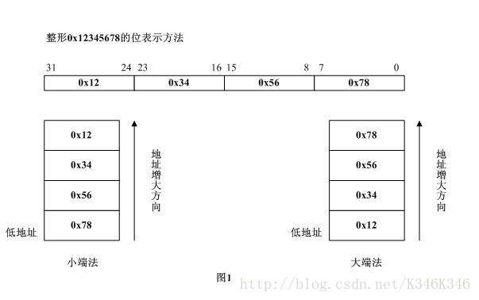

# 1.网络字节序与主机字节序

在Linux网络编程中，经常碰到网络字节序与主机字节序的相互转换。说到网络字节序与主机字节序需要清晰了解以下几个概念。

字节序，顾名思义，指字节在内存中存储的顺序。比如一个int32_t类型的数值占用4个字节，这4个字节在内存中的排列顺序就是字节序。字节序有两种：
（1）小端字节序（Little endinan），数值低位存储在内存的低地址，高位存储在内存的高地址；
（2）大端字节序（Big endian），数值高位存储在内存的低地址，低位存储在内存的高地址。

下面以32位位宽数值0x12345678为例，小端字节序与大端字节序具体的存储区别如下所示：



主机字节序，即CPU存储数据时采用的字节顺序。不同的CPU设计时采用的字节序是不同的，谈到字节序的问题，必然牵涉到两大CPU派系。那就是Motorola的PowerPC系列CPU和Intel的x86与x86_64（该指令集由AMD率先设计推出）系列CPU。PowerPC系列采用big endian方式存储数据，而x86与x86_64系列则采用little endian方式存储数据。平常大多数PC与服务器如果使用的是Intel与AMD CPU，一般都是little endian。

如何具体判断本机的主机字节序呢？参考如下代码：

```
//@ret：返回0小端字节序，返回1大端字节序
int dGetHostByteOrder()
{
	uint32_t a = 0x12345678;  
	uint8_t *p = (uint8_t *)(&a);  
	if(*p==0x78)
	{
		return 0
	}
	else
	{
		return 1;
	}
}
1234567891011121314
```

网络字节序，是TCP/IP中规定好的一种数据表示格式，它与具体的CPU类型、操作系统等无关，从而可以保证数据在不同主机之间传输时能够被正确解释。网络字节顺序采用big endian排序方式。

# 2.网络字节序与主机字节序的相互转换

## 2.1常用系统调用

Linux socket网络编程中，经常会使用下面四个C标准库函数进行字节序间的转换。

```
#include <arpa/inet.h>

uint32_t htonl(uint32_t hostlong);		//把uint32_t类型从主机序转换到网络序
uint16_t htons(uint16_t hostshort);		//把uint16_t类型从主机序转换到网络序
uint32_t ntohl(uint32_t netlong);		//把uint32_t类型从网络序转换到主机序
uint16_t ntohs(uint16_t netshort);		//把uint16_t类型从网络序转换到主机序
123456
```

## 2.2 64位数值的转换

现在如果需要对64位类型数据进行主机字节序与网络字节序的转换，没有现成系统API可用，可以通过下面两种方法进行转换：

\###2.2.1使用移位

```
//主机序转网络序
unsigned long long htonll(unsigned long long val)
{
	if(__BYTE_ORDER == __LITTLE_ENDIAN)  
    {
         return (((unsigned long long )htonl((int)((val << 32) >> 32))) << 32) | (unsigned int)htonl((int)(val >> 32));  
    }  
    else if (__BYTE_ORDER == __BIG_ENDIAN)  
    {  
         return val;  
    }  
}  

//网络序转主机序
unsigned long long ntohll(unsigned long long val)  
{  
    if (__BYTE_ORDER == __LITTLE_ENDIAN)
    {
        return (((unsigned long long )ntohl((int)((val << 32) >> 32))) << 32) | (unsigned int)ntohl((int)(val >> 32));  
    }  
    else if (__BYTE_ORDER == __BIG_ENDIAN)  
    {  
        return val;  
    }
 }
```