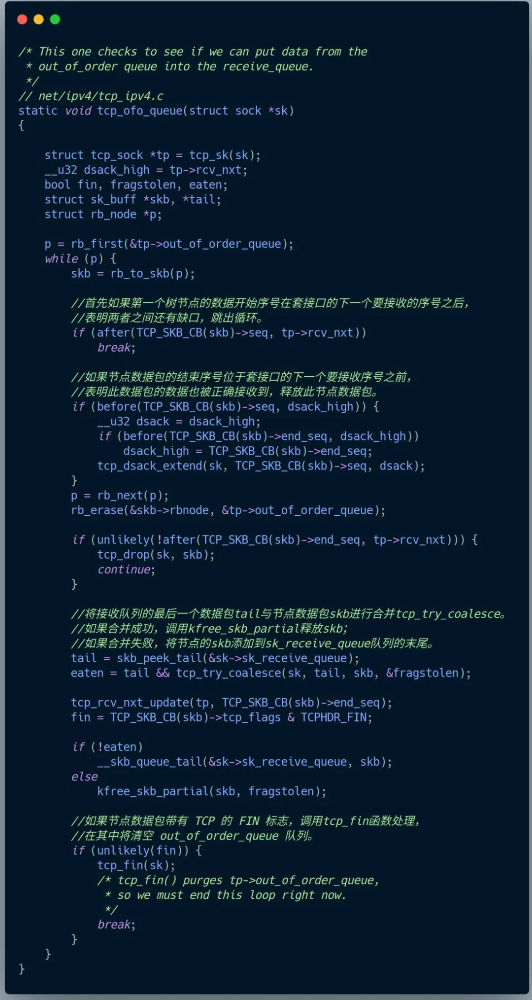
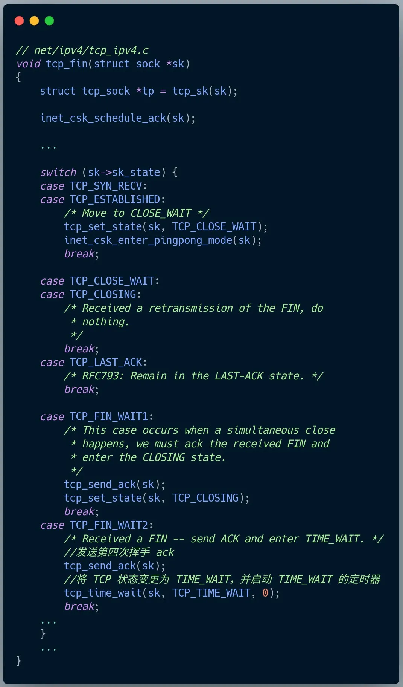

上周发了一篇读者面试鹅厂遇到的网络问题：[又被鹅厂搞懵了！](http://mp.weixin.qq.com/s?__biz=MzUxODAzNDg4NQ==&mid=2247497555&idx=1&sn=bb7e224c45a23729fb928e40b009f0b7&chksm=f98db3f9cefa3aeff072c6f301d227202458cd4cffa6c294bf4534126c6a781021f1ef70829a&scene=21#wechat_redirect)

当时我的关注点放在了「TIME_WAIT 状态下，接收到了数据包会怎么处理？」

然后那篇文章留言区有人说这题的重点并不是想问「在 TIME_WAIT 状态下对数据包的如何处理」。

而是 「**在 FIN_WAIT_2 状态下如何处理乱序的 FIN 报文**」。

随后，我自己去看了 Linux 的源码，验证了这位读者的思路是没问题的。

果然一个人思考容易形成思维定势，和别人交流可能才能发现自己没有注意到的点。

这道鹅厂的网络题可能是提问的读者表述有问题，因为如果 FIN 报文比数据包先抵达客户端，此时 FIN 报文其实是一个乱序的报文，此时客户端的 TCP 连接并不会从 FIN_WAIT_2 状态转换到 TIME_WAIT 状态。

因此，我们要关注到点是看「**在 FIN_WAIT_2 状态下，是如何处理收到的乱序到 FIN 报文，然后 TCP 连接又是什么时候才进入到 TIME_WAIT 状态?**」。

我这里先直接说结论：

**在 FIN_WAIT_2 状态时，如果收到乱序的 FIN 报文，那么就被会加入到「乱序队列」，并不会进入到 TIME_WAIT 状态。**

**等再次收到前面被网络延迟的数据包时，会判断乱序队列有没有数据，然后会检测乱序队列中是否有可用的数据，如果能在乱序队列中找到与当前报文的序列号保持的顺序的报文，就会看该报文是否有 FIN 标志，如果发现有 FIN 标志，这时才会进入 TIME_WAIT 状态**。

我也画了一张图，大家可以结合着图来理解。

### TCP 源码分析 

接下来，我带大家看看源码，听到要源码分析，可能有的同学就怂了。

其实要分析我们今天这个问题，只要懂 if else 就行了，我也会用中文来表述代码的逻辑，所以单纯看我的文字也是可以的。

这次我们重点分析的是，**在 FIN_WAIT_2 状态下，收到 FIN 报文是如何处理的**。

在 Linux 内核里，当 IP 层处理完消息后，会通过回调 `tcp_v4_rcv` 函数将消息转给 TCP 层，所以这个函数就是 TCP 层收到消息的入口。

处于 FIN_WAIT_2 状态下的客户端，在收到服务端的报文后，最终会调用 tcp_v4_do_rcv 函数。

接下来，tcp_v4_do_rcv 方法会调用 tcp_rcv_state_process，在这里会根据 TCP 状态做对应的处理，这里我们只关注 FIN_WAIT_2 状态。

在上面这个代码里，可以看到如果 shutdown 关闭了读方向，那么在收到对方发来的数据包，则会回复 RST 报文。

而我们这次的题目里， shutdown 只关闭了写方向，所以会继续往下调用 tcp_data_queue 函数（因为 case TCP_FIN_WAIT2 代码块里并没有 break 语句，所以会走到该函数）。

在上面的 tcp_data_queue 函数里，如果收到的报文的序列号是我们预期的，也就是有序的话：

- 会判断该报文有没有 FIN 标志，如果有的话就会调用 tcp_fin 函数，这个函数负责将 FIN_WAIT_2 状态转换为 TIME_WAIT。
- 接着还会看乱序队列有没有数据，如果有的话会调用 tcp_ofo_queue 函数，这个函数负责检查乱序队列中是否有数据包可用，即能不能在乱序队列找到与当前数据包保持序列号连续的数据包。

而当收到的报文的序列号不是我们预期的，也就是乱序的话，则调用 tcp_data_queue_ofo 函数，将报文加入到乱序队列，这个队列的数据结构是红黑树。

我们的题目里，**客户端收到的 FIN 报文实际上是一个乱序的报文，因此此时并不会调用 tcp_fin 函数进行状态转换，而是将报文通过 tcp_data_queue_ofo 函数加入到乱序队列**。

然后当客户端收到被网络延迟的数据包后，此时因为该数据包的序列号是期望的，然后又因为上一次收到的乱序 FIN 报文被加入到了乱序队列，表明乱序队列是有数据的，于是就会调用 tcp_ofo_queue 函数。

我们来看看 tcp_ofo_queue 函数。

在上面的 tcp_ofo_queue 函数里，**在乱序队列中找到能与当前报文的序列号保持的顺序的报文后，会看该报文是否有 FIN 标志，如果有的话，就会调用 tcp_fin() 函数**。

最后，我们来看看 tcp_fin 函数的处理。

可以看到，如果当前的 TCP 状态为 TCP_FIN_WAIT2，就会发送第四次挥手 ack，然后调用 tcp_time_wait 函数，这个函数里会将 TCP 状态变更为 TIME_WAIT，并启动 TIME_WAIT 的定时器。