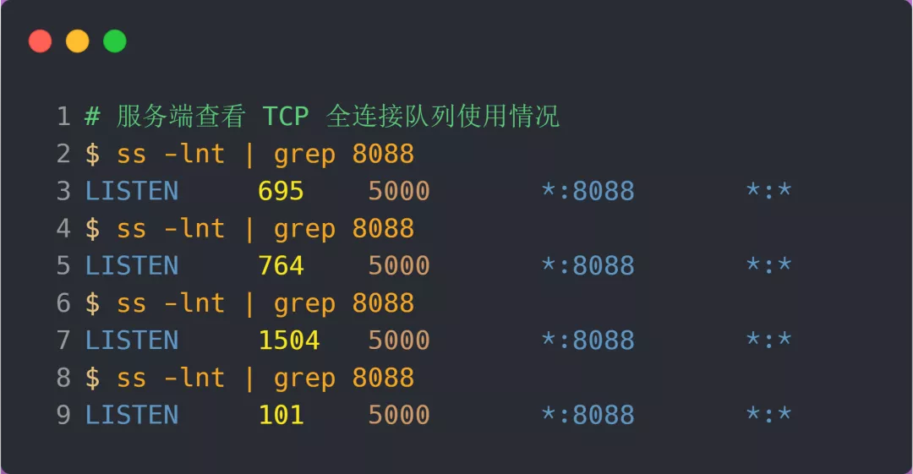

### 实战 - TCP 全连接队列溢出

> 如何知道应用程序的 TCP 全连接队列大小？

在服务端可以使用 `ss` 命令，来查看 TCP 全连接队列的情况：

但需要注意的是 `ss` 命令获取的 `Recv-Q/Send-Q` 在「LISTEN 状态」和「非 LISTEN 状态」所表达的含义是不同的。从下面的内核代码可以看出区别：

在「LISTEN 状态」时，`Recv-Q/Send-Q` 表示的含义如下：

- Recv-Q：当前全连接队列的大小，也就是当前已完成三次握手并等待服务端 `accept()` 的 TCP 连接个数；
- Send-Q：当前全连接最大队列长度，上面的输出结果说明监听 8088 端口的 TCP 服务进程，最大全连接长度为 128；

在「非 LISTEN 状态」时，`Recv-Q/Send-Q` 表示的含义如下：

- Recv-Q：已收到但未被应用进程读取的字节数；
- Send-Q：已发送但未收到确认的字节数；

> 如何模拟 TCP 全连接队列溢出的场景？

测试环境

实验环境：

- 客户端和服务端都是 CentOs 6.5 ，Linux 内核版本 2.6.32
- 服务端 IP 192.168.3.200，客户端 IP 192.168.3.100
- 服务端是 Nginx 服务，端口为 8088

这里先介绍下 `wrk` 工具，它是一款简单的 HTTP 压测工具，它能够在单机多核 CPU 的条件下，使用系统自带的高性能 I/O 机制，通过多线程和事件模式，对目标机器产生大量的负载。

本次模拟实验就使用 `wrk` 工具来压力测试服务端，发起大量的请求，一起看看服务端 TCP 全连接队列满了会发生什么？有什么观察指标？

客户端执行 `wrk` 命令对服务端发起压力测试，并发 3 万个连接：

在服务端可以使用 `ss` 命令，来查看当前 TCP 全连接队列的情况：

其间共执行了两次 ss 命令，从上面的输出结果，可以发现当前 TCP 全连接队列上升到了 129 大小，超过了最大 TCP 全连接队列。

**当超过了 TCP 最大全连接队列，服务端则会丢掉后续进来的 TCP 连接**，丢掉的 TCP 连接的个数会被统计起来，我们可以使用 netstat -s 命令来查看：

上面看到的 41150 times ，表示全连接队列溢出的次数，注意这个是累计值。可以隔几秒钟执行下，如果这个数字一直在增加的话肯定全连接队列偶尔满了。

从上面的模拟结果，可以得知，**当服务端并发处理大量请求时，如果 TCP 全连接队列过小，就容易溢出。发生 TCP 全连接队溢出的时候，后续的请求就会被丢弃，这样就会出现服务端请求数量上不去的现象。**

全连接队列溢出

> 全连接队列满了，就只会丢弃连接吗？

实际上，丢弃连接只是 Linux 的默认行为，我们还可以选择向客户端发送 RST 复位报文，告诉客户端连接已经建立失败。

tcp_abort_on_overflow 共有两个值分别是 0 和 1，其分别表示：

- 0 ：表示如果全连接队列满了，那么 server 扔掉 client  发过来的 ack ；
- 1 ：表示如果全连接队列满了，那么 server 发送一个 `reset` 包给 client，表示废掉这个握手过程和这个连接；

如果要想知道客户端连接不上服务端，是不是服务端 TCP 全连接队列满的原因，那么可以把 tcp_abort_on_overflow 设置为 1，这时如果在客户端异常中可以看到很多 `connection reset by peer` 的错误，那么就可以证明是由于服务端 TCP 全连接队列溢出的问题。

通常情况下，应当把 tcp_abort_on_overflow 设置为 0，因为这样更有利于应对突发流量。

举个例子，当 TCP 全连接队列满导致服务器丢掉了 ACK，与此同时，客户端的连接状态却是 ESTABLISHED，进程就在建立好的连接上发送请求。只要服务器没有为请求回复 ACK，请求就会被多次**重发**。如果服务器上的进程只是**短暂的繁忙造成 accept 队列满，那么当 TCP 全连接队列有空位时，再次接收到的请求报文由于含有 ACK，仍然会触发服务器端成功建立连接。**

所以，tcp_abort_on_overflow 设为 0 可以提高连接建立的成功率，只有你非常肯定 TCP 全连接队列会长期溢出时，才能设置为 1 以尽快通知客户端。

> 如何增大 TCP 全连接队列呢？

是的，当发现 TCP 全连接队列发生溢出的时候，我们就需要增大该队列的大小，以便可以应对客户端大量的请求。

**TCP 全连接队列足最大值取决于 somaxconn 和 backlog 之间的最小值，也就是 min(somaxconn, backlog)**。从下面的 Linux 内核代码可以得知：

- `somaxconn` 是 Linux 内核的参数，默认值是 128，可以通过 `/proc/sys/net/core/somaxconn` 来设置其值；
- `backlog` 是 `listen(int sockfd, int backlog)` 函数中的 backlog 大小，Nginx 默认值是 511，可以通过修改配置文件设置其长度；

前面模拟测试中，我的测试环境：

- somaxconn 是默认值 128；
- Nginx 的 backlog 是默认值 511

所以测试环境的 TCP 全连接队列最大值为 min(128, 511)，也就是 `128`，可以执行 `ss` 命令查看：

现在我们重新压测，把 TCP 全连接队列**搞大**，把 `somaxconn` 设置成 5000：

接着把 Nginx 的 backlog 也同样设置成 5000：

最后要重启 Nginx 服务，因为只有重新调用 `listen()` 函数， TCP 全连接队列才会重新初始化。

重启完后 Nginx 服务后，服务端执行 ss 命令，查看 TCP 全连接队列大小：

从执行结果，可以发现 TCP 全连接最大值为 5000。

> 增大 TCP 全连接队列后，继续压测

客户端同样以 3 万个连接并发发送请求给服务端：

服务端执行 `ss` 命令，查看 TCP 全连接队列使用情况：

从上面的执行结果，可以发现全连接队列使用增长的很快，但是一直都没有超过最大值，所以就不会溢出，那么 `netstat -s` 就不会有 TCP 全连接队列溢出个数的显示：

说明 TCP 全连接队列最大值从 128 增大到 5000 后，服务端抗住了 3 万连接并发请求，也没有发生全连接队列溢出的现象了。

**如果持续不断地有连接因为 TCP 全连接队列溢出被丢弃，就应该调大 backlog 以及 somaxconn 参数。**