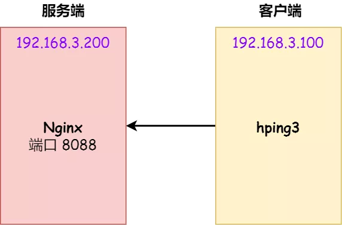
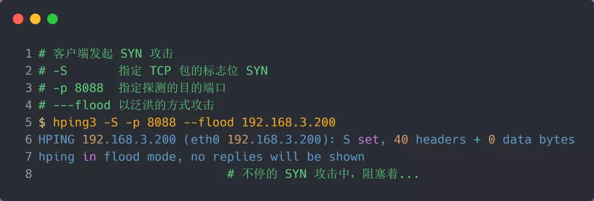
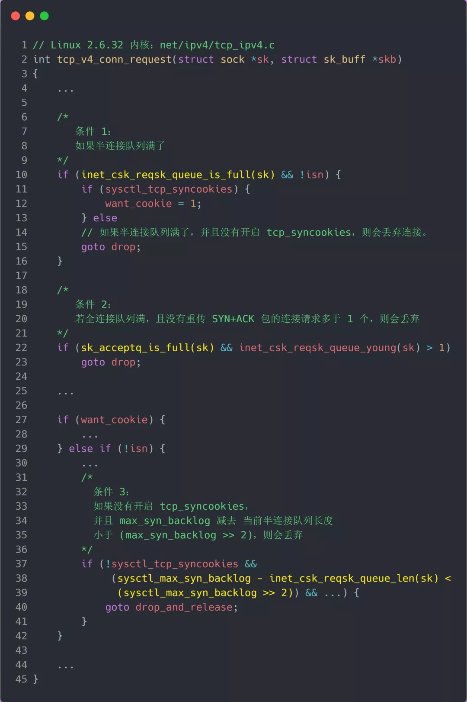
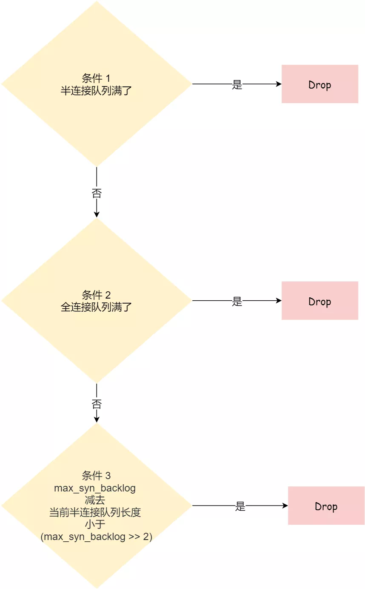
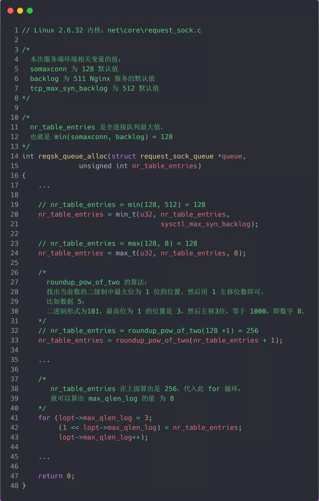
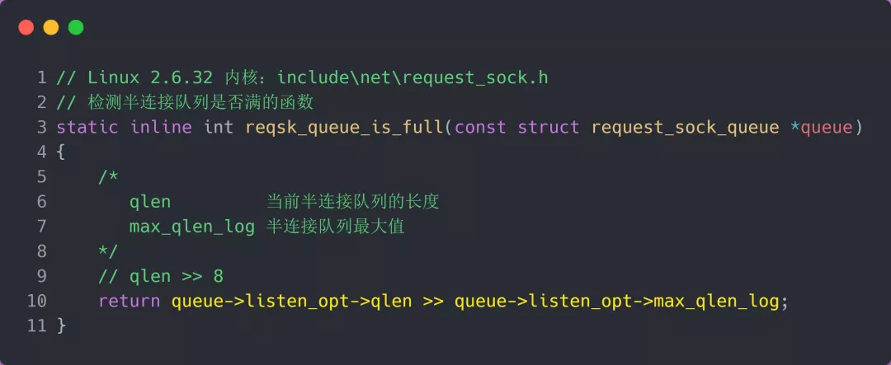
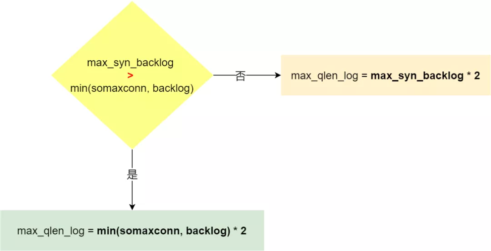
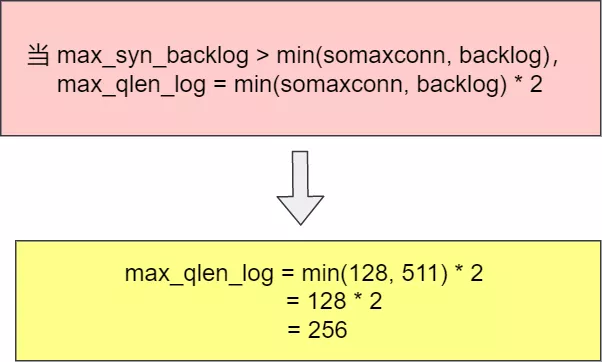
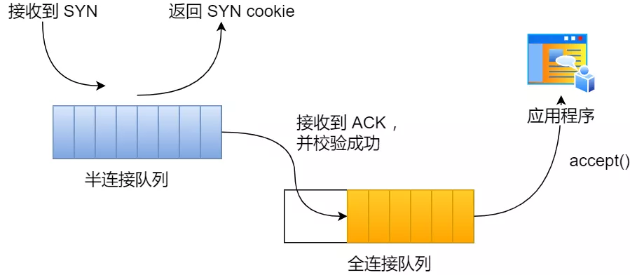

### 实战 - TCP 半连接队列溢出

> 如何查看 TCP 半连接队列长度？

很遗憾，TCP 半连接队列长度的长度，没有像全连接队列那样可以用 ss 命令查看。

但是我们可以抓住 TCP 半连接的特点，就是服务端处于 `SYN_RECV` 状态的 TCP 连接，就是在 TCP 半连接队列。

于是，我们可以使用如下命令计算当前 TCP 半连接队列长度：

> 如何模拟 TCP 半连接队列溢出场景？

模拟 TCP 半连接溢出场景不难，实际上就是对服务端一直发送 TCP SYN 包，但是不回第三次握手 ACK，这样就会使得服务端有大量的处于 `SYN_RECV` 状态的 TCP 连接。

这其实也就是所谓的 SYN 洪泛、SYN 攻击、DDos 攻击。

测试环境

实验环境：

- 客户端和服务端都是 CentOs 6.5 ，Linux 内核版本 2.6.32
- 服务端 IP 192.168.3.200，客户端 IP 192.168.3.100
- 服务端是 Nginx 服务，端口为 8088

注意：本次模拟实验是没有开启 tcp_syncookies，关于 tcp_syncookies 的作用，后续会说明。

本次实验使用 `hping3` 工具模拟 SYN 攻击：

当服务端受到 SYN 攻击后，连接服务端 ssh 就会断开了，无法再连上。只能在服务端主机上执行查看当前 TCP 半连接队列大小：

同时，还可以通过 netstat -s 观察半连接队列溢出的情况：

上面输出的数值是**累计值**，表示共有多少个 TCP 连接因为半连接队列溢出而被丢弃。**隔几秒执行几次，如果有上升的趋势，说明当前存在半连接队列溢出的现象**。

> 大部分人都说 tcp_max_syn_backlog 是指定半连接队列的大小，是真的吗？

很遗憾，半连接队列的大小并不单单只跟 `tcp_max_syn_backlog` 有关系。

上面模拟 SYN 攻击场景时，服务端的 tcp_max_syn_backlog 的默认值如下：

但是在测试的时候发现，服务端最多只有 256 个半连接队列，而不是 512，所以**半连接队列的最大长度不一定由 tcp_max_syn_backlog 值决定的**。

> 接下来，走进 Linux 内核的源码，来分析 TCP 半连接队列的最大值是如何决定的。

TCP 第一次握手（收到 SYN 包）的 Linux 内核代码如下，其中缩减了大量的代码，只需要重点关注 TCP 半连接队列溢出的处理逻辑：

从源码中，我可以得出共有三个条件因队列长度的关系而被丢弃的：

1. **如果半连接队列满了，并且没有开启 tcp_syncookies，则会丢弃；**
2. **若全连接队列满了，且没有重传 SYN+ACK 包的连接请求多于 1 个，则会丢弃；**
3. **如果没有开启 tcp_syncookies，并且 max_syn_backlog 减去 当前半连接队列长度小于 (max_syn_backlog >> 2)，则会丢弃；**

关于 tcp_syncookies 的设置，后面在详细说明，可以先给大家说一下，开启 tcp_syncookies 是缓解 SYN 攻击其中一个手段。

接下来，我们继续跟一下检测半连接队列是否满的函数 inet_csk_reqsk_queue_is_full 和 检测全连接队列是否满的函数 sk_acceptq_is_full ：

从上面源码，可以得知：

- **全**连接队列的最大值是 `sk_max_ack_backlog` 变量，sk_max_ack_backlog 实际上是在 listen() 源码里指定的，也就是 **min(somaxconn, backlog)**；
- **半**连接队列的最大值是 `max_qlen_log` 变量，max_qlen_log 是在哪指定的呢？现在暂时还不知道，我们继续跟进；

我们继续跟进代码，看一下是哪里初始化了半连接队列的最大值 max_qlen_log：

从上面的代码中，我们可以算出 max_qlen_log 是 8，于是代入到 检测半连接队列是否满的函数 reqsk_queue_is_full ：

也就是 `qlen >> 8` 什么时候为 1 就代表半连接队列满了。这计算这不难，很明显是当 qlen 为 256 时，`256 >> 8 = 1`。

至此，总算知道为什么上面模拟测试 SYN 攻击的时候，服务端处于 `SYN_RECV` 连接最大只有 256 个。

可见，**半连接队列最大值不是单单由 max_syn_backlog 决定，还跟 somaxconn 和 backlog 有关系。**

在 Linux 2.6.32 内核版本，它们之间的关系，总体可以概况为：

\1. 当 max_syn_backlog > min(somaxconn, backlog) 时， 半连接队列最大值 max_qlen_log = min(somaxconn, backlog) * 2;

\2. 当 max_syn_backlog < min(somaxconn, backlog) 时， 半连接队列最大值 max_qlen_log = max_syn_backlog * 2;

> 半连接队列最大值 max_qlen_log 就表示服务端处于 SYN_REVC 状态的最大个数吗？

依然很遗憾，并不是。

max_qlen_log 是**理论**半连接队列最大值，并不一定代表服务端处于 SYN_REVC 状态的最大个数。

在前面我们在分析 TCP 第一次握手（收到 SYN 包）时会被丢弃的三种条件：

1. 如果半连接队列满了，并且没有开启 tcp_syncookies，则会丢弃；
2. 若全连接队列满了，且没有重传 SYN+ACK 包的连接请求多于 1 个，则会丢弃；
3. **如果没有开启 tcp_syncookies，并且 max_syn_backlog 减去 当前半连接队列长度小于 (max_syn_backlog >> 2)，则会丢弃；**

假设条件 1 当前半连接队列的长度 「没有超过」理论的半连接队列最大值  max_qlen_log，那么如果条件 3 成立，则依然会丢弃 SYN 包，也就会使得服务端处于 SYN_REVC 状态的最大个数不会是理论值 max_qlen_log。

似乎很难理解，我们继续接着做实验，实验见真知。

服务端环境如下：

配置完后，服务端要重启 Nginx，因为全连接队列最大和半连接队列最大值是在 listen() 函数初始化。

根据前面的源码分析，我们可以计算出半连接队列 max_qlen_log 的最大值为 256：

客户端执行 hping3 发起 SYN 攻击：

服务端执行如下命令，查看处于 SYN_RECV 状态的最大个数：

可以发现，服务端处于 SYN_RECV 状态的最大个数并不是 max_qlen_log 变量的值。

这就是前面所说的原因：**如果当前半连接队列的长度 「没有超过」理论半连接队列最大值  max_qlen_log，那么如果条件 3 成立，则依然会丢弃 SYN 包，也就会使得服务端处于 SYN_REVC 状态的最大个数不会是理论值 max_qlen_log。**

我们来分析一波条件 3 :

从上面的分析，可以得知如果触发「当前半连接队列长度 > 192」条件，TCP 第一次握手的 SYN 包是会被丢弃的。

在前面我们测试的结果，服务端处于 SYN_RECV 状态的最大个数是 193，正好是触发了条件 3，所以处于 SYN_RECV 状态的个数还没到「理论半连接队列最大值 256」，就已经把 SYN 包丢弃了。

所以，服务端处于 SYN_RECV 状态的最大个数分为如下两种情况：

\1. 如果「当前半连接队列」**没超过**「理论半连接队列最大值」，但是**超过** max_syn_backlog - (max_syn_backlog >> 2)，那么处于 SYN_RECV 状态的最大个数就是 max_syn_backlog - (max_syn_backlog >> 2)；

\2. 如果「当前半连接队列」**超过**「理论半连接队列最大值」，那么处于 SYN_RECV 状态的最大个数就是「理论半连接队列最大值」；

> 每个 Linux 内核版本「理论」半连接最大值计算方式会不同。

在上面我们是针对 Linux 2.6.32 版本分析的「理论」半连接最大值的算法，可能每个版本有些不同。

比如在 Linux 5.0.0 的时候，「理论」半连接最大值就是全连接队列最大值，但依然还是有队列溢出的三个条件：

> 如果 SYN 半连接队列已满，只能丢弃连接吗？

并不是这样，**开启 syncookies 功能就可以在不使用 SYN 半连接队列的情况下成功建立连接**，在前面我们源码分析也可以看到这点，当开启了  syncookies 功能就不会丢弃连接。

syncookies 是这么做的：服务器根据当前状态计算出一个值，放在己方发出的 SYN+ACK 报文中发出，当客户端返回 ACK 报文时，取出该值验证，如果合法，就认为连接建立成功，如下图所示。

开启 syncookies 功能

syncookies 参数主要有以下三个值：

- 0 值，表示关闭该功能；
- 1 值，表示仅当 SYN 半连接队列放不下时，再启用它；
- 2 值，表示无条件开启功能；

那么在应对 SYN 攻击时，只需要设置为 1 即可：

> 如何防御 SYN 攻击？

这里给出几种防御 SYN 攻击的方法：

- 增大半连接队列；
- 开启 tcp_syncookies 功能
- 减少 SYN+ACK 重传次数

*方式一：增大半连接队列*

在前面源码和实验中，得知**要想增大半连接队列，我们得知不能只单纯增大 tcp_max_syn_backlog 的值，还需一同增大 somaxconn 和 backlog，也就是增大全连接队列**。否则，只单纯增大 tcp_max_syn_backlog 是无效的。

增大 tcp_max_syn_backlog 和 somaxconn 的方法是修改 Linux 内核参数：

增大 backlog 的方式，每个 Web 服务都不同，比如 Nginx 增大 backlog 的方法如下：

最后，改变了如上这些参数后，要重启 Nginx 服务，因为半连接队列和全连接队列都是在 listen() 初始化的。

*方式二：开启 tcp_syncookies 功能*

开启 tcp_syncookies 功能的方式也很简单，修改 Linux 内核参数：

*方式三：减少 SYN+ACK 重传次数*

当服务端受到 SYN 攻击时，就会有大量处于 SYN_REVC 状态的 TCP 连接，处于这个状态的 TCP 会重传 SYN+ACK ，当重传超过次数达到上限后，就会断开连接。

那么针对 SYN 攻击的场景，我们可以减少 SYN+ACK 的重传次数，以加快处于 SYN_REVC 状态的 TCP 连接断开。

