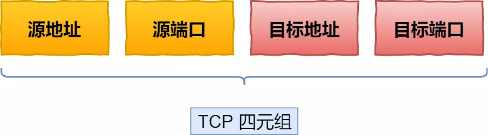

> 如何唯一确定一个 TCP 连接呢？

TCP 四元组可以唯一的确定一个连接，四元组包括如下：

- 源地址
- 源端口
- 目的地址
- 目的端口

TCP 四元组

源地址和目的地址的字段（32位）是在 IP 头部中，作用是通过 IP 协议发送报文给对方主机。

源端口和目的端口的字段（16位）是在 TCP 头部中，作用是告诉 TCP 协议应该把报文发给哪个进程。

> 有一个 IP 的服务器监听了一个端口，它的 TCP 的最大连接数是多少？

服务器通常固定在某个本地端口上监听，等待客户端的连接请求。

因此，客户端 IP 和 端口是可变的，其理论值计算公式如下:

对 IPv4，客户端的 IP 数最多为 `2` 的 `32` 次方，客户端的端口数最多为 `2` 的 `16` 次方，也就是服务端单机最大 TCP 连接数，约为 `2` 的 `48` 次方。

当然，服务端最大并发 TCP 连接数远不能达到理论上限。

- 首先主要是**文件描述符限制**，Socket 都是文件，所以首先要通过 `ulimit` 配置文件描述符的数目；
- 另一个是**内存限制**，每个 TCP 连接都要占用一定内存，操作系统是有限的。