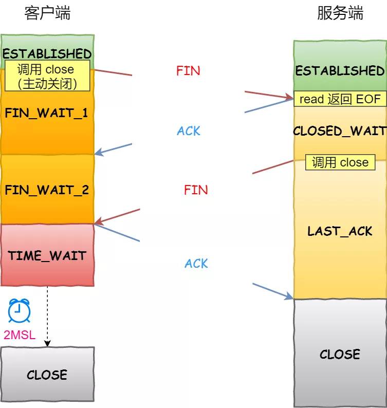
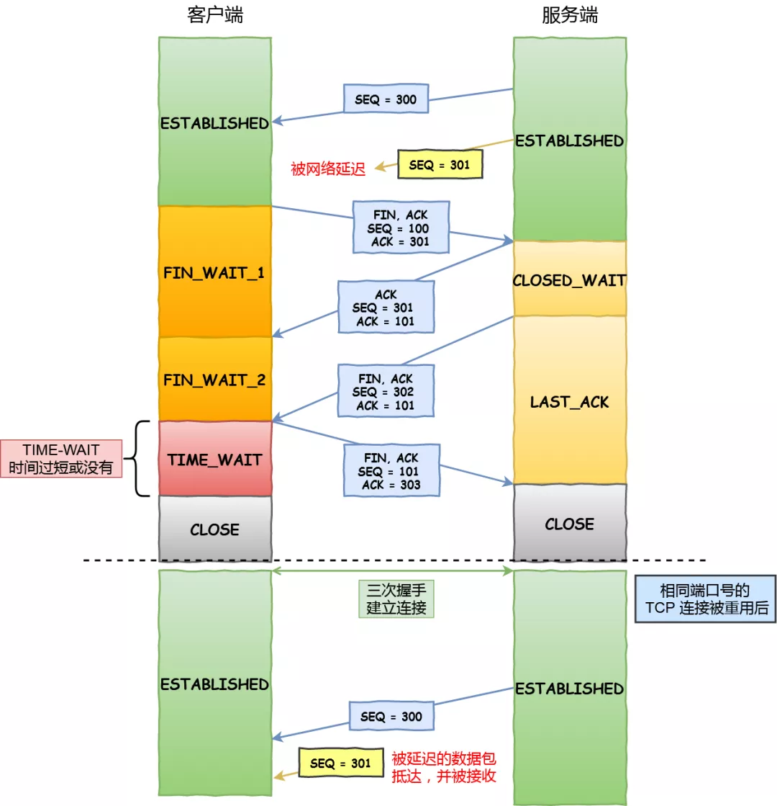
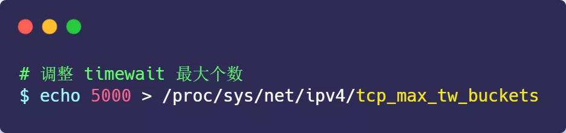
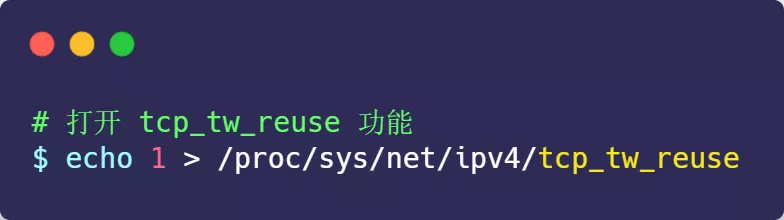
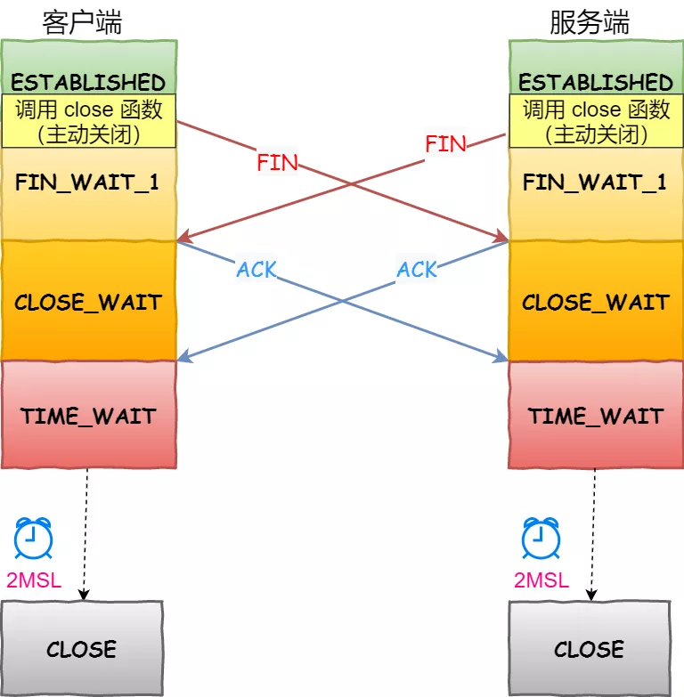
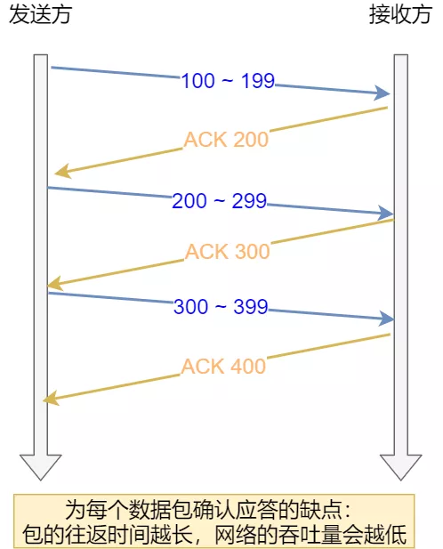
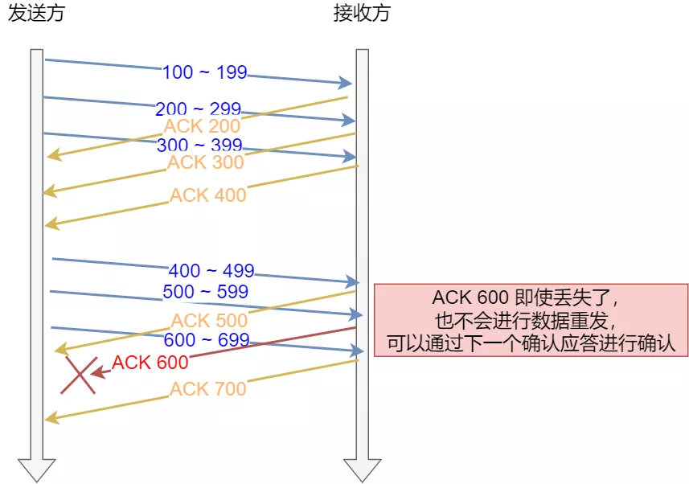
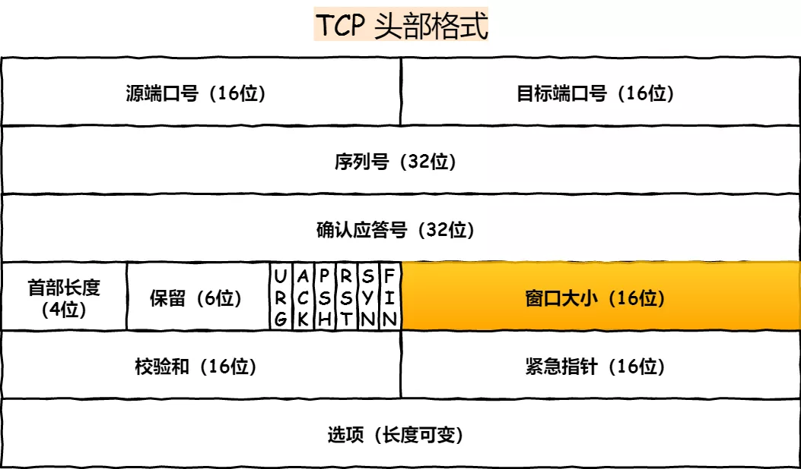
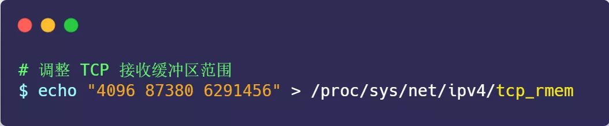
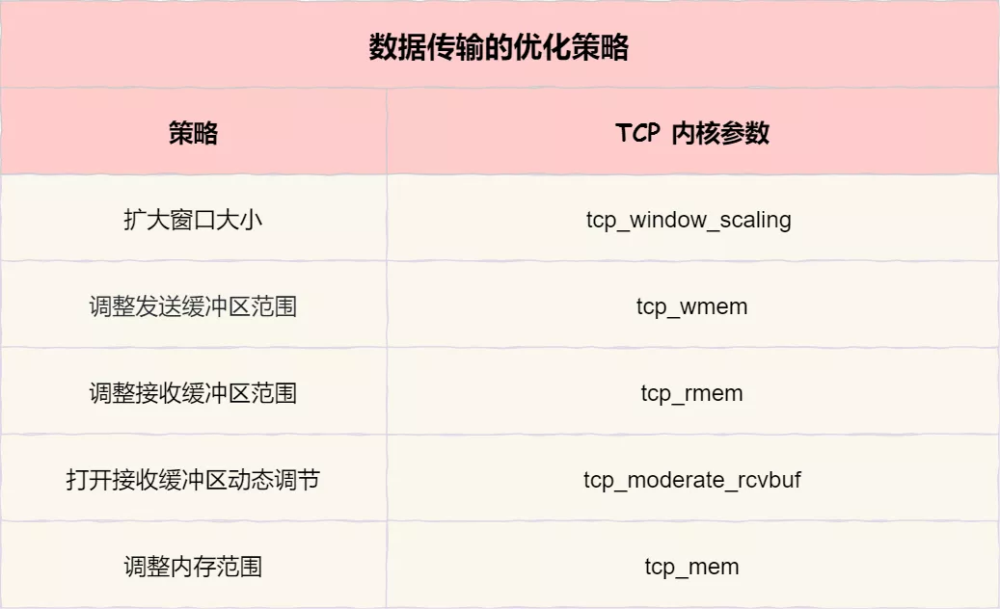

### 02 TCP 四次挥手的性能提升

接下来，我们一起看看针对 TCP 四次挥手关不连接时，如何优化性能。

在开始之前，我们得先了解四次挥手状态变迁的过程。

客户端和服务端双方都可以主动断开连接，**通常先关闭连接的一方称为主动方，后关闭连接的一方称为被动方。**

客户端主动关闭

可以看到，**四次挥手过程只涉及了两种报文，分别是 FIN 和 ACK**：

- FIN 就是结束连接的意思，谁发出 FIN 报文，就表示它将不会再发送任何数据，关闭这一方向上的传输通道；
- ACK 就是确认的意思，用来通知对方：你方的发送通道已经关闭；

四次挥手的过程:

- 当主动方关闭连接时，会发送 FIN 报文，此时发送方的 TCP 连接将从 ESTABLISHED 变成 FIN_WAIT1。
- 当被动方收到 FIN 报文后，内核会自动回复 ACK 报文，连接状态将从 ESTABLISHED 变成 CLOSE_WAIT，表示被动方在等待进程调用 close 函数关闭连接。
- 当主动方收到这个 ACK 后，连接状态由 FIN_WAIT1 变为 FIN_WAIT2，也就是表示**主动方的发送通道就关闭了**。
- 当被动方进入 CLOSE_WAIT 时，被动方还会继续处理数据，等到进程的 read 函数返回 0 后，应用程序就会调用 close 函数，进而触发内核发送 FIN 报文，此时被动方的连接状态变为 LAST_ACK。
- 当主动方收到这个 FIN 报文后，内核会回复 ACK 报文给被动方，同时主动方的连接状态由 FIN_WAIT2 变为 TIME_WAIT，**在 Linux 系统下大约等待 1 分钟后，TIME_WAIT 状态的连接才会彻底关闭**。
- 当被动方收到最后的 ACK 报文后，**被动方的连接就会关闭**。

你可以看到，每个方向都需要**一个 FIN 和一个 ACK**，因此通常被称为**四次挥手**。

这里一点需要注意是：**主动关闭连接的，才有 TIME_WAIT 状态。**

主动关闭方和被动关闭方优化的思路也不同，接下来分别说说如何优化他们。

#### 主动方的优化

关闭的连接的方式通常有两种，分别是 RST 报文关闭和 FIN 报文关闭。

如果进程异常退出了，内核就会发送 RST 报文来关闭，它可以不走四次挥手流程，是一个暴力关闭连接的方式。

安全关闭连接的方式必须通过四次挥手，它由进程调用 `close` 和 `shutdown` 函数发起 FIN 报文（shutdown 参数须传入 SHUT_WR 或者 SHUT_RDWR 才会发送 FIN）。

> 调用 close 函数 和 shutdown 函数有什么区别？

调用了 close 函数意味着完全断开连接，**完全断开不仅指无法传输数据，而且也不能发送数据。此时，调用了 close 函数的一方的连接叫做「孤儿连接」，如果你用 netstat -p 命令，会发现连接对应的进程名为空。**

使用 close 函数关闭连接是不优雅的。于是，就出现了一种优雅关闭连接的 `shutdown` 函数，**它可以控制只关闭一个方向的连接**：

第二个参数决定断开连接的方式，主要有以下三种方式：

- SHUT_RD(0)：**关闭连接的「读」这个方向**，如果接收缓冲区有已接收的数据，则将会被丢弃，并且后续再收到新的数据，会对数据进行 ACK，然后悄悄地丢弃。也就是说，对端还是会接收到 ACK，在这种情况下根本不知道数据已经被丢弃了。
- SHUT_WR(1)：**关闭连接的「写」这个方向**，这就是常被称为「半关闭」的连接。如果发送缓冲区还有未发送的数据，将被立即发送出去，并发送一个 FIN 报文给对端。
- SHUT_RDWR(2)：相当于 SHUT_RD 和 SHUT_WR 操作各一次，**关闭套接字的读和写两个方向**。

close 和 shutdown 函数都可以关闭连接，但这两种方式关闭的连接，不只功能上有差异，控制它们的 Linux 参数也不相同。

> FIN_WAIT1 状态的优化

主动方发送 FIN 报文后，连接就处于 FIN_WAIT1 状态，正常情况下，如果能及时收到被动方的 ACK，则会很快变为 FIN_WAIT2 状态。

但是当迟迟收不到对方返回的 ACK 时，连接就会一直处于 FIN_WAIT1 状态。此时，**内核会定时重发 FIN 报文，其中重发次数由 tcp_orphan_retries 参数控制**（注意，orphan 虽然是孤儿的意思，该参数却不只对孤儿连接有效，事实上，它对所有 FIN_WAIT1 状态下的连接都有效），默认值是 0。

你可能会好奇，这 0 表示几次？**实际上当为 0 时，特指 8 次**，从下面的内核源码可知：

如果 FIN_WAIT1 状态连接很多，我们就需要考虑降低 tcp_orphan_retries 的值，当重传次数超过 tcp_orphan_retries 时，连接就会直接关闭掉。

对于普遍正常情况时，调低 tcp_orphan_retries 就已经可以了。如果遇到恶意攻击，FIN 报文根本无法发送出去，这由 TCP 两个特性导致的：

- 首先，TCP 必须保证报文是有序发送的，FIN 报文也不例外，当发送缓冲区还有数据没有发送时，FIN 报文也不能提前发送。
- 其次，TCP 有流量控制功能，当接收方接收窗口为 0 时，发送方就不能再发送数据。所以，当攻击者下载大文件时，就可以通过接收窗口设为 0 ，这就会使得 FIN 报文都无法发送出去，那么连接会一直处于 FIN_WAIT1 状态。

解决这种问题的方法，是**调整 tcp_max_orphans 参数，它定义了「孤儿连接」的最大数量**：

当进程调用了 `close` 函数关闭连接，此时连接就会是「孤儿连接」，因为它无法在发送和接收数据。Linux 系统为了防止孤儿连接过多，导致系统资源长时间被占用，就提供了 `tcp_max_orphans` 参数。如果孤儿连接数量大于它，新增的孤儿连接将不再走四次挥手，而是直接发送 RST 复位报文强制关闭。

> FIN_WAIT2 状态的优化

当主动方收到 ACK 报文后，会处于 FIN_WAIT2 状态，就表示主动方的发送通道已经关闭，接下来将等待对方发送 FIN 报文，关闭对方的发送通道。

这时，**如果连接是用 shutdown 函数关闭的，连接可以一直处于 FIN_WAIT2 状态，因为它可能还可以发送或接收数据。但对于 close 函数关闭的孤儿连接，由于无法在发送和接收数据，所以这个状态不可以持续太久，而 tcp_fin_timeout 控制了这个状态下连接的持续时长**，默认值是 60 秒：

它意味着对于孤儿连接（调用 close 关闭的连接），如果在 60 秒后还没有收到 FIN 报文，连接就会直接关闭。

这个 60 秒不是随便决定的，它与 TIME_WAIT 状态持续的时间是相同的，后面我们在来说说为什么是 60 秒。

> TIME_WAIT 状态的优化

TIME_WAIT 是主动方四次挥手的最后一个状态，也是最常遇见的状态。

当收到被动方发来的 FIN 报文后，主动方会立刻回复 ACK，表示确认对方的发送通道已经关闭，接着就处于 TIME_WAIT 状态。在 Linux 系统，TIME_WAIT 状态会持续 60 秒后才会进入关闭状态。

TIME_WAIT 状态的连接，在主动方看来确实快已经关闭了。然后，被动方没有收到 ACK 报文前，还是处于 LAST_ACK 状态。如果这个 ACK 报文没有到达被动方，被动方就会重发 FIN 报文。重发次数仍然由前面介绍过的 tcp_orphan_retries 参数控制。

TIME-WAIT 的状态尤其重要，主要是两个原因：

- 防止具有相同「四元组」的「旧」数据包被收到；
- 保证「被动关闭连接」的一方能被正确的关闭，即保证最后的 ACK 能让被动关闭方接收，从而帮助其正常关闭；

*原因一：防止旧连接的数据包*

TIME-WAIT 的一个作用是**防止收到历史数据，从而导致数据错乱的问题。**

假设 TIME-WAIT 没有等待时间或时间过短，被延迟的数据包抵达后会发生什么呢？

接收到历史数据的异常

- 如上图黄色框框服务端在关闭连接之前发送的 `SEQ = 301` 报文，被网络延迟了。
- 这时有相同端口的 TCP 连接被复用后，被延迟的 `SEQ = 301` 抵达了客户端，那么客户端是有可能正常接收这个过期的报文，这就会产生数据错乱等严重的问题。

所以，TCP 就设计出了这么一个机制，经过 `2MSL` 这个时间，**足以让两个方向上的数据包都被丢弃，使得原来连接的数据包在网络中都自然消失，再出现的数据包一定都是新建立连接所产生的。**

*原因二：保证连接正确关闭*

TIME-WAIT 的另外一个作用是**等待足够的时间以确保最后的 ACK 能让被动关闭方接收，从而帮助其正常关闭。**

假设 TIME-WAIT 没有等待时间或时间过短，断开连接会造成什么问题呢？

没有确保正常断开的异常

- 如上图红色框框客户端四次挥手的最后一个 `ACK` 报文如果在网络中被丢失了，此时如果客户端 `TIME-WAIT` 过短或没有，则就直接进入了 `CLOSE` 状态了，那么服务端则会一直处在 `LASE-ACK` 状态。
- 当客户端发起建立连接的 `SYN` 请求报文后，服务端会发送 `RST` 报文给客户端，连接建立的过程就会被终止。

我们再回过头来看看，为什么 TIME_WAIT 状态要保持 60 秒呢？这与孤儿连接 FIN_WAIT2 状态默认保留 60 秒的原理是一样的，**因为这两个状态都需要保持 2MSL 时长。MSL 全称是 Maximum Segment Lifetime，它定义了一个报文在网络中的最长生存时间**（报文每经过一次路由器的转发，IP 头部的 TTL 字段就会减 1，减到 0 时报文就被丢弃，这就限制了报文的最长存活时间）。

为什么是 2 MSL 的时长呢？这其实是相当于**至少允许报文丢失一次**。比如，若 ACK 在一个 MSL 内丢失，这样被动方重发的 FIN 会在第 2 个 MSL 内到达，TIME_WAIT 状态的连接可以应对。

为什么不是 4 或者 8 MSL 的时长呢？你可以想象一个丢包率达到百分之一的糟糕网络，连续两次丢包的概率只有万分之一，这个概率实在是太小了，忽略它比解决它更具性价比。

**因此，TIME_WAIT 和 FIN_WAIT2 状态的最大时长都是 2 MSL，由于在 Linux 系统中，MSL 的值固定为 30 秒，所以它们都是 60 秒。**

虽然 TIME_WAIT 状态有存在的必要，但它毕竟会消耗系统资源。**如果发起连接一方的 TIME_WAIT 状态过多，占满了所有端口资源，则会导致无法创建新连接。**

- **客户端受端口资源限制**：如果客户端 TIME_WAIT 过多，就会导致端口资源被占用，因为端口就65536个，被占满就会导致无法创建新的连接；
- **服务端受系统资源限制**：由于一个 四元组表示TCP连接，理论上服务端可以建立很多连接，服务端确实只监听一个端口 但是会把连接扔给处理线程，所以理论上监听的端口可以继续监听。但是线程池处理不了那么多一直不断的连接了。所以当服务端出现大量 TIME_WAIT 时，系统资源被占满时，会导致处理不过来新的连接；

另外，**Linux 提供了 tcp_max_tw_buckets 参数，当 TIME_WAIT 的连接数量超过该参数时，新关闭的连接就不再经历 TIME_WAIT 而直接关闭：**

当服务器的并发连接增多时，相应地，同时处于 TIME_WAIT 状态的连接数量也会变多，此时就应当调大 `tcp_max_tw_buckets` 参数，减少不同连接间数据错乱的概率。

tcp_max_tw_buckets 也不是越大越好，毕竟内存和端口都是有限的。

**有一种方式可以在建立新连接时，复用处于 TIME_WAIT 状态的连接，那就是打开 tcp_tw_reuse 参数。但是需要注意，该参数是只用于客户端（建立连接的发起方），因为是在调用 connect() 时起作用的，而对于服务端（被动连接方）是没有用的。**

tcp_tw_reuse 从协议角度理解是安全可控的，可以复用处于 TIME_WAIT 的端口为新的连接所用。

什么是协议角度理解的安全可控呢？主要有两点：

- 只适用于连接发起方，也就是 C/S 模型中的客户端；
- 对应的 TIME_WAIT 状态的连接创建时间超过 1 秒才可以被复用。

使用这个选项，还有一个前提，需要打开对 TCP 时间戳的支持（对方也要打开 ）：

由于引入了时间戳，它能带来了些好处：

- 我们在前面提到的 2MSL 问题就不复存在了，因为重复的数据包会因为时间戳过期被自然丢弃；
- 同时，它还可以防止序列号绕回，也是因为重复的数据包会由于时间戳过期被自然丢弃；

老版本的 Linux 还提供了 tcp_tw_recycle 参数，但是当开启了它，就有两个坑：

- **Linux 会加快客户端和服务端 TIME_WAIT 状态的时间**，也就是它会使得 TIME_WAIT 状态会小于 60 秒，很容易导致数据错乱；
- 另外，**Linux 会丢弃所有来自远端时间戳小于上次记录的时间戳（由同一个远端发送的）的任何数据包**。就是说要使用该选项，则必须保证数据包的时间戳是单调递增的。那么，问题在于，此处的时间戳并不是我们通常意义上面的绝对时间，而是一个相对时间。很多情况下，我们是没法保证时间戳单调递增的，比如使用了 NAT，LVS 等情况；

所以，不建议设置为 1 ，建议关闭它：

在 Linux 4.12 版本后，Linux 内核直接取消了这一参数。

另外，我们可以在程序中设置 socket 选项，来设置调用 close 关闭连接行为。

如果`l_onoff`为非 0， 且`l_linger`值为 0，**那么调用close后，会立该发送一个 RST 标志给对端，该 TCP 连接将跳过四次挥手，也就跳过了 TIME_WAIT 状态，直接关闭。**

但这为跨越 TIME_WAIT 状态提供了一个可能，不过是一个非常危险的行为，不值得提倡。

#### 被动方的优化

当被动方收到 FIN 报文时，内核会自动回复 ACK，同时连接处于 CLOSE_WAIT 状态，顾名思义，它表示等待应用进程调用 close 函数关闭连接。

内核没有权利替代进程去关闭连接，因为如果主动方是通过 shutdown 关闭连接，那么它就是想在半关闭连接上接收数据或发送数据。因此，Linux 并没有限制 CLOSE_WAIT 状态的持续时间。

当然，大多数应用程序并不使用 shutdown 函数关闭连接。所以，**当你用 netstat 命令发现大量 CLOSE_WAIT 状态。就需要排查你的应用程序，因为可能因为应用程序出现了 Bug，read 函数返回 0 时，没有调用 close 函数。**

处于 CLOSE_WAIT 状态时，调用了 close 函数，内核就会发出 FIN 报文关闭发送通道，同时连接进入 LAST_ACK 状态，等待主动方返回 ACK 来确认连接关闭。

如果迟迟收不到这个 ACK，内核就会重发 FIN 报文，重发次数仍然由 tcp_orphan_retries 参数控制，这与主动方重发 FIN 报文的优化策略一致。

还有一点我们需要注意的，**如果被动方迅速调用 close 函数，那么被动方的 ACK 和 FIN 有可能在一个报文中发送，这样看起来，四次挥手会变成三次挥手，这只是一种特殊情况，不用在意。**

> 如果连接双方同时关闭连接，会怎么样？

由于 TCP 是双全工的协议，所以是会出现两方同时关闭连接的现象，也就是同时发送了 FIN 报文。

此时，上面介绍的优化策略仍然适用。两方发送 FIN 报文时，都认为自己是主动方，所以都进入了 FIN_WAIT1 状态，FIN 报文的重发次数仍由 tcp_orphan_retries 参数控制。

同时关闭

接下来，**双方在等待 ACK 报文的过程中，都等来了 FIN 报文。这是一种新情况，所以连接会进入一种叫做 CLOSING 的新状态，它替代了 FIN_WAIT2 状态**。接着，双方内核回复 ACK 确认对方发送通道的关闭后，进入 TIME_WAIT 状态，等待 2MSL 的时间后，连接自动关闭。

#### 小结

针对 TCP 四次挥手的优化，我们需要根据主动方和被动方四次挥手状态变化来调整系统 TCP 内核参数。

四次挥手的优化策略

> 主动方的优化

主动发起 FIN 报文断开连接的一方，如果迟迟没收到对方的 ACK 回复，则会重传 FIN 报文，重传的次数由 `tcp_orphan_retries` 参数决定。

当主动方收到 ACK 报文后，连接就进入 FIN_WAIT2 状态，根据关闭的方式不同，优化的方式也不同：

- 如果这是 close 函数关闭的连接，那么它就是孤儿连接。如果 `tcp_fin_timeout` 秒内没有收到对方的 FIN 报文，连接就直接关闭。同时，为了应对孤儿连接占用太多的资源，`tcp_max_orphans` 定义了最大孤儿连接的数量，超过时连接就会直接释放。
- 反之是 shutdown 函数关闭的连接，则不受此参数限制；

当主动方接收到 FIN 报文，并返回 ACK 后，主动方的连接进入 TIME_WAIT 状态。这一状态会持续 1 分钟，为了防止 TIME_WAIT 状态占用太多的资源，`tcp_max_tw_buckets` 定义了最大数量，超过时连接也会直接释放。

当 TIME_WAIT 状态过多时，还可以通过设置 `tcp_tw_reuse` 和 `tcp_timestamps` 为 1 ，将 TIME_WAIT 状态的端口复用于作为客户端的新连接，注意该参数只适用于客户端。

> 被动方的优化

被动关闭的连接方应对非常简单，它在回复 ACK 后就进入了 CLOSE_WAIT 状态，等待进程调用 close 函数关闭连接。因此，出现大量 CLOSE_WAIT 状态的连接时，应当从应用程序中找问题。

当被动方发送 FIN 报文后，连接就进入 LAST_ACK 状态，在未等到 ACK 时，会在 `tcp_orphan_retries` 参数的控制下重发 FIN 报文。

------

### 03 TCP 传输数据的性能提升

在前面介绍的是三次握手和四次挥手的优化策略，接下来主要介绍的是 TCP 传输数据时的优化策略。

TCP 连接是由内核维护的，内核会为每个连接建立内存缓冲区：

- 如果连接的内存配置过小，就无法充分使用网络带宽，TCP 传输效率就会降低；
- 如果连接的内存配置过大，很容易把服务器资源耗尽，这样就会导致新连接无法建立；

因此，我们必须理解 Linux 下 TCP 内存的用途，才能正确地配置内存大小。

### 滑动窗口是如何影响传输速度的？

TCP 会保证每一个报文都能够抵达对方，它的机制是这样：报文发出去后，必须接收到对方返回的确认报文 ACK，如果迟迟未收到，就会超时重发该报文，直到收到对方的 ACK 为止。

**所以，TCP 报文发出去后，并不会立马从内存中删除，因为重传时还需要用到它。**

由于 TCP 是内核维护的，所以报文存放在内核缓冲区。如果连接非常多，我们可以通过 free 命令观察到 `buff/cache` 内存是会增大。

如果 TCP 是每发送一个数据，都要进行一次确认应答。当上一个数据包收到了应答了， 再发送下一个。这个模式就有点像我和你面对面聊天，你一句我一句，但这种方式的缺点是效率比较低的。

按数据包进行确认应答

所以，这样的传输方式有一个缺点：数据包的**往返时间越长，通信的效率就越低**。

**要解决这一问题不难，并行批量发送报文，再批量确认报文即刻。**

并行处理

然而，这引出了另一个问题，发送方可以随心所欲的发送报文吗？**当然这不现实，我们还得考虑接收方的处理能力。**

当接收方硬件不如发送方，或者系统繁忙、资源紧张时，是无法瞬间处理这么多报文的。于是，这些报文只能被丢掉，使得网络效率非常低。

**为了解决这种现象发生，TCP 提供一种机制可以让「发送方」根据「接收方」的实际接收能力控制发送的数据量，这就是滑动窗口的由来。**

接收方根据它的缓冲区，可以计算出后续能够接收多少字节的报文，这个数字叫做接收窗口。当内核接收到报文时，必须用缓冲区存放它们，这样剩余缓冲区空间变小，接收窗口也就变小了；当进程调用 read 函数后，数据被读入了用户空间，内核缓冲区就被清空，这意味着主机可以接收更多的报文，接收窗口就会变大。

因此，接收窗口并不是恒定不变的，接收方会把当前可接收的大小放在 TCP 报文头部中的**窗口字段**，这样就可以起到窗口大小通知的作用。

发送方的窗口等价于接收方的窗口吗？如果不考虑拥塞控制，发送方的窗口大小「约等于」接收方的窗口大小，因为窗口通知报文在网络传输是存在时延的，所以是约等于的关系。

TCP 头部

从上图中可以看到，窗口字段只有 2 个字节，因此它最多能表达 65535 字节大小的窗口，也就是 64KB 大小。

这个窗口大小最大值，在当今高速网络下，很明显是不够用的。所以后续有了扩充窗口的方法：**在 TCP 选项字段定义了窗口扩大因子，用于扩大TCP通告窗口，使 TCP 的窗口大小从 2 个字节（16 位） 扩大为 30 位，所以此时窗口的最大值可以达到 1GB（2^30）。**

Linux 中打开这一功能，需要把 tcp_window_scaling 配置设为 1（默认打开）：

要使用窗口扩大选项，通讯双方必须在各自的 SYN 报文中发送这个选项：

- 主动建立连接的一方在 SYN 报文中发送这个选项；
- 而被动建立连接的一方只有在收到带窗口扩大选项的 SYN 报文之后才能发送这个选项。

这样看来，只要进程能及时地调用 read 函数读取数据，并且接收缓冲区配置得足够大，那么接收窗口就可以无限地放大，发送方也就无限地提升发送速度。

**这是不可能的，因为网络的传输能力是有限的，当发送方依据发送窗口，发送超过网络处理能力的报文时，路由器会直接丢弃这些报文。因此，缓冲区的内存并不是越大越好。**

#### 如果确定最大传输速度？

在前面我们知道了 TCP 的传输速度，受制于发送窗口与接收窗口，以及网络设备传输能力。其中，窗口大小由内核缓冲区大小决定。如果缓冲区与网络传输能力匹配，那么缓冲区的利用率就达到了最大化。

问题来了，如何计算网络的传输能力呢？

相信大家都知道网络是有「带宽」限制的，带宽描述的是网络传输能力，它与内核缓冲区的计量单位不同:

- 带宽是单位时间内的流量，表达是「速度」，比如常见的带宽 100 MB/s；
- 缓冲区单位是字节，当网络速度乘以时间才能得到字节数；

这里需要说一个概念，就是带宽时延积，它决定网络中飞行报文的大小，它的计算方式：

比如最大带宽是 100 MB/s，网络时延（RTT）是 10ms 时，意味着客户端到服务端的网络一共可以存放 100MB/s * 0.01s = 1MB 的字节。

这个 1MB 是带宽和时延的乘积，所以它就叫「带宽时延积」（缩写为 BDP，Bandwidth Delay Product）。同时，这 1MB 也表示「飞行中」的 TCP 报文大小，它们就在网络线路、路由器等网络设备上。如果飞行报文超过了 1 MB，就会导致网络过载，容易丢包。

**由于发送缓冲区大小决定了发送窗口的上限，而发送窗口又决定了「已发送未确认」的飞行报文的上限。因此，发送缓冲区不能超过「带宽时延积」。**

发送缓冲区与带宽时延积的关系：

- 如果发送缓冲区「超过」带宽时延积，超出的部分就没办法有效的网络传输，同时导致网络过载，容易丢包；
- 如果发送缓冲区「小于」带宽时延积，就不能很好的发挥出网络的传输效率。

所以，发送缓冲区的大小最好是往带宽时延积靠近。

#### 怎样调整缓冲区大小？

在 Linux 中发送缓冲区和接收缓冲都是可以用参数调节的。设置完后，Linux 会根据你设置的缓冲区进行**动态调节**。

> 调节发送缓冲区范围

先来看看发送缓冲区，它的范围通过 tcp_wmem 参数配置；

上面三个数字单位都是字节，它们分别表示：

- 第一个数值是动态范围的最小值，4096 byte = 4K；
- 第二个数值是初始默认值，87380 byte ≈ 86K；
- 第三个数值是动态范围的最大值，4194304 byte = 4096K（4M）；

**发送缓冲区是自行调节的**，当发送方发送的数据被确认后，并且没有新的数据要发送，就会把发送缓冲区的内存释放掉。

> 调节接收缓冲区范围

而接收缓冲区的调整就比较复杂一些，先来看看设置接收缓冲区范围的 tcp_rmem 参数：

上面三个数字单位都是字节，它们分别表示：

- 第一个数值是动态范围的最小值，表示即使在内存压力下也可以保证的最小接收缓冲区大小，4096 byte = 4K；
- 第二个数值是初始默认值，87380 byte ≈ 86K；
- 第三个数值是动态范围的最大值，6291456 byte = 6144K（6M）；

**接收缓冲区可以根据系统空闲内存的大小来调节接收窗口：**

- 如果系统的空闲内存很多，就可以自动把缓冲区增大一些，这样传给对方的接收窗口也会变大，因而提升发送方发送的传输数据数量；
- 反正，如果系统的内存很紧张，就会减少缓冲区，这虽然会降低传输效率，可以保证更多的并发连接正常工作；

发送缓冲区的调节功能是自动开启的，**而接收缓冲区则需要配置 tcp_moderate_rcvbuf 为 1 来开启调节功能**：

> 调节 TCP 内存范围

接收缓冲区调节时，怎么知道当前内存是否紧张或充分呢？这是通过 tcp_mem 配置完成的：

上面三个数字单位不是字节，而是「页面大小」，1 页表示 4KB，它们分别表示：

- 当 TCP 内存小于第 1 个值时，不需要进行自动调节；
- 在第 1 和第 2 个值之间时，内核开始调节接收缓冲区的大小；
- 大于第 3 个值时，内核不再为 TCP 分配新内存，此时新连接是无法建立的；

一般情况下这些值是在系统启动时根据系统内存数量计算得到的。根据当前 tcp_mem 最大内存页面数是 177120，当内存为 (177120 * 4) / 1024K ≈ 692M 时，系统将无法为新的 TCP 连接分配内存，即 TCP 连接将被拒绝。

> 根据实际场景调节的策略

在高并发服务器中，为了兼顾网速与大量的并发连接，**我们应当保证缓冲区的动态调整的最大值达到带宽时延积，而最小值保持默认的 4K 不变即可。而对于内存紧张的服务而言，调低默认值是提高并发的有效手段。**

同时，如果这是网络 IO 型服务器，那么，**调大 tcp_mem 的上限可以让 TCP 连接使用更多的系统内存，这有利于提升并发能力**。需要注意的是，tcp_wmem 和 tcp_rmem 的单位是字节，而 tcp_mem 的单位是页面大小。而且，**千万不要在 socket 上直接设置 SO_SNDBUF 或者 SO_RCVBUF，这样会关闭缓冲区的动态调整功能。**

#### 小结

本节针对 TCP 优化数据传输的方式，做了一些介绍。

数据传输的优化策略

TCP 可靠性是通过 ACK 确认报文实现的，又依赖滑动窗口提升了发送速度也兼顾了接收方的处理能力。

可是，默认的滑动窗口最大值只有 64 KB，不满足当今的高速网络的要求，要想要想提升发送速度必须提升滑动窗口的上限，在 Linux 下是通过设置 `tcp_window_scaling` 为 1 做到的，此时最大值可高达 1GB。

滑动窗口定义了网络中飞行报文的最大字节数，当它超过带宽时延积时，网络过载，就会发生丢包。而当它小于带宽时延积时，就无法充分利用网络带宽。因此，滑动窗口的设置，必须参考带宽时延积。

内核缓冲区决定了滑动窗口的上限，缓冲区可分为：发送缓冲区 tcp_wmem 和接收缓冲区 tcp_rmem。

Linux 会对缓冲区动态调节，我们应该把缓冲区的上限设置为带宽时延积。发送缓冲区的调节功能是自动打开的，而接收缓冲区需要把 tcp_moderate_rcvbuf 设置为 1 来开启。其中，调节的依据是 TCP 内存范围 tcp_mem。

但需要注意的是，如果程序中的 socket 设置 SO_SNDBUF 和 SO_RCVBUF，则会关闭缓冲区的动态整功能，所以不建议在程序设置它俩，而是交给内核自动调整比较好。

有效配置这些参数后，既能够最大程度地保持并发性，也能让资源充裕时连接传输速度达到最大值。