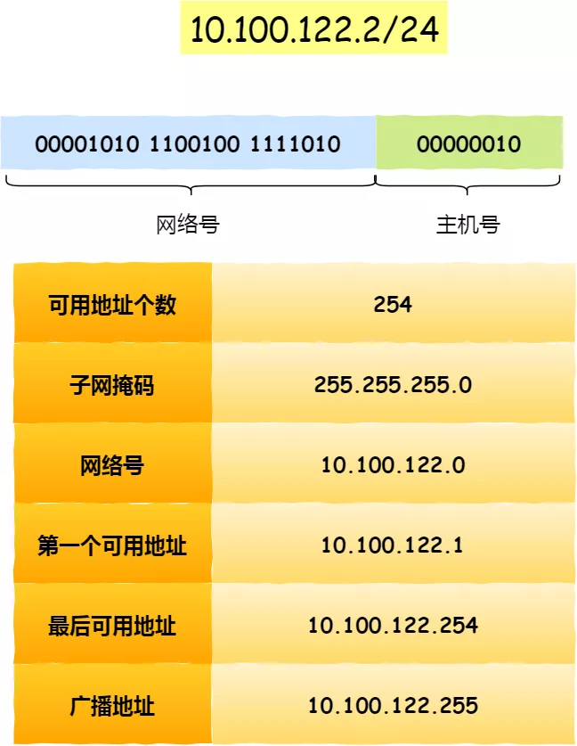
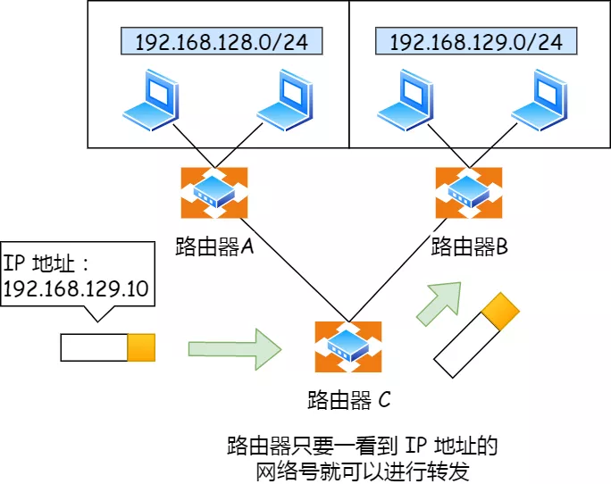
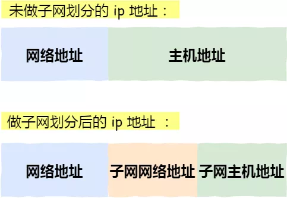
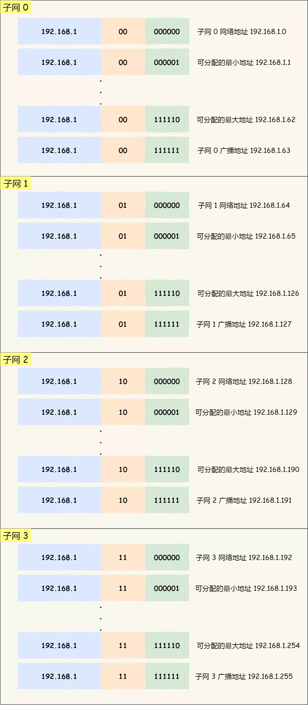
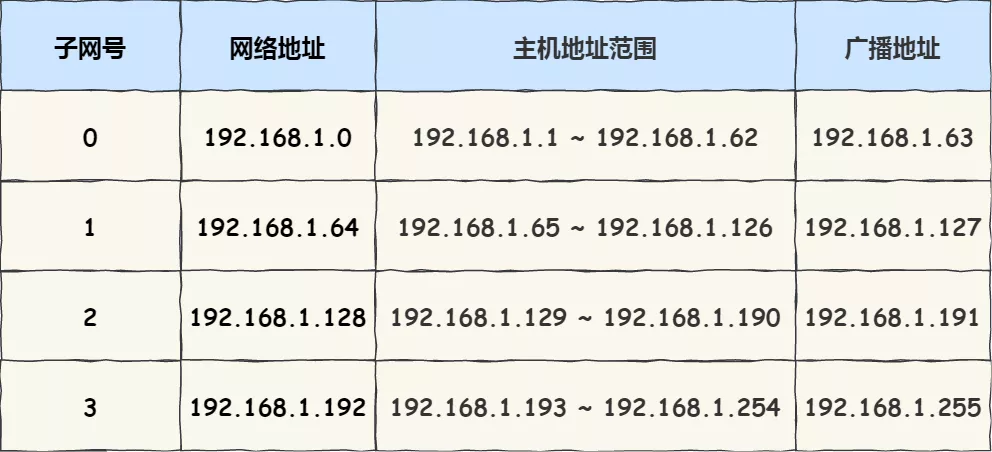

#### 无分类地址 CIDR

正因为 IP 分类存在许多缺点，所有后面提出了无分类地址的方案，即 `CIDR`。

这种方式不再有分类地址的概念，32 比特的 IP 地址被划分为两部分，前面是**网络号**，后面是**主机号**。

> 怎么划分网络号和主机号的呢？

表示形式 `a.b.c.d/x`，其中 `/x` 表示前 x 位属于**网络号**， x 的范围是 `0 ~ 32`，这就使得 IP 地址更加具有灵活性。

比如 10.100.122.2/24，这种地址表示形式就是 CIDR，`/24` 表示前 24 位是网络号，剩余的 8 位是主机号。

还有另一种划分网络号与主机号形式，那就是**子网掩码**，掩码的意思就是掩盖掉主机号，剩余的就是网络号。

**将子网掩码和 IP 地址按位计算 AND，就可得到网络号。**

> 为什么要分离网络号和主机号？

因为两台计算机要通讯，首先要判断是否处于同一个广播域内，即网络地址是否相同。如果网络地址相同，表明接受方在本网络上，那么可以把数据包直接发送到目标主机，

路由器寻址工作中，也就是通过这样的方式来找到对应的网络号的，进而把数据包转发给对应的网络内。

IP地址的网络号

> 怎么进行子网划分？

在上面我们知道可以通过子网掩码划分出网络号和主机号，那实际上子网掩码还有一个作用，那就是**划分子网**。

**子网划分实际上是将主机地址分为两个部分：子网网络地址和子网主机地址**。形式如下：

- 未做子网划分的 ip 地址：网络地址＋主机地址
- 做子网划分后的 ip 地址：网络地址＋（子网网络地址＋子网主机地址）

假设对 C 类地址进行子网划分，网络地址 192.168.1.0，使用子网掩码 255.255.255.192 对其进行子网划分。

C 类地址中前 24 位 是网络号，最后 8 位是主机号，根据子网掩码可知**从 8 位主机号中借用 2 位作为子网号**。

由于子网网络地址被划分成 2 位，那么子网地址就有 4 个，分别是 00、01、10、11，具体划分如下图：

划分后的 4 个子网如下表格：

