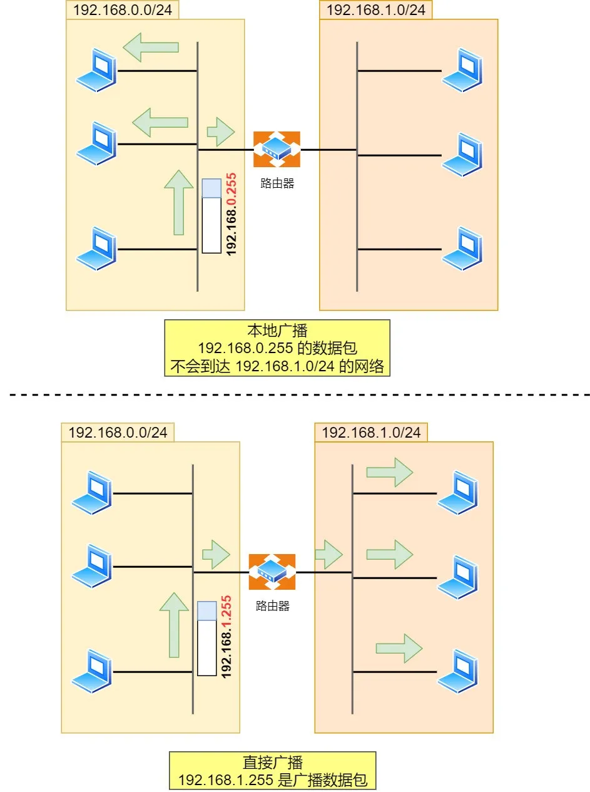

> 广播地址用于什么？

广播地址用于在**同一个链路中相互连接的主机之间发送数据包**。

学校班级中就有广播的例子，在准备上课的时候，通常班长会喊：“上课， 全体起立！”，班里的同学听到这句话是不是全部都站起来了？这个句话就有广播的含义。

当主机号全为 1 时，就表示该网络的广播地址。例如把 `172.20.0.0/16` 用二进制表示如下：

10101100.00010100.00000000.00000000

将这个地址的**主机部分全部改为 1**，则形成广播地址：

10101100.00010100.**11111111.11111111**

再将这个地址用十进制表示，则为 `172.20.255.255`。

广播地址可以分为本地广播和直接广播两种。

- **在本网络内广播的叫做本地广播**。例如网络地址为 192.168.0.0/24 的情况下，广播地址是 192.168.0.255 。因为这个广播地址的 IP 包会被路由器屏蔽，所以不会到达 192.168.0.0/24 以外的其他链路上。
- **在不同网络之间的广播叫做直接广播**。例如网络地址为 192.168.0.0/24 的主机向 192.168.1.255/24 的目标地址发送 IP 包。收到这个包的路由器，将数据转发给192.168.1.0/24，从而使得所有 192.168.1.1~192.168.1.254 的主机都能收到这个包（由于直接广播有一定的安全问题，多数情况下会在路由器上设置为不转发）。

本地广播与直接广播