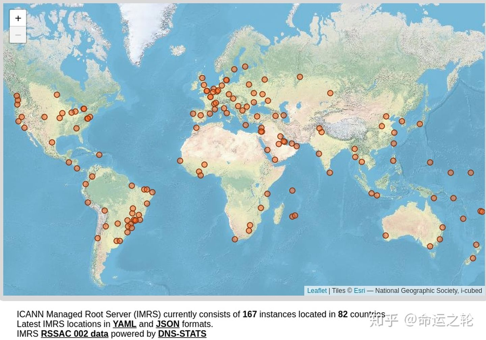
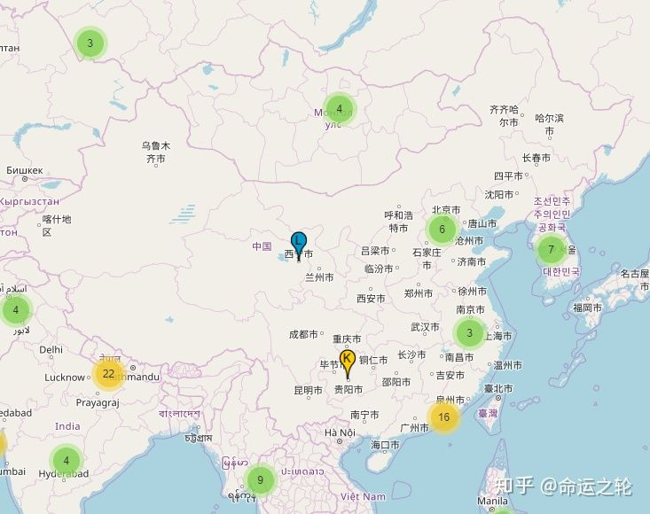

根[域名服务器](https://www.zhihu.com/search?q=域名服务器&search_source=Entity&hybrid_search_source=Entity&hybrid_search_extra={"sourceType"%3A"article"%2C"sourceId"%3A107492241})只有13台这个说法流传甚广，哪怕你不了解[DNS协议](https://www.zhihu.com/search?q=DNS协议&search_source=Entity&hybrid_search_source=Entity&hybrid_search_extra={"sourceType"%3A"article"%2C"sourceId"%3A107492241})，也有可能听说过这个说法，但事实真的如此吗？

当然不可能啦！世界上有45亿的因特网用户，哪怕有[递归名称](https://www.zhihu.com/search?q=递归名称&search_source=Entity&hybrid_search_source=Entity&hybrid_search_extra={"sourceType"%3A"article"%2C"sourceId"%3A107492241})服务器作为缓冲，根域名服务器只有13台是不可能应付的了如此大规模的查询的。

## 只有13台的说法来源

根域名服务器只有13台的说法是怎么来的呢？这是源于DNS协议在不使用EDNS0和TCP协议时，通过UDP协议传输的DNS消息最大长度需要限制在512字节（不包括IP头部、UDP头部），超出部分要被截断。有了最大长度限制后，一个UDP协议传输的DNS响应能够返回的资源记录数量就是有限的。

[512字节](https://www.zhihu.com/search?q=512字节&search_source=Entity&hybrid_search_source=Entity&hybrid_search_extra={"sourceType"%3A"article"%2C"sourceId"%3A107492241})的限制是在RFC 1035中规定的，为了更好的性能我们需要将响应限制在一个响应报文中完成，也就是只有512字节可以用了。

当我们查询根域（.）的NS记录时，512字节只够返回包含13个由A-M命名的根域名服务器的NS记录和A记录的响应。NS记录在回答区段中，A记录在额外信息区段中，A记录用于帮助你接下来向根域名服务器进一步查询。

## 为什么需要查询根域的NS记录？

递归名称服务器中的根名称服务器信息是需要管理员提前配置的，需要一个的包含根名称服务器的域名和IP地址的根提示文件。

根名称服务器的域名和IP地址有可能会改变，导致根提示文件中的信息过时，因此递归名称服务器需要一种不需要依赖管理员更新自己根提示文件信息的机制，这就是我们需要查询根域的NS记录的原因。我们称这种查询为“启动查询”，在RFC 8109中有对启动查询的更多描述。直至今天，根名称服务器的使用的IP地址仍然会改变，不过域名在1997年已经稳定。

递归名称服务器刚启动时在根提示文件中随机选择一个根名称服务器发送启动查询，如果查询失败则随机选择下一个。根域的NS记录与其他资源记录相同，都是有TTL的，TTL过期后递归名称服务器就需要重新发送启动查询。

现在的启动查询要求使用EDNS0，需要至少能够处理1024字节。不过我们不能用现在的技术去套用在曾经的历史上，决定根名称服务器只有13台的时候，EDNS0还没有出现，还存在512字节的限制。

## 限制512字节的原因

为什么需要限制DNS消息长度呢？这是因为在DNS出现的年代，网络设备还没有处理长度比较大的数据报的能力。另一方面是为了避免IP分片，在分片重组过程中只要其中一个分片丢失，就会导致整个数据报无法被重组接收。为了提高可靠性需要尽量避免IP分片（TCP中也有类似的功能，MSS选项）。

为什么是512字节呢？为什么不是514字节，不是522字节呢？实际上不仅仅是DNS协议有512字节的限制，很多其他的基于UDP的协议也有512字节的限制，例如RIP协议（RFC 1058）、HSP协议（RFC 3652）。那这个512是怎么来的呢？我能找到最好的解释在IP协议的RFC 791中，以下为相关描述：

> Total Length: 16 bits
> Total Length is the length of the datagram, measured in octets,
> including internet header and data. This field allows the length of
> a datagram to be up to 65,535 octets. Such long datagrams are
> impractical for most hosts and networks. All hosts must be prepared
> to accept datagrams of up to 576 octets (whether they arrive whole
> or in fragments). It is recommended that hosts only send datagrams
> larger than 576 octets if they have assurance that the destination
> is prepared to accept the larger datagrams.
>
> The number 576 is selected to allow a reasonable sized data block to
> be transmitted in addition to the required header information. For
> example, this size allows a data block of 512 octets plus 64 header
> octets to fit in a datagram. The maximal internet header is 60
> octets, and a typical internet header is 20 octets, allowing a
> margin for headers of higher level protocols.
> ...
> Fragmentation and Reassembly.
> ...
> Every internet destination must be able to receive a datagram of 576
> octets either in one piece or in fragments to be reassembled.
> ...

以上内容规定了IP数据报最大总长度可以为65535字节（包括头部和数据），但是接收这么长的数据报对于当时的大多数主机和网络来说都是不切实际的。不过所有主机必须准备好接收总长度最多为576字节的IP数据报，无论是单个IP数据报形式还是IP分片的形式。选择576是为了允许使用合理的数据块大小传输IP头部以外的信息。举个例子，576字节允许传输512字节的数据块加上64字节的头部在一个数据报中。最大的IP头部是60字节，而常用的IP头部是20字节（无IP选项），保留了空间给其他高层协议头部。

我猜测上述的协议就是基于此处的举例把512字节作为消息的最大长度限制，常用IP头部20字节 + UDP头部8字节 + 512字节消息为540字节，低于规定必须准备好接收的576字节，能够兼容所有主机。同时剩余的36字节也预留了空间给额外的IP选项、二次封装（IPsec）等需求。

## 512字节可以容纳多少台根域名服务器？

我们先来明确一下DNS响应报文的长度计算方式。DNS头部是固定的12字节。问题区段是1字节的根域0 + 2字节查询类型 + 2字节查询类一共是5字节。回答区段的每个NS记录都会在额外信息区段添加对应的A记录（当时IPv6还没出现，所以不考虑AAAA记录）。NS记录为1字节根域0 + 2字节类型 + 2字节类 + 4字节TTL + 2字节资源数据长度 + 不定长度的根服务器域名，一共是11字节固定部分 + 不定长度数据。A记录是2字节的压缩标签（指向NS记录中的根服务器域名） + 10字节资源记录固定部分（类型、类、TTL、资源数据长度）+ 4字节IPv4地址，一共是16字节。

总结起来就是12 + 5 + 11n + 16n + 所有根服务器域名的数据标签的长度总和，得到结果为DNS响应报文总长度，n为根服务器数量。

事实上512字节曾经还无法容纳13台这么多，现在能容纳13台A-M根域名服务器已经是改进过的了。根域名服务器并不是一开始就有13台的，也并不是一开始就是使用a.root-servers.net.的形式的域名。

## 根域名服务器系统的历史

在DNS刚发明后的1984年首台根域名服务器运行在南加州大学（USC）的信息科学研究所（ISI）为ARPANET提供服务。在1985年ISI添加了一台新的根域名服务器，斯坦福国际研究院（SRI International）也部署了根域名服务器。同样在1985年，美国弹道研究实验室（BRL）建立了根域名服务器为MILNET提供服务。此时一共有四台根域名服务器。

![[公式]](image/-16394836592662.svg+xml)

以上表格中的“域名”看起来和现在不一样是因为当时还没有顶级域名（TLD）这个概念，DNS刚发明的时候仅仅为了取代存储主机名的hosts。在1986年ISIB停止服务，由另一台域名为ISIA的根域名服务器代替。在1987年引入顶级域名后SRI-NIC改名为SRI-NIC.ARPA，ISIA改名为[http://A.ISI.EDU](https://link.zhihu.com/?target=http%3A//A.ISI.EDU)，ISIC改名为[http://C.ISI.EDU](https://link.zhihu.com/?target=http%3A//C.ISI.EDU)，BRL-AOS改名为BRL-AOS.ARPA。

在1987年随着NSFNET的流量和使用人数增长，现有的根域名服务器已经不够用了。为了解决这个问题，经过IETF会议的讨论，决定增加三个新的根域名服务器，分别为：马里兰大学的[http://TERP.UMD.EDU](https://link.zhihu.com/?target=http%3A//TERP.UMD.EDU)、美国国家航空航天局（NASA）的[http://NS.NASA.GOV](https://link.zhihu.com/?target=http%3A//NS.NASA.GOV)、[伦斯勒理工大学](https://www.zhihu.com/search?q=伦斯勒理工大学&search_source=Entity&hybrid_search_source=Entity&hybrid_search_extra={"sourceType"%3A"article"%2C"sourceId"%3A107492241})（RPI）的[http://C.NYSER.NET](https://link.zhihu.com/?target=http%3A//C.NYSER.NET)，为NSFNET、ARPANET等网络提供服务。同样在1987年，为了继续对MILNET进行从hosts到DNS的迁移，甘特空军基地（Gunter AFS）也建立了根域名服务器GUNTER-ADAM.ARPA，为MILNET提供服务。在1987年底[http://C.ISI.EDU](https://link.zhihu.com/?target=http%3A//C.ISI.EDU)停用。

在1988年美国国防数据网（DDN）继续对MILNET实施域名解析的第二阶段改造，将SRI-NIC.ARPA改名为NIC.DDN.MIL，BRL-AOS.ARPA改名为AOS.BRL.MIL，GUNTER-ADAM.ARPA改名为GUNTER-ADAM.AF.MIL。

在1990年，随着ARPANET、MILNET等网络逐渐被淘汰，Gunter AFS建立的GUNTER-ADAM.AF.MIL停止服务，NIC.DDN.MIL停止服务，DDN建立了新的根域名服务器NS.NIC.DDN.MIL。

随着因特网在欧洲的发展，越来越需要在欧洲建立根域名服务器，减少对美国根域名服务器依赖（当时的跨国网络非常不稳定）。最终在1991年在瑞典皇家理工学院网络运营中心（KTHNOC）部署了第一台不在美国的根域名服务器[http://NIC.NORDU.NET](https://link.zhihu.com/?target=http%3A//NIC.NORDU.NET)，支持多种网络协议。

在1991年美国国防信息系统局将网络信息中心（DDN-NIC）交给了政府系统公司（GSI），GSI将其外包给了网络解决方案公司（NSI），交接后[http://A.ISI.EDU](https://link.zhihu.com/?target=http%3A//A.ISI.EDU)停止服务，由[http://KAVA.NISC.SRI.COM](https://link.zhihu.com/?target=http%3A//KAVA.NISC.SRI.COM)取代。

从80年代开始DDN-NIC一直负责域名注册，因为当时大部分都是军事用途，不过从90年代开始，学术机构占了新注册域名的大部分，军方不愿意为其提供资金。美国联邦网络委员会要求国家科学基金会为非军事用途域名注册提供资金，在1992年经过招标后由[美国电话电报公司](https://www.zhihu.com/search?q=美国电话电报公司&search_source=Entity&hybrid_search_source=Entity&hybrid_search_extra={"sourceType"%3A"article"%2C"sourceId"%3A107492241})（AT&T）、通用原子公司（GA）、网络解决方案公司（NSI）合作提供数据库服务、信息服务、非军事域名注册服务，采用了InterNIC作为合作名称。在1993年NSI赢得了管理域名注册服务的竞标，IANA同意其部署一台新的根域名服务器[http://NS.INTERNET.NET](https://link.zhihu.com/?target=http%3A//NS.INTERNET.NET)。

在1994年KAVA.NISC.SRI.COMIANA停止提供服务，由[http://NS1.ISI.EDU](https://link.zhihu.com/?target=http%3A//NS1.ISI.EDU)取代。同年因特网软件联盟（ISC）请求在其部署新的根域名服务器，IANA同意后添加新根域名服务器[http://NS.ISC.ORG](https://link.zhihu.com/?target=http%3A//NS.ISC.ORG)。在1994年年底 [http://C.NYSER.NET](https://link.zhihu.com/?target=http%3A//C.NYSER.NET)改为[http://C.PSI.NET](https://link.zhihu.com/?target=http%3A//C.PSI.NET)。

![[公式]](image/+.svg+xml)

以上为此时的根域名服务器列表，一共有9台，DNS响应已经快接近512字节的极限了。我们计算一下以上列表构成的DNS响应报文大小为12 + 5 + 11 * 9 + 16 * 9 + (17 + 13 + 11 + 14 + 13 + 12 + 16 + 18 + 15) = 389字节。

假设一个新的根域名服务器的域名长度为15字节，那么就需要占用11 + 15 + 16 = 42字节，512 - 389 = 123字节， 123 / 42 ≈ 2.9，也就是只能再增加 2 - 3个根域名服务器，最多只能容纳9 + 3 = 12个根域名服务器。

为了继续添加更多的根域名服务器Bill Manning和Paul Vixie发起了重命名根域名服务器的域名的计划，将所有根域名服务器放在[http://root-servers.net](https://link.zhihu.com/?target=http%3A//root-servers.net)域下，这样就可以使用压缩标签节省空间。

IANA在1995年同意了重命名计划，使用单个字母表示一个特定的根域名服务器，根域名服务器的域名变成了我们现在使用的[http://a.root-servers.net](https://link.zhihu.com/?target=http%3A//a.root-servers.net)。此时有9台根域名服务器，用字母命名就是A到I。

![[公式]](image/-16394836592651.svg+xml)

重命名后第一个NS记录使用20字节的数据标签，例如a.root-servers.net.，后续NS记录就可以使用字母后跟压缩标签的形式，一共只需要4字节。例如第二个NS记录b.root-servers.net.为0x01 0x61 0xc0 0x1e，0x01是标签长度，0x61是’b’，0xc01e就是压缩标签，指针指向第一个NS记录的root-servers.net.。0x1e十进制是30，跳过了17字节的头部和问题区段，再跳过11字节的资源记录头部，再跳过2字节的0x01 0x60（‘a’），刚好就是root-servers.net.。

我们再计算一下DNS响应报文的大小，第一个NS记录为11字节资源记录头部 + 20字节的数据标签，其余8个NS记录使用4字节的压缩后的标签。那么报文大小为12 + 5 + (11 + 20) + (11 + 4) * 8 + 16 * 9 = 312字节。剩余的空间为512 - 312 = 200字节，增加一个新的根域名服务器需要(11 + 4) + 16 = 31字节，200 / 31 ≈ 6.4，也就是说最多可以再添加6台根域名服务器，一共9 + 6 = 15台。

通过将域名移到[http://root-servers.net](https://link.zhihu.com/?target=http%3A//root-servers.net)域下，使用压缩标签，DNS响应中就留出了空间给额外的根域名服务器。在1997年IANA增加了最后4台J、K、L、M根域名服务器，成为了13台根域名服务器。J和K由在美国东部的NSI负责运营，L和M由在美国西部的USC ISI负责运营。

后来为了让根域名服务器部署在更需要它的地方，K和M转移到了因特网正在高速发展的欧洲和亚洲。K根域名服务器部署到了伦敦，由欧洲IP资源网络协调中心（RIPE NCC）负责运营。M根域名服务器部署到了日本，由WIDE负责运营。其他两个根域名服务器J和L本来也是打算分配给其他更有需要的地区，不过由于此项工作的负责人Jon Postel过世，一直没有人去推动。

我们计算一下13台根域名服务器的DNS响应报文大小，12 + 5 + (11 + 20) + (11 + 4) * 12 + 16 * 13 = 436字节，剩余空间为512 - 436 = 76字节。由于增加一个新根域名服务器只需要31字节，实际上我们还有空间可以再增加2台根域名服务器。不过Bill Manning（ICANN）表示应该保守一些，保留一定的空间方便未来进行扩展，所以只停留在了13台。

根域名服务器的故事到这里就结束了吗？当然不是了，后来各个根域名服务器的运营组织很多经历了转移、收购、改名，使用的IP地址也发生过改变，不过这些与“根域名服务器只有13台”的问题已经无关了。

## 任播网络的出现

在1993年因特网社区提出了任播（anycast）的想法并在RFC 1546中记录。当有多个服务器能提供同样网络服务时，对于用户来说使用具体哪个服务器并不重要。当数据报被发送到服务器的任播地址时，网络负责将其传送到最好的（最近的）一个服务器。这样就可以简化用户寻找合适服务器的过程，不再需要保存服务器列表去选择，只需要知道服务器的任播地址。

在RFC 4786与RFC 7094中记录了更多关于任播工作的内容。任播在实现上是通过[路由协议](https://www.zhihu.com/search?q=路由协议&search_source=Entity&hybrid_search_source=Entity&hybrid_search_extra={"sourceType"%3A"article"%2C"sourceId"%3A107492241})（例如BGP）在路由系统的不同区域对同一个IP地址（网段）发出通告，产生多条路由路径，每条路径实际上对应着不同的[服务器节点](https://www.zhihu.com/search?q=服务器节点&search_source=Entity&hybrid_search_source=Entity&hybrid_search_extra={"sourceType"%3A"article"%2C"sourceId"%3A107492241})，达到一组服务器节点使用同一个IP地址的目的，最终根据[路由算法](https://www.zhihu.com/search?q=路由算法&search_source=Entity&hybrid_search_source=Entity&hybrid_search_extra={"sourceType"%3A"article"%2C"sourceId"%3A107492241})选择的最优路径通常就是最近的节点（例如根据AS_PATH属性选择）。当一个节点不可用时会撤销路由信息，后续的流量将会通过其他路由路径被路由到其他节点，用户请求能够继续正常处理，提高了可靠性。

任播利用了现有的网络基础架构，数据包不需要作任何修改，不需要独立的地址空间，不需要像组播一样有单独的[路由表](https://www.zhihu.com/search?q=路由表&search_source=Entity&hybrid_search_source=Entity&hybrid_search_extra={"sourceType"%3A"article"%2C"sourceId"%3A107492241})，不需要特殊的客户端与服务端程序，在用户眼中任播使用起来与单播没有任何区别。

任播可以实现更好的负责均衡，避免所有流量集中在一个节点，一个区域的流量只会传送到距离此区域最近的节点，降低了响应延迟。同时也很好的缓解了分布式拒绝服务攻击（DDOS），使攻击流量只会到达离攻击源最近的节点，不会影响其他节点，也更容易定位攻击源。

## DNS与任播

DNS是任播最成功的应用，早在2002年F根域名服务器就开始实行任播，在RFC 3258中也记录了权威名称服务器部署在任播上的内容，在往后的几年里其他根域名服务器也逐渐开始使用任播，到了今天所有根域名服务器都是部署在任播上了，节点遍布全球。不仅仅是根域名服务器使用任播，顶级域名服务器，甚至公共递归服务器（例如1.1.1.1）都会使用任播。



例如上图为L根域名服务器的任播节点分布，在全球有167个节点，遍布82个国家，可以在[https://www.dns.icann.org/imrs/locations/](https://link.zhihu.com/?target=https%3A//www.dns.icann.org/imrs/locations/)查看。

DNS使用任播后DNS[解析器](https://www.zhihu.com/search?q=解析器&search_source=Entity&hybrid_search_source=Entity&hybrid_search_extra={"sourceType"%3A"article"%2C"sourceId"%3A107492241})不再需要知道DNS服务器的真正IP地址，只需要知道任播地址就可以在世界各地与当地的最优节点通信了，我们现在所看到的根域名服务器的IP地址实际上都是任播地址。


至今（2020.2.15）在全球已经有1089个根域名服务器节点了，当前由12个组织负责运营，我们可以在[https://root-servers.org/](https://link.zhihu.com/?target=https%3A//root-servers.org/)看到部署情况。



在我国有26个根域名服务器节点，分别为：[西宁市](https://www.zhihu.com/search?q=西宁市&search_source=Entity&hybrid_search_source=Entity&hybrid_search_extra={"sourceType"%3A"article"%2C"sourceId"%3A107492241})L；贵阳市K；郑州市L；武汉市L；北京市I、L、J、K、F；上海市L；杭州市F；香港特别行政区A、I、H、F、F、E、J；澳门特别行政区E、F；台北市I、E、F、F、K、L。

每个根服务器的运营者独立负责管理自己的任播节点，任播节点数量没有限制，但是各个组织有着不同的运营模式，所以不同根服务器的任播节点数量有很大差异，例如H根只有4个任播节点，E根却有306个节点。

每个根服务器运营者通过DNS区域传输（RFC 5936的AXFR和RFC 1995的IXFR）从根区域维护者（IANA）获取根区域信息，传输数据通过RFC 2845的TSIG保护，资源记录现在还有DNSSEC的签名，保证根区域信息正确。根服务器运营者获取根区域信息后通过自己的内部分发系统交付信息到所有任播节点。

根区域的信息完全公开，完整的根区域文件我们可以在IANA的网站上获取[http://www.internic.net/domain/root.zone](https://link.zhihu.com/?target=http%3A//www.internic.net/domain/root.zone)。事实上根据RFC 7706我们甚至可以在本地建立一个自己的根域名服务器部署在回环地址，用于降低查询延迟和避免查询被窃听，使用BIND或NSD作为DNS服务器程序。通过AXFR从ICANN的服务器lax.xfr.dns.icann.org或iad.xfr.dns.icann.org获取根区域的完整信息，用DNSSEC验证信息，根据SOA记录中的信息定期更新。

如果你想测试一下DNS的完整区域传输（AXFR），可以通过以下命令

```text
dig @lax.xfr.dns.icann.org AXFR .
```

在返回的结果中你可以看到完整的根区域内容，根区域所有的资源记录，由于内容实在太多，这里为了节省篇幅省略，可以自己做一下这个测试。

## 如何标识根服务器的任播节点

随着DNS越来越多的部署在任播上，大量任播节点使用同一个任播地址，有时候很难判断到底是哪一个节点对查询返回响应，这会给管理者排错带来一些困扰，RFC 4892中记录了这个问题，并给出了常用的解决办法。

在BIND服务器程序中可以使用CHAOS类中的TXT类型的资源记录存储根域名服务器的标识，查询名称为“HOSTNAME.BIND.”。这种机制被其他DNS实现引入后去除了BIND特有的BIND.域，改为了SERVER.域，查询名称改为“ID.SERVER.”，我们可以通过以下dig命令测试这种标识机制：

```text
dig @k.root-servers.net TXT CHAOS ID.SERVER
;; QUESTION SECTION:
;ID.SERVER.   CH TXT
;; ANSWER SECTION:
ID.SERVER.  0 CH TXT "ns1.cn-gya.k.ripe.net"
```

可以看到我这里的K根任播节点的标识为[http://ns1.cn-gya.k.ripe.net](https://link.zhihu.com/?target=http%3A//ns1.cn-gya.k.ripe.net)。

以上这种方法有一点不好在于需要一个额外的DNS查询报文去确认任播节点，但是此查询报文和其他普通查询报文有可能会被路由到不同的任播节点，导致获取到错误标识，所以利用CHAOS类的方法没有被标准化。

更好的方法应该是标识包含在普通查询的响应报文内，在RFC 5001中标准化了DNS名称服务器标识选项（NSID），作为EDNS0伪资源记录RDATA中的选项来存储标识信息。DNS解析器通过在DNS查询中包含一个空的NSID选项表示想要获取名称服务器标识，如果名称服务器支持NSID则返回包含标识内容的NSID选项的响应。NSID在权威名称服务器和递归名称服务器都可以使用，不过NSID是逐跳选项(hop-by-hop)，不会被传递，只作用于接收到的服务器本身。

```text
dig @k.root-servers.net www.baidu.com +nsid
;; OPT PSEUDOSECTION:
; EDNS: version: 0, flags:; udp: 4096
; NSID: 6e 73 31 2e 63 6e 2d 67 79 61 2e 6b 2e 72 69 70 65 2e 6e 65 74 ("ns1.cn-gya.k.ripe.net")
;; QUESTION SECTION:
;www.baidu.com.   IN A
;; AUTHORITY SECTION:
com.   172800 IN NS a.gtld-servers.net.
...
;; ADDITIONAL SECTION:
a.gtld-servers.net. 172800 IN A 192.5.6.30
...
```

通过dig使用NSID机制可以看到我这里的K根任播节点的NSID中的标识为[http://ns1.cn-gya.k.ripe.net](https://link.zhihu.com/?target=http%3A//ns1.cn-gya.k.ripe.net)，包含在查询[http://www.baidu.com](https://link.zhihu.com/?target=http%3A//www.baidu.com)的响应报文内。

```text
dig ns1.cn-gya.k.ripe.net A
;; ANSWER SECTION:
ns1.cn-gya.k.ripe.net. 86400 IN A 58.16.72.74
```

[http://ns1.cn-gya.k.ripe.net](https://link.zhihu.com/?target=http%3A//ns1.cn-gya.k.ripe.net)刚好是这个K根服务器的域名，我们查询其A记录可以看到此域名对应的IPv4地址为58.16.72.74。为了更好的让管理员对特定节点监控管理，通常每个任播节点除了任播地址还会有自己的单播地址。注意，不是所有根域名服务器返回的NSID内容都是域名，NSID内容可由管理员随意设置。


查询58.16.72.74的地理位置可以发现这是一个贵阳市的IP地址，显然这是在贵阳市部署的K根域名服务器的任播节点。

## 不再有512字节限制后的DNS

到了今天网络世界早已天翻地覆，绝大部分的网络设备支持的IP报文最大长度不再是区区576字节，经过统计表明大部分的MTU都在1340字节以上，能够重组的IP分片数据长度就更大了，512字节的限制在ENDS0（RFC 6891）出现后已经不存在了。事实上在IPv6出现后，增加了AAAA记录，13台根域名服务器构成的DNS响应报文无论如何都会超过512字节，而在DNSSEC出现后添加了RRSIG记录响应报文就更大了。

那为什么现在没有512字节的空间限制后不继续增加新的根域名服务器呢？为了回答这个问题我们先来想想，增加根域名服务器的目的是为了什么？是为了减轻现有根域名服务器的查询负担，将查询分散到更多的服务器，是为了让根域名服务器离用户更近，降低查询延迟。

不断在响应报文中增加服务器数量总会有极限的，也会让报文越来越大增加传输开销，用户也很难知道到底哪个服务器离自己最近，也会有一定的向后兼容性问题，要是旧的解析器不支持EDNS0就只能截断报文了。

更好的解决方法是使用任播网络，任播网络由路由系统选择最近的服务器，不需要用户操心，也没有任播节点数量的限制，哪怕全球范围内部署上万个任播节点也没有任何问题。在任播网络中所有节点都是平等的，没有主次之分，技术上没有差别，提供的内容也完全相同。现在的13台，倒不如说是13组，任播节点实际上有上千个，只有13台根域名服务器这个概念已经毫无意义了。

综上所述，这是个马车与汽车的问题，当更强大的汽车出现后我们就不需要继续使用马车作为交通工具了，当任播出现后我们也不需要继续在启动查询的响应报文中添加更多NS记录来增加根域名服务器了。