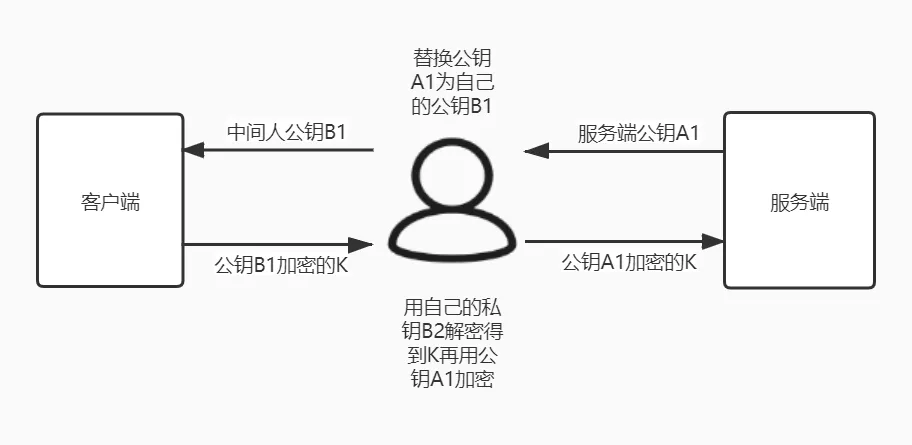

#### 对称加密与非对称加密

> 又是对称加密又是非对称加密，一会公钥一会私钥一会随机Key，为什么要这么复杂呢，一套搞到底不好么？

对称加密是指有一个密钥，用它可以对一段明文加密，加密之后也只能用这个密钥来解密得到明文。如果通信双方都持有密钥，且天知地知你知我知，绝对不会有别的人知道，那么通信安全自然是可以得到保证的（在**密钥足够强**的情况下）。

然而，在HTTPS的传输场景下，服务端事先并不知道客户端是谁，你也**不可能在事先不通过互联网和每一个网站的管理员都悄悄商量好一个通信密钥**出来，那么必然存在一个密钥在互联网上传输的过程，如果在传输过程中被别人监听到了，那么后续的所有加密都是无用功。

这时，我们就需要另一种神奇的加密类型，非对称加密。

非对称加密有两个密钥，一个是公钥，另一个是私钥。一般来说，公钥用来加密，这时密文只能用私钥才能解开。

那么，当客户端发起连接请求，服务端将公钥传输过去，客户端利用公钥加密好信息，再将密文发送给服务端，服务端里有私钥可以解密。

但是，当服务端要返回数据，如果用公钥加密，那么客户端并没有私钥用来解密，而如果用私钥加密，客户端虽然有公钥可以解密，但这个公钥之前就在**互联网上传输过**，很有可能已经有人拿到，并不安全，所以这一过程只用非对称加密是不能满足的。

> 注意，严格来讲，私钥并不能用来加密，只能用作签名使用，这是由于密码学中生成公钥私钥时对不同变量的数学要求是不同的，因此公钥私钥抵抗攻击的能力也不同，在实际使用中不可互换。签名的功能在HTTPS里也有用到，下文中会说明。

只有一组公钥私钥只能保证单程的加解密，那么如果我们准备**两组公钥私钥**呢，是不是可以解决这个问题？来看下面这个过程。

1. 服务端有非对称加密的公钥A1，私钥A2；
2. 客户端有非对称加密的公钥B1，私钥B2；
3. 客户端向服务端发起请求，服务端将公钥A1返回给客户端；
4. 浏览器收到公钥A1，将自己保存的公钥B1发送给服务端；
5. 之后浏览器所有向客户端发送的数据，使用公钥B1加密，客户端可以使用私钥B2解密；
6. 客户端所有向服务端发送的数据，使用公钥A1加密，服务端可以使用私钥A2解密。

此时，两条传输方向的数据都经过非对称加密，都能保证安全性，那么为什么不采用这种方案呢？

最主要的原因是**非对称加解密耗时要远大于对称加解密**，对性能有很大损耗，大家的使用体验很差。

所以，我们才最终选用了上文介绍到非对称加密+对称加密的方案，再复习一下↓↓↓😝

1. 服务端有非对称加密的公钥A1，私钥A2；
2. 客户端发起请求，服务端将公钥A1返回给客户端；
3. 客户端随机生成一个对称加密的密钥K，用公钥A1加密后发送给服务端；
4. 服务端收到密文后用自己的私钥A2解密，得到对称密钥K，此时完成了安全的对称密钥交换，解决了对称加密时密钥传输被人窃取的问题
5. 之后双方通信都使用密钥K进行对称加解密。

看起来是一个非常完美的方案，**兼顾**了安全性和性能，但是，真的就安全了么？

#### CA颁发机构

依然考虑**中间人攻击**的情况，非对称加密的算法都是**公开**的，所有人都可以自己生成一对公钥私钥。

当服务端向客户端返回公钥A1的时候，中间人将其**替换**成自己的公钥B1传送给浏览器。

而浏览器此时一无所知，傻乎乎地使用公钥B1加密了密钥K发送出去，又被**中间人截获**，中间人利用自己的私钥B2解密，得到密钥K，再使用服务端的公钥A1加密传送给服务端，完成了通信链路，而服务端和客户端毫无感知。

HTTPS中间人

出现这一问题的核心原因是**客户端无法确认收到的公钥是不是真的是服务端发来的**。为了解决这个问题，互联网引入了一个公信机构，这就是CA。