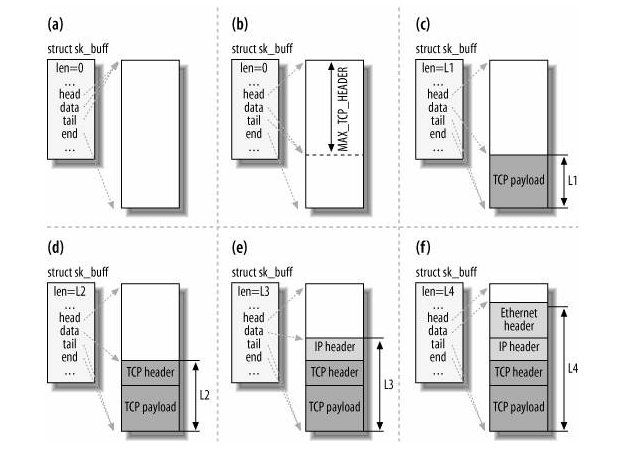
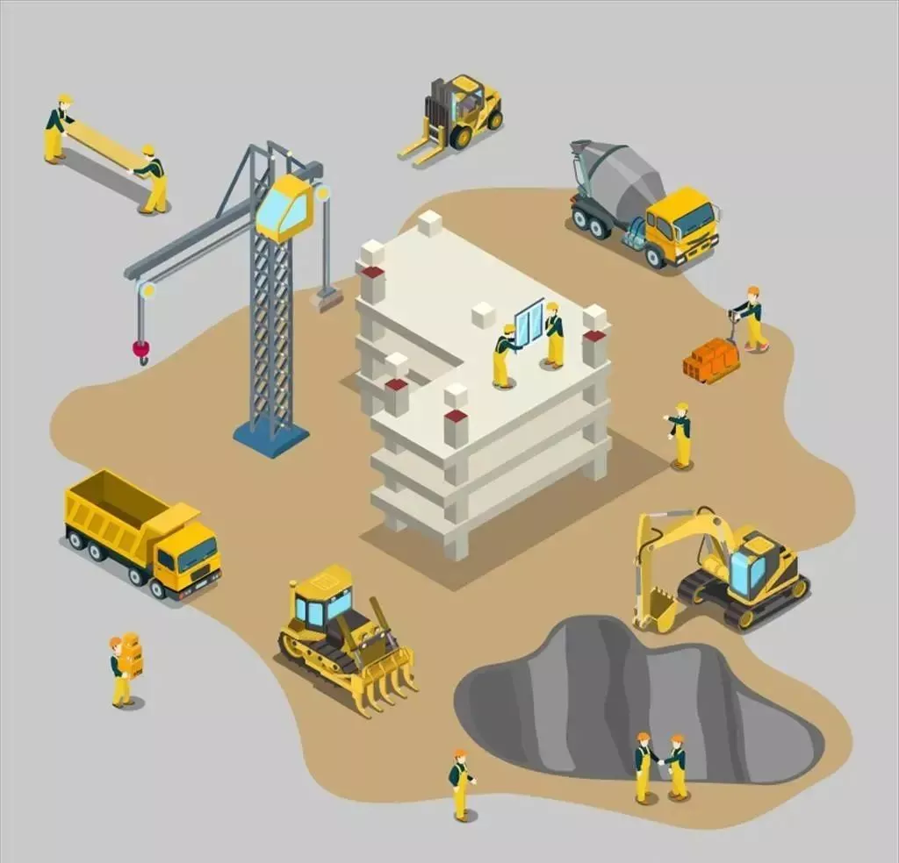
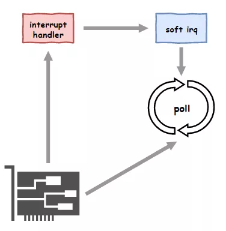
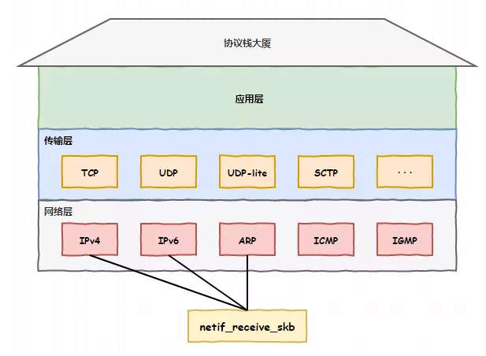
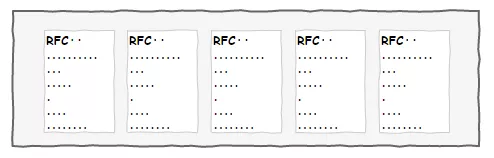
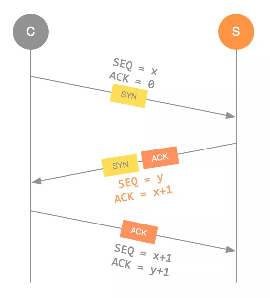

### Linux 接收网络包的流程

网卡是计算机里的一个硬件，专门负责接收和发送网络包，当网卡接收到一个网络包后，会通过 DMA 技术，将网络包放入到 Ring Buffer，这个是一个环形缓冲区，该缓冲区在内核内存中的网卡驱动里。

那接收到网络包后，应该怎么告诉操作系统这个网络包已经到达了呢？

最简单的一种方式就是触发中断，也就是每当网卡收到一个网络包，就触发一个中断告诉操作系统。

但是，这存在一个问题，在高性能网络场景下，网络包的数量会非常多，那么就会触发非常多的中断，要知道当 CPU  收到了中断，就会停下手里的事情，而去处理这些网络包，处理完毕后，才会回去继续其他事情，那么频繁地触发中断，则会导致 CPU 一直没玩没了的处理中断，而导致其他任务可能无法继续前进，从而影响系统的整体效率。

所以为了解决频繁中断带来的性能开销，Linux 内核在 2.6 版本中引入了 **NAPI 机制**，它是混合「中断和轮询」的方式来接收网络包，它的核心概念就是**不采用中断的方式读取数据**，而是首先采用中断唤醒数据接收的服务程序，然后 `poll` 的方法来轮询数据。

比如，当有网络包到达时，网卡发起硬件中断，于是会执行网卡硬件中断处理函数，**中断处理函数处理完需要「暂时屏蔽中断」，然后唤醒「软中断」来轮询处理数据，直到没有新数据时才恢复中断，这样一次中断处理多个网络包**，于是就可以降低网卡中断带来的性能开销。

那软中断是怎么处理网络包的呢？它会从 Ring Buffer 中拷贝数据到内核 struct sk_buff 缓冲区中，从而可以作为一个网络包交给网络协议栈进行逐层处理。

首先，会先进入到网络接口层，在这一层会检查报文的合法性，如果不合法则丢弃，合法则会找出该网络包的上层协议的类型，比如是 IPv4，还是 IPv6，接着再去掉帧头和帧尾，然后交给网络层。

到了网络层，则取出 IP 包，判断网络包下一步的走向，比如是交给上层处理还是转发出去。当确认这个网络包要发送给本机后，就会从 IP 头里看看上一层协议的类型是 TCP 还是 UDP，接着去掉 IP 头，然后交给传输层。

传输层取出 TCP 头或 UDP 头，根据四元组「源 IP、源端口、目的 IP、目的端口」 作为标识，找出对应的 Socket，并把数据拷贝到 Socket 的接收缓冲区。

最后，应用层程序调用 Socket 接口，从内核的 Socket 接收缓冲区读取新到来的数据到应用层。

至此，一个网络包的接收过程就已经结束了，你也可以从下图左边部分看到网络包接收的流程，右边部分刚好反过来，它是网络包发送的流程。

------

文件描述符的作用是什么？每一个进程都有一个数据结构 `task_struct`，该结构体里有一个指向「文件描述符数组」的成员指针。该数组里列出这个进程打开的所有文件的文件描述符。数组的下标是文件描述符，是一个整数，而数组的内容是一个指针，指向内核中所有打开的文件的列表，也就是说内核可以通过文件描述符找到对应打开的文件。

然后每个文件都有一个 inode，Socket 文件的 inode 指向了内核中的 Socket 结构，在这个结构体里有两个队列，分别是**发送队列**和**接收队列**，这个两个队列里面保存的是一个个 `struct sk_buff`，用链表的组织形式串起来。

sk_buff 可以表示各个层的数据包，在应用层数据包叫 data，在 TCP 层我们称为 segment，在 IP 层我们叫 packet，在数据链路层称为 frame。

你可能会好奇，为什么全部数据包只用一个结构体来描述呢？协议栈采用的是分层结构，上层向下层传递数据时需要增加包头，下层向上层数据时又需要去掉包头，如果每一层都用一个结构体，那在层之间传递数据的时候，就要发生多次拷贝，这将大大降低 CPU 效率。

于是，为了在层级之间传递数据时，不发生拷贝，只用 sk_buff 一个结构体来描述所有的网络包，那它是如何做到的呢？是通过调整 sk_buff 中 `data` 的指针，比如：

- 当接收报文时，从网卡驱动开始，通过协议栈层层往上传送数据报，通过增加 skb->data 的值，来逐步剥离协议首部。
- 当要发送报文时，创建 sk_buff 结构体，数据缓存区的头部预留足够的空间，用来填充各层首部，在经过各下层协议时，通过减少 skb->data 的值来增加协议首部。

你可以从下面这张图看到，当发送报文时，data 指针的移动过程。

------

五

总结

网络模块是Linux内核中最复杂的模块了，看起来一个简简单单的收包过程就涉及到许多内核组件之间的交互，如网卡驱动、协议栈，内核ksoftirqd线程等。看起来很复杂，本文想通过图示的方式，尽量以容易理解的方式来将内核收包过程讲清楚。现在让我们再串一串整个收包过程。

当用户执行完`recvfrom`调用后，用户进程就通过系统调用进行到内核态工作了。如果接收队列没有数据，进程就进入睡眠状态被操作系统挂起。这块相对比较简单，剩下大部分的戏份都是由Linux内核其它模块来表演了。

首先在开始收包之前，Linux要做许多的准备工作：

- \1. 创建ksoftirqd线程，为它设置好它自己的线程函数，后面指望着它来处理软中断呢
- \2. 协议栈注册，linux要实现许多协议，比如arp，icmp，ip，udp，tcp，每一个协议都会将自己的处理函数注册一下，方便包来了迅速找到对应的处理函数
- \3. 网卡驱动初始化，每个驱动都有一个初始化函数，内核会让驱动也初始化一下。在这个初始化过程中，把自己的DMA准备好，把NAPI的poll函数地址告诉内核
- \4. 启动网卡，分配RX，TX队列，注册中断对应的处理函数

以上是内核准备收包之前的重要工作，当上面都ready之后，就可以打开硬中断，等待数据包的到来了。

当数据到来了以后，第一个迎接它的是网卡（我去，这不是废话么）：

- \1. 网卡将数据帧DMA到内存的RingBuffer中，然后向CPU发起中断通知
- \2. CPU响应中断请求，调用网卡启动时注册的中断处理函数
- \3. 中断处理函数几乎没干啥，就发起了软中断请求
- \4. 内核线程ksoftirqd线程发现有软中断请求到来，先关闭硬中断
- \5. ksoftirqd线程开始调用驱动的poll函数收包
- \6. poll函数将收到的包送到协议栈注册的ip_rcv函数中
- \7. ip_rcv函数再讲包送到udp_rcv函数中（对于tcp包就送到tcp_rcv）

------

## **网络部新员工**

我叫Robert，是Linux帝国一个普通的公民。

今天是我第一天上班的日子，我下了好大功夫才考上了帝国的公务员，根据我的成绩，我被分到了帝国网络部。

一进入帝国的办公园区，我就被眼前的景象惊呆了，一座座高楼大厦，富丽堂皇，鳞次栉比，我忍不住驻足多看了几眼。

这些大楼上面都有招牌，最高的那一座是帝国的进程&线程管理部门的办公大厦，旁边还有内存管理部门、文件管理等部门办公大厦。

## **网卡驱动部门**

我只顾东张西望，不小心跟旁边小路跑出来的一位小哥撞了一个满怀，他手里抱的一堆数据散落的满地都是。

我一边道歉，一边帮他捡起数据。

“这位小哥行色匆匆，不知要去哪里啊”，我好奇的问到。

“哦，你好，我是网卡驱动部门的，这是从网卡那里刚刚拿到的数据包，我得赶紧交给协议栈处理”，说完整理了下数据，就匆忙离开了。

寻着他出来的地方看去，不远处就是他说的网卡驱动部门，难道我办公的地方就在这里？我沿着这条小路走了过去。

一进入网卡驱动部门，出现在眼前的就是一副热火朝天的景象，收包的，解包的，发包的，一群人忙的不亦乐乎。

“这么早就这么忙碌了啊”，我问门口的保安大叔。

“是啊，这平时这个点也没什么网络访问，不知道今天怎么回事，一大早的数据就传输个不停”，保安说到。

我指着里面一个员工问保安：“大叔，那人在干嘛呢？一直在转来转去的”

“你说他啊，他在从网卡轮询读取数据包呢！”

“**轮询**？网络数据包不是网卡发中断通知吗，干嘛要去轮询呢？”，我不解的问到。

“以前是这样的，不过后来CPU那边有个叫阿Q的家伙不干了，说网卡数据太频繁，老是打断他们正常的工作。不仅如此，中断响应的时候还得把中断给关了，避免出现错误，时间久了，键盘、鼠标等单位就得不到响应纷纷闹事了”，保安说完点了一支香烟。

我若有所思的点了点头，“那现在就改成轮询了？不过这样好浪费时间哦”

保安吐了一个烟圈，继续说到：“倒也不是全都是轮询，现在把处理过程分成了两段，最开始的第一部分还是靠中断来通知的，这个时候需要关一下中断，不过通知后不会真正处理数据包，而是开启了一个`软中断`，所以关不了太久时间。第二部分在软中断中去轮询处理的，这个时候就不用关中断了。把硬中断和轮询结合了一下，就不用每个数据包来都中断一次了，也不用关中断太长时间，还给这技术取了个名字叫**NAPI**”

“保安大叔，你怎么什么都知道啊？”

“我以前就在里面工作啊，现在年纪稍微大了些，比不上年轻人，就让我来当保安了，唉～”，大叔说完又猛抽了一口香烟，整理了下自己日益稀疏的头发。

“唉，对了，你是谁啊，怎么没见过你？”

“我是帝国网络部新来的员工，今天来报道的。我把手中的录取通知书递给了保安”

保安大叔看了看说到：“你走错了，不是这里，你该去网络协议栈大厦”。

## **协议栈大厦**

离开网卡驱动部门，我继续前行终于找到了网络协议栈大厦，这便是我今后工作的地方了。

走近一看，这座网络大厦并不如前面看到的高大，只有三层高，每一层的墙上都挂着一个巨大的招牌，上面写着这一层的名字，从上向下分别是：

- `应用层`
- `传输层`
- `网络层`

大厦的门口还有一个收发室，门牌上写着`netif_receive_skb`，收发室坐着一位大爷。

正在这时，先前碰到的小哥又来了，将手里的数据放到了收发室就离开了，看来这里就是网络协议栈的入口了。

大爷拆开这个数据包看了看，随即按了下按钮，数据包就顺着管道传到了背后协议栈大厦一楼的一个办公室，我抬头一看，上面写着IPv4。再向旁边看去，还有好几间办公室，分别写了IPv6、ICMP、IGMP、ARP···

我来到这个IPv4的门口，里面也是忙的不亦乐乎，有分片的、组包的、计算校验和的、有条不紊。

办公室正中央有一个圆柱形的管道，通向了二楼，一楼处理完毕就通过这管道把数据包送了上去。

墙上还有另一个管道，上面写着`netfilter hook`，不知道是通向了哪里。

“你找谁？”，我正看得入神，里面一个负责人发现了我，我赶紧表明来意。

他看过我手中的录取通知书后说到，“你是在传输层啊，出门右拐上二楼就是了。我们这一楼都是网络层协议的办公室。”

我又看了下手里的录用通知书，这才发现被分配在了`传输层`工作。

## **传输层工作**

来到二楼，总算见到了我的主管。

“Robert，欢迎加入网络部，工作岗位在传输层的TCP小组，大家欢迎！”

“谢谢主管！谢谢大家！”

“这是Cerf，你刚来，就让他先带带你，有什么不懂的就向他请教吧。”

我点头感谢，和一旁这个叫Cerf的握了握手。

接下来，主管向我介绍了咱们传输层的几个小组的情况：TCP、UDP、SCTP、UDP-lite······我这才知道，原来传输层不是只有TCP和UDP。

Cerf带我来到了工位，不愧是国有单位，无比宽敞，桌上还有一堆奇怪的设备。

“这是一堆什么东西啊”，我问Cerf。

“这些都是定时器，后面你工作处理TCP连接会用到的”

我点了点头，环顾四周，工位旁边的墙壁上还贴满了什么东西，我凑近了一看，才发现满满的都是RFC几千条的规定。

“好好看，以后的工作可是要天天用到这些东西呢”，Cerf略开玩笑的说着。

“这些我基本都背的下来了，要不然我也考不到这里来”，我笑着说，略带一些得意。

Cerf也笑了笑，“别大意，之前也有人也说过这话，后来还不是走了”

我有些尴尬，不知道说些什么，这时办公室中央的管道里冒出了一个数据包。

“Robert，你刚来，这个新的连接数据包就交给你来处理下，熟悉下工作流程”，主管说到。

我刚刚放松的心情一下紧张了起来，毕竟以前都是纸上谈兵，还从没有真正处理过数据包呢。

我小心翼翼的接过这个数据包，定位到TCP的头部，瞧了一眼标志位，发现`SYN`位是1，看来是有新的连接到来了，接下来不就是三次握手吗，我再熟悉不过了。

我准备了一个响应包，将`SYN`标记和`ACK`标记都点亮后，接下来就犯了难了。这个确认号`ACK`我倒是知道是对方的序列号+1，不过我回复的序列号该是多少呢？一时之间，不知道如何是好。

你们知道吗？在线等，挺急的。

**未完待续······**

## **彩蛋**

> CPU一号车间的阿Q又闹脾气了。
>
> “我们花了大量时间把网卡数据搬运到内存，重复又没有技术含量，我受够了！”
>
> *预知后事如何，请关注后续精彩······*
