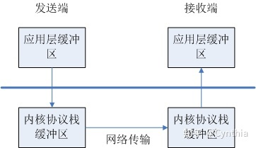

### **1、socket通信**

`socket`是一种`IPC`方法，它允许位于同一台主机（计算机）或使用网络连接起来的不同主机上的应用程序直接交换数据，掌握基本的`socket API`函数对于网络编程至关重要，无论是自己写网络通信库还是学习开源的网络通信库，都离不开基本的`socket API`函数。

------

### **2、网络通信基本流程**

完整的网络通信流程包括服务端与客户端通过一系列`socket`函数建立连接。


### **2.1 服务端建立连接过程**


> **socket()函数**

服务端首先调用`socket()`创建一个`fd`（文件描述符）用来侦听客服端的连接，通常称此`侦听fd`（或`监听fd`）。

```cpp
#include <sys/socket.h>
int socket(int domain, int type, int protocol);
    
    --成功时返回文件描述符，失败时返回-1，并设置errno;
```

下面简要介绍三个参数`socket()`中的三个参数。

1、`domain`：套接字中使用的协议族信息；


虽然存在多个协议族，但是常用的只有`PF_INET`。

2、`type`：套接字数据传输类型；


`TCP`采用的就是面向连接的数据传输，采用`SOCK_STREAM`具有以下特点：

- 传输过程中数据不会消失；
- 按照顺序传输数据；
- 传输的数据没有边界，像水流一样；

`UDP`采用的就是面向消息的数据传输，采用`SOCK_DGEAM`具有以下特点：

- 传输速度快但是没有顺序；
- 传输的数据可能丢失也可能损毁；
- 传输的数据存在边界；
- 限制每次传输数据大小

3、`protocol`：计算机间通信中使用的[协议信息](https://www.zhihu.com/search?q=协议信息&search_source=Entity&hybrid_search_source=Entity&hybrid_search_extra={"sourceType"%3A"article"%2C"sourceId"%3A158394673})；

`socket()`的第三个参数决定最终采用的协议，一般根据前两个参数就可以确定了协议类型，比如`domain`选择`PF_INET`（`IPv4`协议族），`type`采用`SOCK_STREAM`（面向连接传输数据），能满足这两点的第三个参数只有`IPPROTO_TCP`，所以通常第三个参数直接传0就行了。

```cpp
int tcp_socket = socket(PF_INET, SOCK_STREAM, IPPROTO_TCP);

//等价写法
int tcp_socket = socket(PF_INET, SOCK_STREAM, 0);
```


> **`bind()`函数**

当socket()函数调用成功后就能够得到网络连接所需的`fd`，接下来就是要对该`fd`绑定地址与端口信息，这样，客户端才能根据服务端所绑定的地址与端口发起连接。地址与端口的绑定需要调用`bind()`函数实现。

```cpp
#include <sys/socket.h>
int bind(int sockefd, struct sockaddr* myaddr, socklen_t addrlen);

    --成功时返回0，失败时返回-1，并设置errno;
```

下面简要介绍三个参数`bind()`中的三个参数。

1、`sockfd`：`socket()`调用返回的`侦听fd`；

2、`myaddr`：保存的是服务端的地址与端口信息，`sockaddr`结构体包含地址族、端口、地址等信息；

```cpp
struct sockaddr
{
    sa_family sin_family;  //地址族
    char      sa_data[14];  //地址信息
};
```

`sa_data`保存地址与端口信息，而14字节无法容纳多数协议族的地址值，`Linux`为各个协议族提供专门的`socket`地址结构体，比如常用的`sockaddr_in`（保存`IPv4`地址信息）。

```cpp
struct sockaddr_in 
{
    sa_family_t    sin_family;  //地址族
    uint16_t       sin_port;    //16位的TCP/UDP 端口号
    struct in_addr sin_addr;    //32位IP地址
    char           sin_zero;    //不使用
};
```

地址族信息


> PF*系列宏与AF*系列宏的值完全相同，经常混用。

```
sockaddr_in`还包含另外一个结构体`in_addr
struct in_addr
{
    In_addr_t      s_addr;       //32位的IPv4地址
};
```

将给定的地址族、地址、端口保存到结构体`sockaddr_in`中，然后再转换成`sockaddr`类型的结构体。

3、`addrlen`：表示第二个参数的长度信息；


`bind()`调用失败返回-1并设置`errno`，其中常见的`errno`是`EACCES`与`EADDRINUSE`。

- `EACCES`：被绑定的地址是受保护的，仅超级用户能访问，比如0~1023窗口是系统使用的，不能绑定；
- `EADDRINUSE`：被绑定的地址正在使用，常见于将`侦听fd`绑定到一个处于`TIME_WAIT`状态的`sockfd`地址；


> **`listen()函数`**

当调用`bind()`函数为`侦听fd`绑定了地址、端口信息之后，接下来通过`listen()`函数，进入等待连接状态，只有调用了`listen()`函数，客户端才能调用`connect()`函数（提前调用将发生错误）。

```cpp
#include <sys/socket.h>

int listen(int sockfd, int backlog);

    --成功时返回0，失败时返回-1，并设置errno;
```

下面介绍`listen()`函数的两个参数。

1、`sockfd`：已经绑定地址、端口的`侦听fd`；

2、`backlog`：连接请求队列的长度，客户端发起连接，在服务端会将这些待连接的客户端请求放进队列中，若`backlog`的值为5，表示最多允许5个客户端请求进入队列。


> **`accept()函数`**

当`listen()`函数调用后，如果客户端发起了连接请求，就会把待连接的请求放进队列中，此时调用`accept()`函数就可以与客户端建立连接。

```cpp
#include <sys/socket.h>

int accept(int sockfd, struct sockaddr* addr, socklen_t* addrlen);

    --成功时返回创建的fd,失败时返回-1，并设置errno;
```

`accept()`也是需要参数。

1、`sockfd`：这个依然是绑定了地址与端口信息的服务端的`侦听fd`，当有客户端连接请求，该`侦听fd`会变成可读状态；

2、`addr`：该结构体是传入传出参数，用来保存发起连接请求的客户端的地址与端口信息，`accept()`返回后，客户端的地址与端口填充到结构体对应的变量中；

3、`addrlen`：指向保存二个参数`addr`长度的变量地址；

`accept()`调用成功后，创建一个`clientfd`（客户端`fd`）,用来与建立连接的客户端收发数据。到此为止，服务端建立连接过程就结束了，接下来就是通过`read()`、`write()`等`IO`函数进行数据的收发操作。


### **2.2 客户端建立连接过程**

前文分析了服务端建立连接的整个过程，通过一系列的[socket函数](https://www.zhihu.com/search?q=socket函数&search_source=Entity&hybrid_search_source=Entity&hybrid_search_extra={"sourceType"%3A"article"%2C"sourceId"%3A158394673})，客户端的建立连接的过程与服务端类似，相比较服务端的处理流程，客户端稍微简单一些。


> **`socket()函数`**

```cpp
#include <sys/socket.h>
int socket(int domain, int type, int protocol);
	
	--成功时返回文件描述符，失败时返回-1，并设置errno;
```

客户端在想要建立一个连接，首先也是要调用socket()函数建立一个`fd`，该f`d`先用来与服务端建立连接，当服务端建立连接完成后，客户端就能够利用该`fd`与服务端实现收发数据。这里的三个参数与服务端的`socket()`使用的参数保持一致。


> **`connect()函数`**

客户端发起建立连接的请求，一定要等待服务端调用`listen()`函数之后，只有服务端成功调用了`listen()`函数，才有一个存放客户端连接请求的队列，这样客户端的连接请求才会被放进队列中，然后服务端调用`accept()`函数建立连接。

```cpp
#include <sys/connect>

int connect(int sockfd, struct sockaddr* seraddr, socklen_t addrlen);

	--成功时返回0，失败时返回-1，并设置errno;
```

`connect()`三个参数都是传入参数。

1、`sockfd`：`socket()`调用返回的`fd`，用来与服务端建立连接使用；

2、`seraddr`：保存将要连接的服务端的地址、端口信息，这里同样是先将服务端信息保存到`sockddr_in`结构体中，然后再转换成`sockaddr`类型。

3、`addrlen`：保存第二个参数的长度信息

客户端调用`connect()`函数时自动为客户端分配地址与端口信息，所以客户端一般不需要绑定地址与端口。


当`connect()`出错返回时，两种常见的`errno`是`ECONNREFUSED`、`ETIMEDOUT`与`EINPROGRESS`。

- `ECONNREFUSED`：请求连接的目标端口不存在；
- `ETIMEDOUT`：连接超时；
- `EINPROGRESS`：正在尝试连接，并不一定表示连接失败，这种情况，`Linux`系统上稍后要通过`getsockopt()`判断`sockfd`是否出错；


### **2.3 数据读写**

在网络通信中，数据的读写可以通过`read()`、`write()`函数实现，`Linux`中不区分文件与套接字。

> **写函数`write()`**

```cpp
#include <unistd.h>

ssize_t write(int fd, const void* buf, size_t nbytes);

	--成功时返回写入的字节数，失败时返回-1;
```

1、`fd`：数据想要写入的`sockfd`；

2、`buf`：保存将要写入数据的缓冲区；

3、`nbytes`：将要写入的字节数


> **与`write()`相对应的是`read()`函数，用来读取数据**

```cpp
#include <unistd.h>

ssize_t read(int fd, void* buf, size_t nbytes);

	--成功时返回字节数，遇到文件结尾返回0，失败时返回-1;
```

1、`fd`：将要从该`fd`上读取数据；

2、`buf`：保存所读取数据的缓冲区；

3、`nbytes`：能够读取的最大字节数；


`size_t`与`ssize_t`是通过`typedef`声明定义的元数据类型，主要是兼容不同位数的操作系统数据类型的差异（如`int32`、`int64`），为了与用户自己定义的数据类型区别开，以`_t`结尾。

```cpp
typedef unsigned int size_t;
typedef signed int   ssize_t;
```


文件的读写函数`read()`、`write()`可以用来网络数据的读取，但是`socket`编程提供了专用的`socket`数据读写函数。`TCP`读写函数`recv()`、`send()`，`UDP`的读写函数`recvfrom()`、`sendto()`。


> **`TCP`数据读函数`recv()`**

```cpp
#include <sys/types.h>
#include <sys/socket.h>

ssize_t recv(int fd, void* buf, size_t len, int flags);

		--成功时返回读取到字节数，失败返回-1，设置errno;
```

与`read()`相比，这里多了参数`flags`，主要用于特殊的数据读取，通常设为0即可，`recv()`调用成功时返回实际读取到的字节数，它可能小于我们期望的字节数，所以可能需要多次调用才能读取到完整的数据，如果对方关闭了连接，则`recv()`调用返回0。


> **`TCP`数据写函数`send()`**

```cpp
#include <sys/types.h>
#include <sys/socket.h>

ssize_t send(int fd, const void* buf, size_t len, int flags);

		--成功时返回写入字节数，失败返回-1，设置errno;
```

`send()`用法与`recv()`类似。


> **`UDP`数据读函数`recvfrom()`**

```cpp
#include <sys/types.h>
#include <sys/socket.h>

ssize_t recvfrom(int fd, void* buf, size_t len, int flags, struct sockaddr* src_addr, socklen_t* addrlen);

		----成功时返回读取到字节数，失败返回-1，设置errno;
```

与`TCP`中的数据读取函数`recv()`相比，这里多了两个参数，因为`UDP`通信没有连接的概念，所以每次读取数据都需要获取发送端的地址端口信息，保存在`src_addr`中，`addrlen`指向保存地址信息长度的变量。


> **`UDP`数据写函数`sendto()`**

```cpp
#include <sys/types.h>
#include <sys/socket.h>

ssize_t sendto(int fd, void* buf, size_t len, int flags, const struct sockaddr* dest_addr, socklen_t addrlen);

		----成功时返回读取到字节数，失败返回-1，设置errno;
```

用法与`recvfrom()`类似，这两个函数中的`flags`参数与`TCP`中`recv()`、s`end()`函数中的`flags`一致。当我们把`recvfrom()`、`sendto()`中的后两个参数设置为`NULL`的时候，同样可以用于`TCP`的数据读取。




数据发送：系统调用`write()/send()/sendto()`将数据从应用层缓冲区写入到[内核缓冲区](https://www.zhihu.com/search?q=内核缓冲区&search_source=Entity&hybrid_search_source=Entity&hybrid_search_extra={"sourceType"%3A"article"%2C"sourceId"%3A158394673})，由内核进行数据的发送；

数据接收：系统调用`read()/recv()/recvfrom()`将数据从内核缓冲区读取到[应用层缓冲区](https://www.zhihu.com/search?q=应用层缓冲区&search_source=Entity&hybrid_search_source=Entity&hybrid_search_extra={"sourceType"%3A"article"%2C"sourceId"%3A158394673})；

------

### **3、主机字节序与网络字节序**

在数据传输过程之前，往往需要进行字节序的转换，因为不同的`CPU`，保存数据的方式不一样，所谓的主机字节序分为[大小端](https://www.zhihu.com/search?q=大小端&search_source=Entity&hybrid_search_source=Entity&hybrid_search_extra={"sourceType"%3A"article"%2C"sourceId"%3A158394673})模式。

大端字节序（`Big Endian`）： 高位字节放在低位地址；

小端字节序（`Little Endian`）：高位字节放在高位地址；

现代的`PC`大多采用小端字节序，因此小端字节序又被称为主机字节序。

网络字节序是 `TCP/IP` 协议中规定好的一种数据表示格式，它与具体的`CPU`类型、操作系统等无关，从而可以保证数据在不同主机之间传输时能够被正确解释，网络字节顺序采用大端字节序排序方式。因此为了不同的机器和系统可以正常交换数据，一般建议将需要传输的整型值转换成网络字节序。

`Linux`提供了4个函数完成主机字节序和网络字节序之间的转换。

```cpp
#include <netinet/in.h>

unsigned long int htonl(unsigned long int hostlong); 
unsigned short int htons(unsigned short int hostshort);
unsigned long int ntohl(unsigned long int netlong);
unsigned short int ntohs(unsigned short int netshort);
```

`htonl()`：表示`host to network long`，主机字节序转换成网络字节序；

`ntohl()`：表示`network to host long`，网络字节序转化成主机字节序；

这两个长整形用来转换`IP`地址信息，而剩下的两个短整形用来转换`PORT`端口信息。

下面给出一个`htons()`函数的实现，`IDE`是`Visual Studio 2019`。

```cpp
#include <iostream>
 
//判断大小端编码方式
bool ByteOrderFunc()
{
    unsigned short mode = 0x1234;
    char* pmode = (char*)& mode;
    //低字节放低位
    if (*pmode == 0x34)
        return false;    //是小端
 
    return true;         //是大端(网络字节序)
}
 
int main()
{
    //小端编码
    int hostport = 0x1234;
    
    if (ByteOrderFunc())   //先判断是大端还是小端
        std::cout << "大端编码方式" << std::endl;
    else
        std::cout << "小端编码方式， 需要转换成网络字节序" << std::endl;
 
    int i =  ((uint16_t)(hostport >> 8)) | ((uint16_t)((hostporthost & 0x00ff) << 8));
 
    std::cout << "i = " << i << std::endl;
 
    return 0;
 
}
```

在`hostport`出打断点，在[局部变量](https://www.zhihu.com/search?q=局部变量&search_source=Entity&hybrid_search_source=Entity&hybrid_search_extra={"sourceType"%3A"article"%2C"sourceId"%3A158394673})窗口查看`hostport`的内存地址，然后再内存窗口查看其存储方式，可见是小端编码方式。

```cpp
0x00D8FA8C  34 12 00 00 cc cc cc cc 
```

下面是进行网络字节序的转换，查看i字节序方式与`hostport`相同。

```cpp
0x00D8FA80  12 34 00 00 cc cc cc cc
```

已经转换成网络字节序（大端字节序）。

------

### **4、IP地址端口转换函数**


> **`IP`地址转换函数**

网络字节序与本机字节序的转换是整形之间的转换，但是`IP`地址信息通常是点分十进制（字符串）表示的，往往需要先转化成整形，`inet_addr()`函数可以将字符串形式的`IP`地址信息转化成32位的整数类型。

```cpp
#include <arpa/inet.h>
in_addr_t inet_addr(const char* string);

		--成功返回32位大端字节序，失败返回INADDR_NONE;
```

`inet_addr()`升级版`inet_aton()`函数可以直接将转换后的网络字节序存入到`sockaddr_in`结构体中，更方便使用。

```cpp
#include <arpa/inet.h>

int inet_aton(const char* string, struct in_addr* addr);
```

1、`string`：待转换的字符串形式的`IP`地址信息；

2、`addr`：转换后的IP地址信息存放到`sockaddr_in`的`in_addr`中；


除了将`IP`地址信息从主机字节序转换成网络字节序，也能够从网络字节序转换成主机字节序。

```cpp
#include <arpa/inet.h>

char* inet_ntoa(struct in_addr adr);

		--成功时返回转换成功的字符串地址，失败返回-1;
```

`adr`是保存网络字节序的`IP`地址信息。


> **端口转换函数**

如果给定的端口是字符串形式，依然可以将其转换成整形。

```cpp
#include <stdlib.h>

int atoi(const char *nptr);
      
		--成功时返回int整形端口号，失败返回-1;

long atol(const char *nptr);

		--成功时返回long整形端口号，失败返回-1;
```

`nptr`是将要转换的字符型端口信息。

------

下面是一个服务端与客户端通信的例子，回显服务器。

服务端代码

```cpp
/**
 * 服务端
 */
#include <sys/types.h> 
#include <sys/socket.h>
#include <arpa/inet.h>
#include <unistd.h>
#include <iostream>
#include <string.h>

int main(int argc, char* argv[])
{
    //1.创建一个侦听socket
    int listenfd = socket(AF_INET, SOCK_STREAM, 0);
    if (listenfd == -1)
    {
        std::cout << "create listen socket error." << std::endl;
        return -1;
    }

    //2.初始化服务器地址
    struct sockaddr_in bindaddr;
    bindaddr.sin_family = AF_INET;
    bindaddr.sin_addr.s_addr = htonl(INADDR_ANY);
    bindaddr.sin_port = htons(8888);
    if (bind(listenfd, (struct sockaddr *)&bindaddr, sizeof(bindaddr)) == -1)
    {
        std::cout << "bind listen socket error." << std::endl;
        return -1;
    }

	//3.启动侦听
    if (listen(listenfd, SOMAXCONN) == -1)
    {
        std::cout << "listen error." << std::endl;
        return -1;
    }

    while (true)
    {
        struct sockaddr_in clientaddr;
        socklen_t clientaddrlen = sizeof(clientaddr);
		//4. 接受客户端连接
        int clientfd = accept(listenfd, (struct sockaddr *)&clientaddr, &clientaddrlen);
        if (clientfd != -1)
        {         	
			char recvBuf[32] = {0};
			//5. 从客户端接收数据
			int ret = recv(clientfd, recvBuf, 32, 0);
			if (ret > 0) 
			{
				std::cout << "recv data from client, data: " << recvBuf << std::endl;
				//6. 将收到的数据原封不动地发给客户端
				ret = send(clientfd, recvBuf, strlen(recvBuf), 0);
				if (ret != strlen(recvBuf))
					std::cout << "send data error." << std::endl;
				else
					std::cout << "send data to client successfully, data: " << recvBuf << std::endl;
			} 
			else 
			{
				std::cout << "recv data error." << std::endl;
			}
			
			close(clientfd);
        }
    }
	
	//7.关闭侦听socket
	close(listenfd);

    return 0;
}
```

服务端绑定的地址是`INADDR_ANY`，采用这种方式，可以自动获取运行服务端的计算机`IP`地址，不用再设定`IP`地址。

客户端代码

```cpp
/**
 * 客户端
 */
#include <sys/types.h> 
#include <sys/socket.h>
#include <arpa/inet.h>
#include <unistd.h>
#include <iostream>
#include <string.h>

#define SERVER_ADDRESS "127.0.0.1"
#define SERVER_PORT     8888
#define SEND_DATA       "hello world！"

int main(int argc, char* argv[])
{
    //1.创建一个socket
    int clientfd = socket(AF_INET, SOCK_STREAM, 0);
    if (clientfd == -1)
    {
        std::cout << "create client socket error." << std::endl;
        return -1;
    }

    //2.连接服务器
    struct sockaddr_in serveraddr;
    serveraddr.sin_family = AF_INET;
    serveraddr.sin_addr.s_addr = inet_addr(SERVER_ADDRESS);
    serveraddr.sin_port = htons(SERVER_PORT);
    if (connect(clientfd, (struct sockaddr *)&serveraddr, sizeof(serveraddr)) == -1)
    {
        std::cout << "connect socket error." << std::endl;
        return -1;
    }

	//3. 向服务器发送数据
	int ret = send(clientfd, SEND_DATA, strlen(SEND_DATA), 0);
	if (ret != strlen(SEND_DATA))
	{
		std::cout << "send data error." << std::endl;
		return -1;
	}
	
	std::cout << "send data successfully, data: " << SEND_DATA << std::endl;
	
	//4. 从服务器收取数据
	char recvBuf[32] = {0};
	ret = recv(clientfd, recvBuf, 32, 0);
	if (ret > 0) 
	{
		std::cout << "recv data successfully, data: " << recvBuf << std::endl;
	} 
	else 
	{
		std::cout << "recv data error, data: " << recvBuf << std::endl;
	}
	
	//5. 关闭socket
	close(clientfd);

    return 0;
}
```

客户端输出

```cpp
send data successfully, data: hello world！
recv data successfully, data: hello world！
```

服务端输出

```cpp
recv data from client, data: hello world！
send data to client successfully, data: hello world！
```