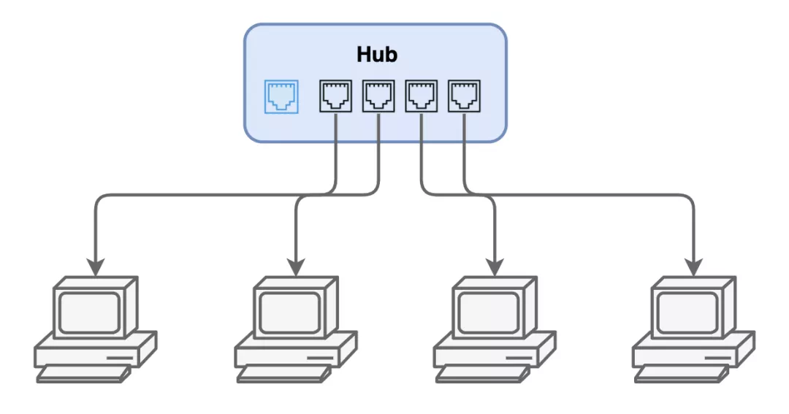
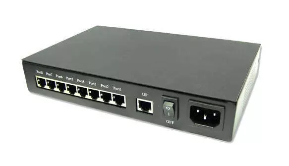
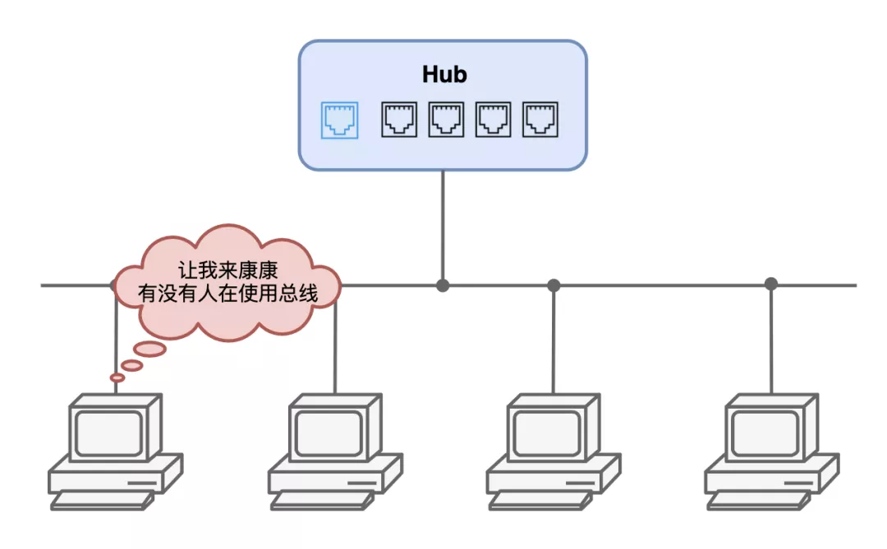
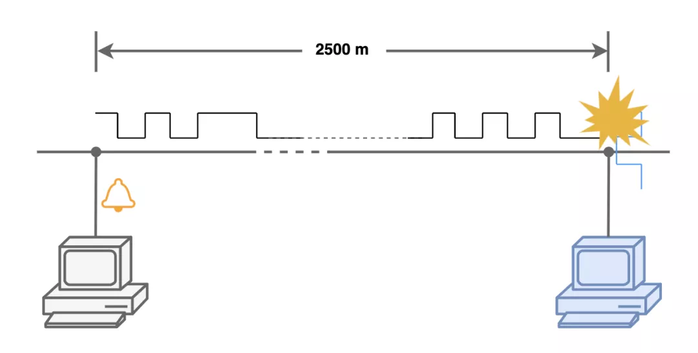
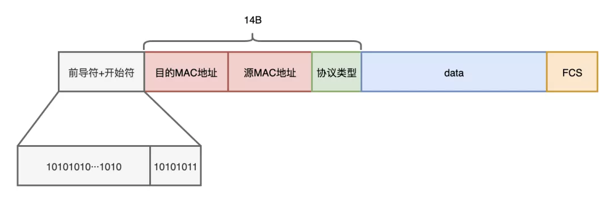
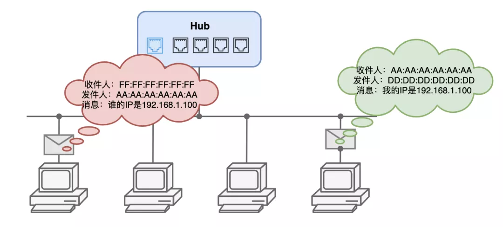
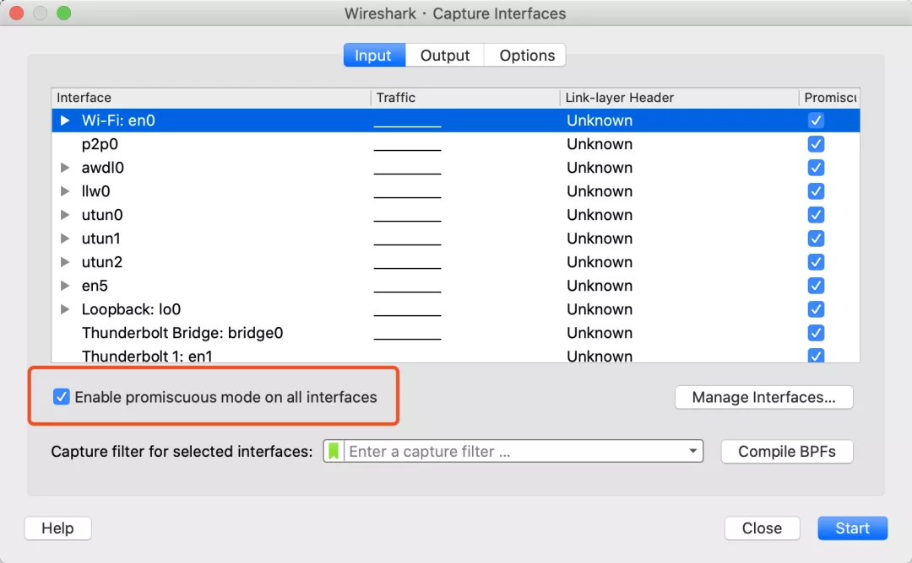
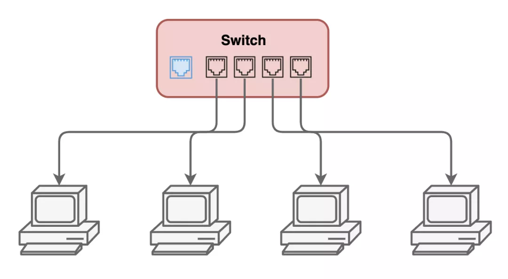

## **阿Q造访**

我是一个**网卡**，居住在一个机箱内的主板上，负责整台计算机的网络通信，要是没有我，这里就成了一个信息孤岛了，那也太无聊了～

上个周末，服务器断电维护了，这是我难得的休息时间，我准备打个盹儿眯一会儿。

这才刚合上眼，CPU一号车间的**阿Q**跑过来串门了。

“怎么是你小子，听说你背后说了我很多坏话啊！今天怎么想起找我来了”

“网卡老哥，你这都听谁造的谣，我想来拜访你很久了，这不平时工作太忙抽不开身，今天停电了一有空就找你来了嘛！”，阿Q笑着说到。

“你可是大忙人，无事不登三宝殿，说吧，找我什么事儿”

阿Q露出了尴尬而不失礼貌的微笑，“那我就开门见山了，这不年底了吗，咱们厂里最近评优呢，想学点网络知识，特来向你讨教讨教”

“就这啊，好说好说，来里边坐”，我招待阿Q进门坐下。

刚刚落座，阿Q就忍不住提问：“老哥，你们网卡是怎么工作的？听说你可以抓到别的主机通信的数据包？可以给我露一手吗？”

“唉，现在不行了”，我叹了一口气。

“咋了这是？”

我抬头凝望，开始给阿Q讲起了我的故事。

## **集线器时代**

很久很久以前，那时候网络中的各个计算机都是通过一个叫**集线器Hub**的家伙来相连的，通过集线器，我们大家在物理上构成了一个星型的网络，还给取了个名字：**以太网**。那时候我们的传输速度能做到10Mbps，在那个年代，已经非常了不起了！。

集线器这家伙，不知道该说他笨，还是该说他懒，他从来不会管数据是谁发给谁，只是一个没有感情的转发机器，工作在物理层，把收到的信号做一个增强处理后就一股脑的发给所有端口。

这样一来，我们在逻辑上就变成了一个总线型网络了。总线属于公共资源，由所有连接在上面的主机共享，有人在传输数据的时候其他人就得等着，不然数据就会发生冲突，全乱套了。

为了让大家都能和平共处，不必为了争抢线路发生不愉快，我们制定了一套规则：**CSMA/CD**。

每次要发送数据之前，我都得要监听一下线路上是否空闲，如果有别人在传输数据，那我就得等待。至于等待多久，我也不知道，因为这是一个随机值。

等到空闲的时候，我就可以发送数据了。不过一边发送，我还得一边检测是否有冲突发生，因为说不定有别人跟我一样以为现在空闲都在发送数据呢！

所以这就是CSMA/CD——**载波侦听多路访问/冲突检测**名字的来历了。

但是如果数据的长度太短，我很快就发送完了，结果先头部队还在路上，这之后再遇到冲突那我就发现不了了。为了应对这种情况，我们还得考虑即便是在极端情况下发生冲突，我们还是能够检测到。

我们这个网络能够支持的最远距离是2500米，极端情况下，到达最远端的时候冲突才发生。冲突信号得赶在我发送完最后一个bit之前传回来，这一来一回就是5000米。

线路上的信号跑个来回需要57.6微秒，我们的传输速度是10Mbps，一个来回的时间我就能发送576bit，也就是72个字节，除开8个字节的帧前导符和帧开始符，剩下的以太网帧长度不能低于**64**个字节，这样就算在最远两端发生的碰撞冲突都能及时传递回去被检测到。

有了这套协议，大家再也不用争抢，可以专心工作了。

“我说为什么非得要至少64字节你才发送，原来还有这段历史呢！那你们具体是怎么收发数据的呢？”，说到这儿，阿Q打断了我。

“那你听我继续给你说”

## **数据收发过程**

我每天的工作就是接收、发送数据包，操作系统把数据交给我以后，我就按照以太网的数据格式，把数据封装成一个个的以太网帧发出去

帧的头部有收件人和发件人的地址，我们叫它MAC地址，这是我们每个网卡的身份证号码，从我们出生那一刻起就确定了。

发件人是我的MAC地址，但收件人地址我不知道啊！操作系统协议栈部门交给我的数据包只有IP地址，我们又不认识这个，我们收发数据帧只用MAC地址。

为了解决这个问题，我们又制定了一套协议：**ARP**，地址解析协议，来实现这两个地址的转换。在不知道IP对应的MAC地址时候，就发送一个广播，这个广播的发件人地址填我的，然后收件人地址是**FF:FF:FF:FF:FF:FF**，这是一个特殊的MAC地址，我们约定好了每个人收到广播都要接收而不能丢弃。

这个广播里面填了IP地址，谁收到以后发现跟自己的匹配上就来应答我，这样我就能知道对方的MAC地址了，接下来就能通信了。

当然，为了避免每一次都去询问一遍浪费时间，我会把查询过的记录缓存起来，下次就能直接用啦。

不过这样做也有安全风险，要是有人冒充真正的收件人给我回信，我也没办法分辨，这就叫**ARP欺骗**。

“唉，等等，你还是给我讲讲你是怎么可以抓到别人的通信数据吧，我对这个更有兴趣。”，阿Q又一次打断了我。

因为集线器这家伙闭着眼睛到处转发，所以不管是谁发的数据，所有人都可以看到。

就因为这样，总线中每天有大量数据在流动，但我通常也不会全部都抓下来交给你们处理，不然你们CPU的人估计要骂死我了。所以我每次拿到一个数据帧，就会检查它的收件人是不是我，如果不是那就直接丢弃了，当然，前面我说的广播消息例外。

我能抓到别人通信数据的秘密就在于：我提供了一种工作模式叫做**混杂模式**，这种模式下，我就会把总线中我看到的所有数据帧全部都抓下来交给你们CPU去处理，一般都是一些抓包软件才会要求我这么做，但也有一些流氓软件和病毒木马经常让我抓别人的数据包，这样他们就能**嗅探**网络中的其他主机的通信了。

我并不喜欢这样，因为每次一开启混杂模式，我和你们CPU就忙的要死，主板上的风扇都会疯狂的转起来。

“原来是这样，那你开启混杂模式给我露一手看看呗，可以看到别人的通信数据，这也太刺激了！”，阿Q又又又一次打断了我。

“你别着急，听我继续说嘛，别老是打断我，而且现在停电了，我想露一手也露不了啊？”

“好好好，你继续，继续，我不插嘴了。”

## **交换机时代**

不知道从什么时候开始，就算我开启混杂模式，也抓不到别人的数据包了，因为我发现网络中的数据包只有跟我相关的了。

后来一打听才知道，不只是我一个网卡这样，别的也一样。

原来集线器那家伙退休了，新来了一个叫**交换机**的大佬取代了他的位置。

这位大佬名不虚传，他不只是简单的把大家连接在一块儿，它还会学习，用一张表把大家的MAC地址和连接的端口号记录下来。每次收到数据后，它只转发给对应的端口，而不会像集线器那样到处转发，我再也看不到别人的通信数据了！

“啊？交换机那家伙可真多事！”，阿Q露出了失望的表情。

这也是件好事啊，交换机大佬不用到处转发数据占用线路，相当于把**冲突域**进行了隔离，我连接的线路上只有我自己的数据，没有别人的数据，就不会和别的主机传输数据发生冲突了。不仅如此，我们连接的网线也进行了升级换代了，现在我们可以**全双工通信**，一边收一边发，也不用和交换机发给我的下行数据发生冲突！

**隔离冲突域+全双工通信**，现在再也不用CSMA/CD，因为不会有冲突发生，可以随心发送数据了，真是爽太多了！我们的传输速度也是日新月异，从10Mbps到100Mbps，再到1000Mbps，越来越快，这在以前想都不敢想。

阿Q点了点头说到：“厉害了，网卡老哥！真是塞翁失马焉知非福”

说完，CPU六号车间的小六出现在了门口，只见他满头大汗的说到：“Q哥，到处找你都找不到，原来你在这，快回去，领导叫我们出趟差”

*未完待续······*