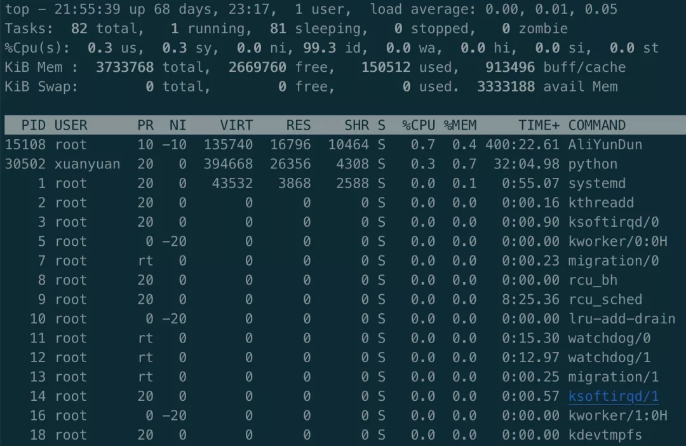
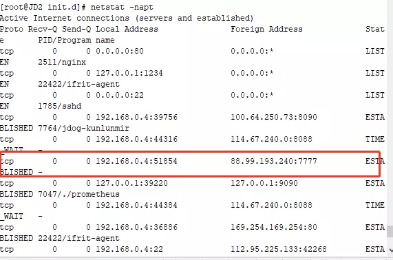
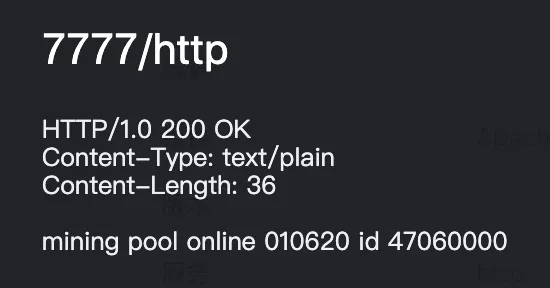
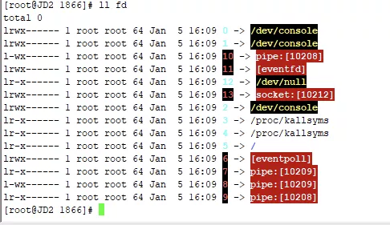

本故事根据上次的挖矿病毒事件改编

傍晚时分，警报声乍起，整个Linux帝国都陷入了惊恐之中。


安全部长迅速召集大家商讨应对之策。

“诸位，突发情况，CPU占用率突然飙升，并且长时间没有降下来的趋势，CPU工厂的阿Q向我们表达了强烈抗议”

这时，一旁的**kill**命令说到：“部长莫急，叫**top**老哥看一下谁在占用CPU，拿到进程号pid，我把他干掉就好了”

此言一出，在座的大伙都点头赞许，惊恐之色稍解。

top命令站了起来，面露得意之色，说到：“大家请看好了”，说完，打印出了当前的进程列表：



众人瞪大了眼睛，瞅了半天，也没看出哪个进程在疯狂占用CPU，top老哥这下尴尬了。

这时，一旁的**ps**命令凑了上来，“让我来试试”

ps命令深吸了一口气，也打印出了进程列表。

然而，依旧没有任何可疑的进程。

“你俩怎么回事，为什么没有？”，安全部长有些不悦。

“部长，我俩都是遍历的 **/proc/** 目录下的内容，按理说，所有的进程都会在这里啊，我也想不通为什么找不到···”，top老哥委屈的说到。

“遍历，怎么遍历的？”

“就是通过**opendir/readdir**这些系统调用函数来遍历的，这都是帝国提供的标准接口，应该不会出错，除非···”，说到这，top打住了。

“除非什么？”

“除非这些系统调用把那个进程给过滤掉了，那样的话我就看不到了，难道有人潜入帝国内核，篡改了系统调用？”

安全部长瞪大了眼睛，真要如此，那可是大事啊！

眼看部长急的团团转，一旁的**netstat**起身说到：“部长，我之前结识一好友，名叫**unhide**，捉拿隐藏进程是他的拿手好戏，要不请他来试试？”

部长大喜，“还犹豫什么，赶紧去请啊！”

“已经联系了，随后就到”

部长看着**netstat**，说到：“正好，趁着这个功夫，你先来看看现在有没有对外可疑的连接”

netstat点了点头，随后打印出了所有的网络连接信息：



“来来来，你们挨个来认领，看看都是谁的”，部长说到。

“这个80端口的服务是我的”，nginx站了出来。

“这个6379端口服务是我的”，redis也站了出来。

“这个，9200是我的”，elasticsearch说到。

“3306那个是我的”

“8182是我的”

······

一阵嘈杂后，只剩下一个连接无人认领：

```
tcp   0    0 192.168.0.4:51854      88.99.193.240:7777    ESTABLISHED  -
```

“部长，这八成就是躲在暗处那家伙的连接”，netstat说到。

安全部长思考片刻问到：“**curl**何在？来访问下这个IP地址，探探对方虚实”

curl站了出来，“来了来了”

curl小心翼翼的发送了一个HTTP请求过去，对方竟然回信了：



一行醒目的**mining poll**出现在大家面前。

“挖，挖矿病毒！”，top老哥叫了出来。

这一下，在场所有的人都倒吸了一口凉气。

部长赶紧叫防火墙**firewall**配置了一条规则，将这条连接掐断。

就在这时，**unhide**走了进来。

简单了解了情况后，unhide拍拍胸脯说到：“这事交给我了，一定把这家伙给揪出来”

随后，unhide一阵操作猛如虎，输出了几行信息：

```
Found HIDDEN PID 13053
    Executable: "/usr/bin/pamdicks"
    $USER=root

Found HIDDEN PID 13064
    Executable: "/usr/bin/pamdicks"
    $USER=root
```

众人皆凑了过来，瞪大了眼睛，unhide老哥果然不是盖的，果真发现了几个可疑分子。

top有点表示怀疑，问到：“敢问兄台用的什么路数，为何我等都看不到这几个进程的存在？”

unhide笑道：“没什么神秘的，其实我也是遍历 **/proc/** 目录，和你们不同的是，我不用**readdir**，而是从进程id最小到最大，挨个访问 **/proc/$pid** 目录，一旦发现目录存在而且不在ps老哥的输出结果中，那这就是一个隐藏进程。”

一旁的ps笑道：“原来还有我的功劳呐”

“找到了，就是这家伙！”，netstat大声说到。



“你怎么这么肯定？”部长问到。

“大家请看，进程打开的文件都会在 **/proc/pid/fd** 目录下，socket也是文件，我刚看了一下，这个进程刚好有一个socket。再结合/proc/tcp信息，可以确定这个socket就是目标端口号7777的那一条！”

“好家伙！好家伙”，众人皆啧啧称赞。

“还等什么，快让我来干掉它吧！”，**kill**老哥已经按捺不住了。

“让我来把它删掉”，**rm**小弟也磨刀霍霍了。

部长摇头说到：“且慢，**cp**何在，把这家伙先备份到隔离目录去，以待秋后算账”

cp拷贝完成，kill和rm两位一起上，把背后这家伙就地正法了。

top赶紧查看了最新的资源使用情况，惊喜的欢呼：“好了好了，CPU占用率总算降下去了，真是大快人心”

天色已然不早，没多久，众人先后离开，帝国恢复了往日的平静。

不过，安全部长的脸上，仍然是一脸愁容。

“部长，病毒已经被清除，为何还是闷闷不乐呢？”，助理问到。

“病毒虽已清除，但却不知这家伙是如何闯入的，还有背后暗中保护隐藏它的人又是谁，这实让我在很忧心啊”


不知不觉夜已深，帝国安全警报突然再一次响了起来。

“这又是怎么回事？”，部长厉声问到。

“部长，**rm**那小子是假冒的，今天他骗了我们，病毒根本没删掉，又卷土重来了！”

部长望向远处的天空，CPU工厂门口的风扇又开始疯狂地转了起来···


今天的文章就完啦，下面说一件大大大事儿···