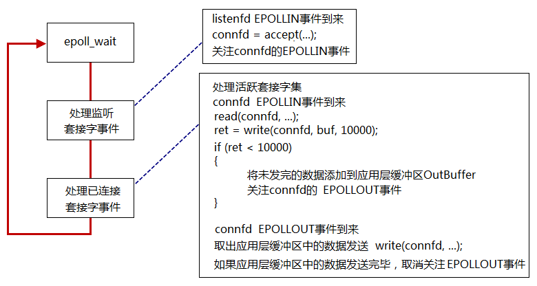
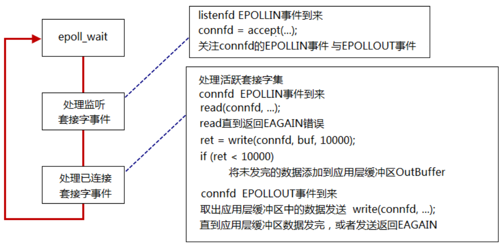

##### LT 模式

在 `connfd = accept(listenfd,...)` 获得监听套接字`connfd`之后，不能立即监听`connfd`的`EPOLLOUT`事件，因为刚获得`connfd`的接受缓冲区肯定是空的，一直处于高电平，处于可写状态。如果此时就监听那么将一直触发`epoll_wait`函数，会一直等待写，消费CPU资源。这个现象即`busy loop`。 正确的流程 :

在第一次你 *`n=write(connfd, buffer, sizeof(BUFFER))`* 之后，根据函数返回值`n`有两种情况：

- `n == sizeof(buffer)`

  即已将应用层 `OutBuffer` 的数据全部发送数据了，那么只是需要等待下次用户发送数据

- `n==-1 && erron = EWOULDBLOCK/EAGAIN`.

  这个是 `socket`的发送缓冲区已经满了，无法再发送数据。因此非阻塞模式下的`write/send` 会立即返回-1，并且将错误码`erron` 设置为 `EWOULDBLOCK/EAGAIN`，此时需要做两件事：

  1. 需要将未发完的数据添加到应用层缓冲区 `OutBuffer`
  2. **关注 `connfd` 的 `EPOLLOUT` 事件**

  然后等待 `connfd` 的 `EPOLLOUT` 事件的到来：取出应用层的缓冲区中的数据继续发送 *`write(connfd, ...)`* 。如果应用层缓冲区中的数据发送完毕，**取消关注`EPOLLOUT`事件**。因为不取消，`sokcet` 发送缓冲区为空后，又会触发`EPOLLOUT`，但是此时数据已经发送完毕，又会陷入`busy loop。`

**[应用层的流量控制]**：如果对端出现故障或者什么原因，导致对端一直不接受数据，而发送端还是一直发送数据，会导致 `outBuffer_`超过一定阈值，就是可以切除这个连接。或者其他处理。

- `n==-1`：如果此时错误码不等于上述的和 `EINTR` ，那么就对端可能已经崩溃，需要直接关闭连接

**muduo LT模式下发送数据源码展示**

```cpp
void TcpConnection::sendInLoop(const void* data, size_t len) {
  loop_->assertInLoopThread();
  ssize_t nwrote   = 0;
  size_t remaining = len;
  bool faultError  = false;
  if (state_ == kDisconnected)
  {
    LOG_WARN << "disconnected, give up writing";
    return;
  }

  /// 如果没有关注可写事件 且 @b outputBuffer_ 中无待发送数据，说明之前的数据都已经写完
  /// 对于 用户来说是向 @b outputBuffer_ 中写，
  /// 对于 @c socket 来说是从  @b outputBuffer_ 中读取
  /// if no thing in output queue, try writing directly
  if (!channel_->isWriting() && outputBuffer_.readableBytes() == 0)
  {
    nwrote = sockets::write(channel_->fd(), data, len);
    if (nwrote >= 0)
    {
      remaining = len - nwrote;
      // 全部写完了，那么就执行写完成回调
      if (remaining == 0 && writeCompleteCallback_)
      {
        loop_->queueInLoop(std::bind(writeCompleteCallback_, shared_from_this()));
      }
    }
    else // nwrote < 0
    {
      nwrote = 0;
      /// socket 的发送缓冲已经满，无法将 outputBuffer_ 的数据都复制到 socket 的发送缓冲区
      /// 非阻塞模式下，函数返回 -1,errno == EWOULDBLOCK
      /// 如果错误码不是EWOULDBLOCK，那么是真的产生错误了，需要关闭连接
      if (errno != EWOULDBLOCK) 
      {
        LOG_SYSERR << "TcpConnection::sendInLoop";
        if (errno == EPIPE || errno == ECONNRESET) // FIXME: any others?
        {
          faultError = true;
        }
      }
    }
  }

  assert(remaining <= len);
  /// @brief: 运行到这有两种可能：
  /// 1 之前没有注册可写事件，且 @b outputBuffer_ 中没有可读取数据，
  /// 	运行到此是因为此次数据 data 没有发送完
  /// 2 之前的数据没有发送完，又来了新的数据
  /// 无论哪种情况，处理方式：
  ///  将数据复制到  @b outputBuffer_ 中，关注 @b EPOLLOUT 事件，等待可写事件触发，发送数据
  if (!faultError && remaining > 0)
  {
    size_t oldLen = outputBuffer_.readableBytes();
    // 待发送的内容已经超过标志位了，就调用高水位这个函数
    if (oldLen + remaining >= highWaterMark_  &&
        oldLen < highWaterMark_  &&
        highWaterMarkCallback_)
    {
      loop_->queueInLoop(std::bind(highWaterMarkCallback_, 
                                   shared_from_this(), 
                                   oldLen + remaining));
    }
    /// 将剩余的内容加如 @b outbuffer_
    outputBuffer_.append(static_cast<const char*>(data)+nwrote, remaining);

    /// 在LT 模式下不需要重复关注可写事件，即使运行到此的第二种情况不需要再关注可写事件
    if (!channel_->isWriting())
    {
      channel_->enableWriting();
    }
  }
}

/// @brief: 写回调函数
void TcpConnection::handleWrite()
{
  loop_->assertInLoopThread();
  /// 触发写回调函数
  /// 将 @b outputBuffer_ 中的数据复制到 @b socket 的发送缓冲区
  if (channel_->isWriting())
  {
    ssize_t n = sockets::write(channel_->fd(),
                               outputBuffer_.peek(),
                               outputBuffer_.readableBytes());
    if (n > 0)
    {
      outputBuffer_.retrieve(n);
      /// 如果 @b outputBuffer_ 中的数据全部写完，
      /// 那么就可以取消关注 @b EPOLLOUT ，防止出现 busy loop
      /// 并且调用写完成回调函数
      /// 如果全部写完，此时就需要取消关注可写事件
      /// 如果 @b outbuffer_ 中还有数据，就继续等待下次可写事件的触发
      if (outputBuffer_.readableBytes() == 0)
      {
        channel_->disableWriting();
        if (writeCompleteCallback_)
        {
          loop_->queueInLoop(std::bind(writeCompleteCallback_, shared_from_this()));
        }
        if (state_ == kDisconnecting)
        {
          shutdownInLoop();
        }
      }
    }
    else
    {
      LOG_SYSERR << "TcpConnection::handleWrite";
      // if (state_ == kDisconnecting)
      // {
      //   shutdownInLoop();
      // }
    }
  }
  else
  {
    LOG_TRACE << "Connection fd = " << channel_->fd()
              << " is down, no more writing";
  }
}    
```

流程展示：



##### ET模式

在ET模式下正确的流程：在 `connfd = accept(listenfd,...)` 之后就可以关注`connfd`的可读/可写事件，在触发可读/可写事件之后

- 读操作要一直到读到函数 `read` 返回 `EAGAIN`

  触发 `EPOLLIN` 事件后，如果 `connfd` 的接受缓冲区中的数据没有读取完毕，那么当 `connfd` 的又接受到新的缓冲区数据时，`EPOLLIN`事件不会触发。因为之前的数据没有读取完，处于高电平状态，此时又来新的数据并没有改变电平状态，因此即使有新的数据到来也无法触发 `EPOLLIN`。此时就会导致严重的丢包、数据混乱问题。

- 写操作要一直写到发送缓冲区`outBuffer_`为空，或者函数返回`EAGAIN`

  上面的 `epoll LT` 模式注册一次监听可写事件后，可写事件触发后，尝试发送`outBuffer_`中的剩余数据，如果数据此时还不能全部发送完，不用再次注册可写事件。

  如果是 `epoll ET` 模式，注册监听可写事件后，可写事件触发后，尝试发送数据，如果数据此时还不能全部发送完，**需要再次注册可写事件以便让可写事件下次再次触发（给予再次发数据的机会）**。

```
当然，这只是理论上的情况，实际开发中，如果一段数据反复发送都不能完全发送完（例如对端先不收，后面每隔很长时间再收一个字节），我们可以设置一个最大发送次数或最大发送总时间，超过这些限定，我们可以认为对端出了问题，应该立即清空发送缓冲区并关闭连接
```

流程展示



**[面试题]**：阻塞型和非阻塞型文件描述符，都能用epoll的LT和ET模式吗？

```
阻塞模式下不能用 ET，非阻塞下都可以。
```

ET模式下每次 `write` 或 `read` 需要循环 `write` 或 `read` 直到返回 `EAGAIN` 错误。以读操作为例，这是因为ET模式只在 `socket` 描述符状态发生变化时才触发事件，如果不一次把 `socket` 内核缓冲区的数据读完，会导致`socket` 内核缓冲区中即使还有一部分数据，该 `socket` 的可读事件也不会被触发。

根据上面的讨论，若ET模式下使用阻塞IO，则程序一定会阻塞在最后一次`write/read`操作，因此说`ET`模式下一定要使用非阻塞IO。

**[面试题]：**为什么要设计个 Buffer 类

```
对于读事件：一次性scoket数据全部读取到 `inputBuffer_`，避免一直触发 `epoll_wait`，对于LT模式一样，比ET模式更加高效，只是触发一次read，而ET至少需要读取两次。对于ET模式也可以尽量一次性读取完数据，避免数据残留。
对于写事件：能更加高效的实现发数据，避免阻塞等待，还可以实现流量控制
```

##### LT与ET总结

- 读数据

  LT 模式下，读事件触发后，可以按需收取想要的字节数，不用把本次接收到的数据收取干净（即不用循环到 recv 或者 read 函数返回 -1，错误码为 `EWOULDBLOCK` 或 `EAGAIN`）

  ET 模式下，读事件必须把数据收取干净，因为你不一定有下一次机会再收取数据了，即使有机会，也可能存在上次没读完的数据没有及时处理，造成客户端响应延迟。

- 写数据

  LT 模式下，不需要写事件一定要及时移除 `EPLLOUT`，避免不必要的触发，浪费 CPU 资源；

  ET 模式下，写事件触发后，如果还需要下一次的写事件触发来驱动任务（例如发上次剩余的数据），你需要继续注册一次检测可写事件。

  靠事件来触发，即检测到可写事件才写数据，而不是主动的写数据。

  发送数据是否需要继续注册可写事件与可写事件的移除？