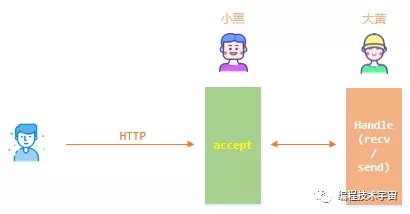
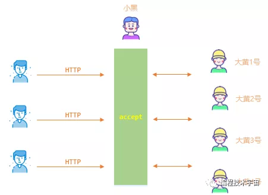
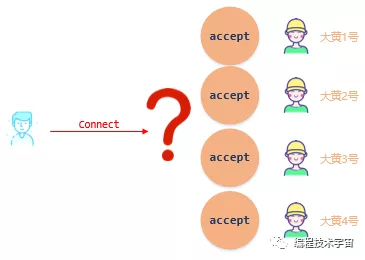
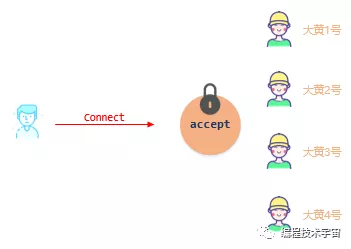
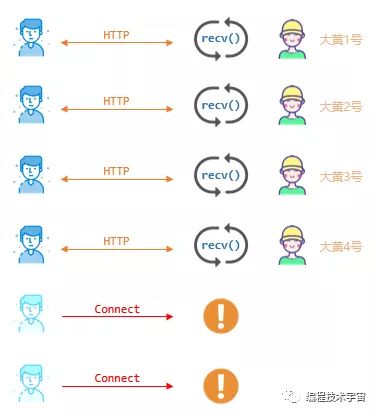
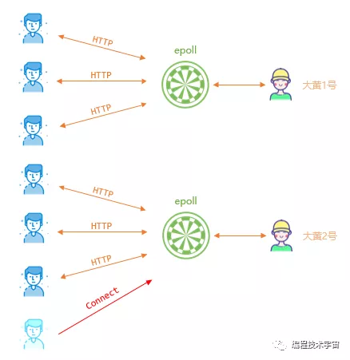

**前情回顾**：

NextStep帝国推出的web服务，迅速风靡比特宇宙，各星系帝国均蠢蠢欲动，想在这一波浪潮中掘一桶金。

详情参见：[万维网的诞生](http://mp.weixin.qq.com/s?__biz=MzAwMjc3NDQ1Mw==&mid=2247483792&idx=1&sn=3377e7ac7f1f935aa4a306619cb7a5cb&chksm=9ac4054aadb38c5c03201f27cba9b5953e1b8b06241bc3b2d4c77e8a7d2d47f2274c7ee6b707&scene=21#wechat_redirect)

1

**初出茅庐**

小马哥和他的小伙伴小黑、大黄来到陌生的Linux帝国，准备在这里闯出一片天地。

不久，他们成立了一家Web服务器公司，小黑负责网络接待，进来的客户交给大黄，大黄负责处理请求，读取HTML文件交给客户，小马哥当总管，开始了他们的创业之旅。

虽然人少，但大家分工合作，齐心协力，小公司也还是慢慢走上正轨。

2

**fork分身术**

公司的发展出乎他们的意料，浏览网页的请求越来越多，小黑开始抱怨大黄处理太慢。大黄也很无奈，明明自己已经很努力了。小黑催的紧，一着急数据处理错误，把整个进程都搞崩溃了。

晚上的总结会上，小黑表达了不满：大黄你还得加把劲啊，你看我这队列里都接待了这么多客户进来，他们都等着你办业务，你也太慢了。而且忙起来也不能乱啊，把进程搞崩溃，这不是连累大家嘛！

大黄心里委屈，可是今天确实因为自己把进程搞崩溃了，连累大家。面对小黑的数落，只好默不作声。

小马哥看在眼里，打破沉默：这事不能怪大黄，业务量大了，他一个人忙不过来。我听说Linux帝国有一个fork大法，大黄你从小黑那里拿到请求后就使用fork大法，去一个单独的进程的处理这个请求吧。

大黄抬起头来：fork不是叉子的意思吗，fork大法是什么？

小马哥：我也了解不太多，听说这叫分身术，执行fork可以把当前进程复制一份。

大黄听得迷迷糊糊：这么神奇？

小马哥：听行业巨头Apache公司的人说的，他们就是用的fork大法，你去研究下。

第三天，大家按照新的办法来运行，果然见效，小黑接进来的客户，大黄马上就拿过来执行fork，产生一个分身，在新的进程中处理。仿佛长了三头六臂，效率高了不少，即便偶尔还会处理出错，也只是把那个独立进程弄崩溃，主进程还是稳稳当当运转，不影响业务。

3

**惊群效应**

就这样过了一段时间，小马哥注意到大黄每次都要去磁盘读取网页文件，费时费力，于是召开公司会议，宣布了两项决定：

1、调小黑去成立新的缓存管理部门，原来小黑负责的网络接待工作交给大黄一起做。

2、提前执行fork，分身出几个进程准备着，而不在客户来临时才执行分身。

很快，大黄接过原来小黑的活，开始独挑大梁。

不过新的麻烦又来了！刚工作半天，大黄又来到小马哥办公室。

大黄：马哥，这网络接待这活不好干啊，以前是小黑一个人处理，接待完我来服务，没啥问题。但现在换我来接待，我有多个分身，每个分身都在执行accept函数等客户来，结果就是每来一个客户，所有分身都来接待，实际只有一个接待成功，其他几个分身白跑一趟，浪费表情！

小马哥：唉，你看我这脑袋，忘了叮嘱你了。前几天去Apache公司技术交流时提到过这事，这是Linux帝国的缺陷，叫**惊群效应**，已经有好几家公司联名向帝国反映了。目前没有什么好的办法，你在执行accept前加一把锁来同步你的多个分身进程吧！

大黄：嗯，也只好这样了，帝国要是出了新政修复这个问题，记得告诉我声哈！

4

**多路复用**

随着公司业务的快速发展，大黄的工作压力也越来越大，虽然fork多进程可以多派人手，但这一招也不是包治百病，毕竟帝国资源有限，进程多了以后频繁的线程切换，大量的时间花在线程调度上，大黄真正处理业务的时间反而变少了。

小马哥看到了大黄的窘迫，找到大黄说：你看，现在业务很多，你分身出来的这些进程，却有好多都是闲着的，这不浪费资源吗？

大黄：这没办法啊，这些进程接待上一个客户还没接待完呢，客户没有断开连接，只能继续等着，等他下一步的请求。

小马哥：这就是明显的人力浪费嘛，新的客户来了没办法接待，而你却还在干等着，这不行。

大黄：额，这个······

小马哥：我听隔壁Apache的员工说他们用一个叫select的多路复用技术，不用干等着，有消息会自动通知你们来处理，你们就可以腾出手来处理其他客户的请求了。

大黄：好的，我去研究下。

又过了几天后。。。

大黄：马哥，我研究了下那个select多路复用，确实不错，但是有个缺点，当我添加了多个需要关注的客户后，有消息来了的时候，select它不告诉我到底是哪个客户来请求了，我还得一个个检查，客户多了，浪费太多时间。

小马哥：那还是比你干等着不能接待其他客户强吧，先用起来，别挑了。

大黄：马哥别急，我还从Apache公司打听到，他们还在用一个叫epoll的多路复用技术，这个比select好多了，它不仅告诉我有消息来了，还告诉我哪些客户有消息，不用我去一个个检查，省事！

小马哥：你小子还给我藏一手，既然这么好，赶紧用起来。

很快，大黄用上了新的技术，处理起网络请求效率成倍提高，工作越发的得心应手。

公司的业务也是发展迅速，公司规模不断扩张，招了不少新人，连隔壁Apache公司都眼红了起来。

这天，小马哥召集大家开会，宣布了一项决定：公司发展迅猛，为了公司的品牌形象，决定起一个响亮的名字，我已经想好了，就叫**nginx**。

未完待续·······

**彩蛋**

一天，小马哥的办公司来了一位美女。

“马总你好，我叫小雪，是tomcat公司市场部的，现在动态网页技术这么火，贵司不考虑拓展下业务吗？”

“动态网页技术？这是什么东西”

欲知后事如何，请关注后续精彩......