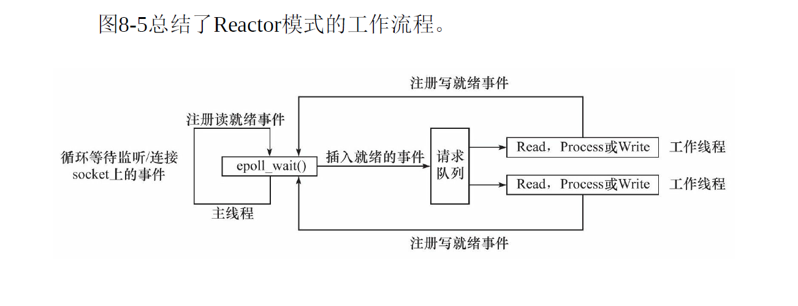

#### 4. `Reactor`和`Proactor`区别

- Reactor 模式

  `Reactor` 是这样一种模式，它要求主线程只负责监听文件描述上 是否有事件发生，有的话就立即将该事件通知工作线程。除此之外，主线程不做任何其他实质性的工作。读写数据，接受新的连接，以及处理客户诮求均在工作线 程中完成。

  

- proactor

  与Reactor模式不同，Proactor模式将所有 I/O 操作都交给主线程和内核来处理，工作线程仅仅负责业务逻辑。