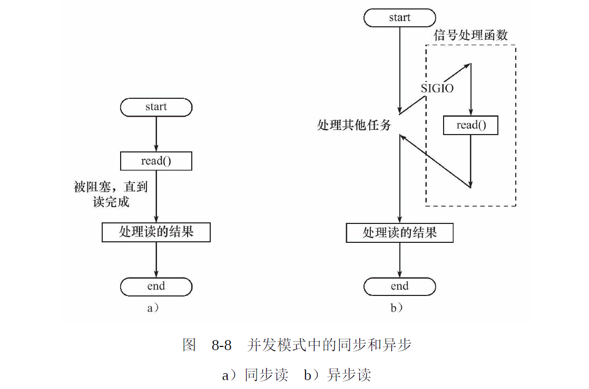
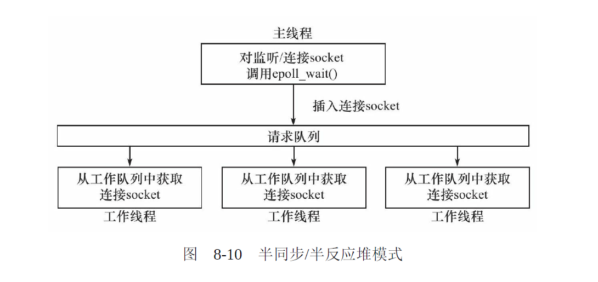
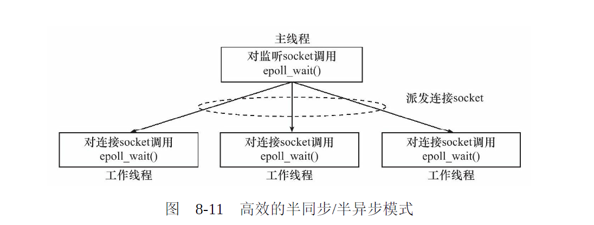

#### 5. 高效的并发模式-半同步半异步模型

此处的同步与前面的IO模式中的同步不是一个概念。

- 在IO模型中的，同步与异步区分的是内核向应用程序通知的是何种IO事件（是就绪事件还是完成事件），以及该谁来完成IO读写（是应用程序还是内核）。
- 在并发模式中，“同步”指的是程序完全按照代码序列的顺序执行：“异步” 指的是程序的执行需要由系统事件来驱动。常见的系统事件包括中断、信号等。

**半同步/半异步**
半同步/半异步模式结合了同步的简单与异步的效率。

半同步/半异步模式中，同步线程用于处理客户逻辑（工作线程）；异步线程用于处理 `I/O` 事件（主线程）。异步线程监听到客户诸求后，就将其封装成请求对象并插入诸求队列中。 诮求队列将通知某个工作在同步模式的工作线程来读取并处理该请求对象。

在服务器程序中， 如果结合考虑两种串件处理模式和几种l/0模烈， 则半同步/半异步模式就存在多种变体。其中有一种变体称为半同步/半反应堆(half-sync/half-reactive) 模式。如图

异步线程只有一个， 由主线程来充当。它负责监听所有socket 上的事件。

- 如果监听socket 上有可读事件发生， 即有新的连接请求到来，主线程就接受之以得到新的连接socket, 然后往epoll 内核事件表中注册该 连接socket 上的读写事件。
- 如果连接socket 上有读写事件发生， 即有新的客户请求到来或有数据要发送至客户端， 主线程就将该连接socket 插人请求队列中。所有工作线程都睡眠在请求队列上， 当有任务到来时， 它们将通过竞争（比如申诸互斥锁）获得任务的接管权。这种竞争机制使得只有空闲的工作线程才有机会来处理新任务， 这是很合理的。

但是这个模式仍然具有较多的缺点

因此诞生了更为高效的半同步/半反应堆模式，也是`muduo`采用的设计模式。

主线程只管理监听`socket`, 连接`socket`由工作线程来管理。 当有新的连接到来时， 主线程就接受之并将新返回的连接socket派发给某个工作线程， 此后该新的连接socket上的任何 I/O 操作都由被选中的工作线程来处理， 直到客户关闭连接。

每个线程（主线程和工作线程）都维持自己的事件循环，它们各自独立地监听不同的事件。 因此，在这种商效的半同步/半异步模式中， 每个线程都工作在异步模式， 所以它并非严格意义上的半同步/半异步校式。