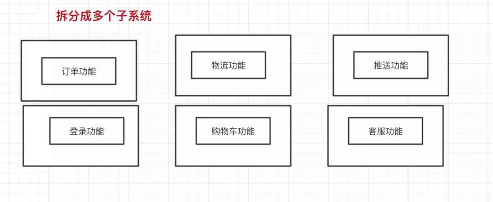
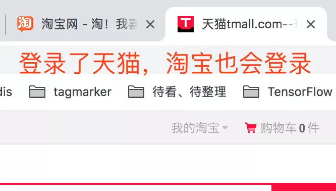
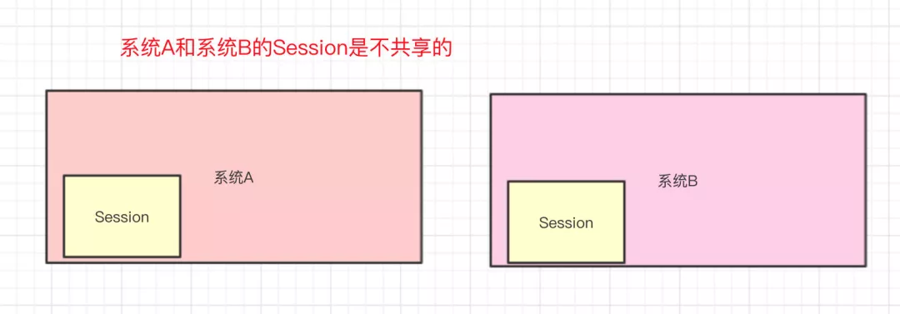
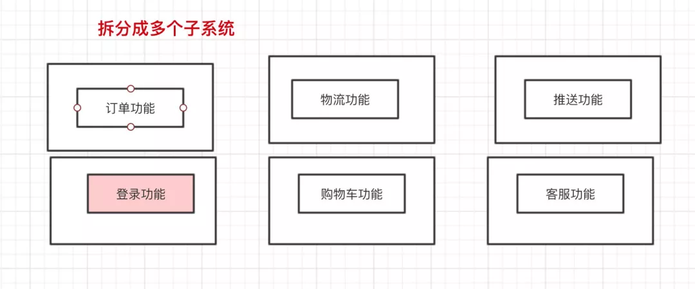
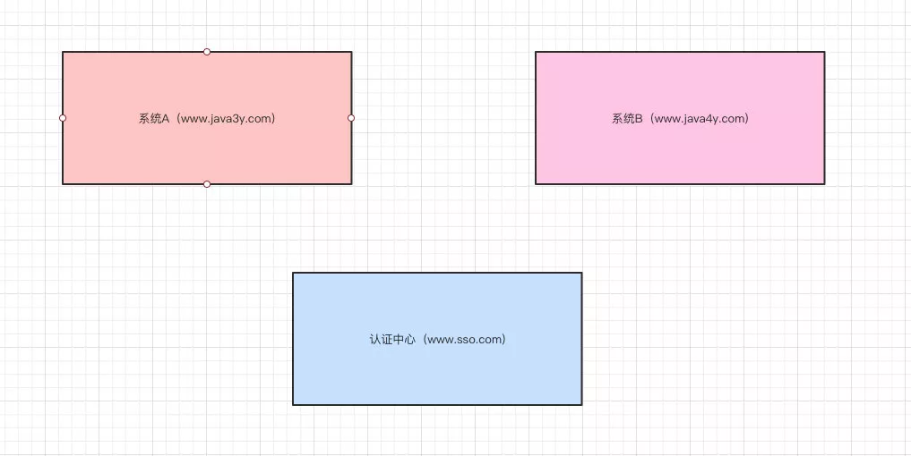
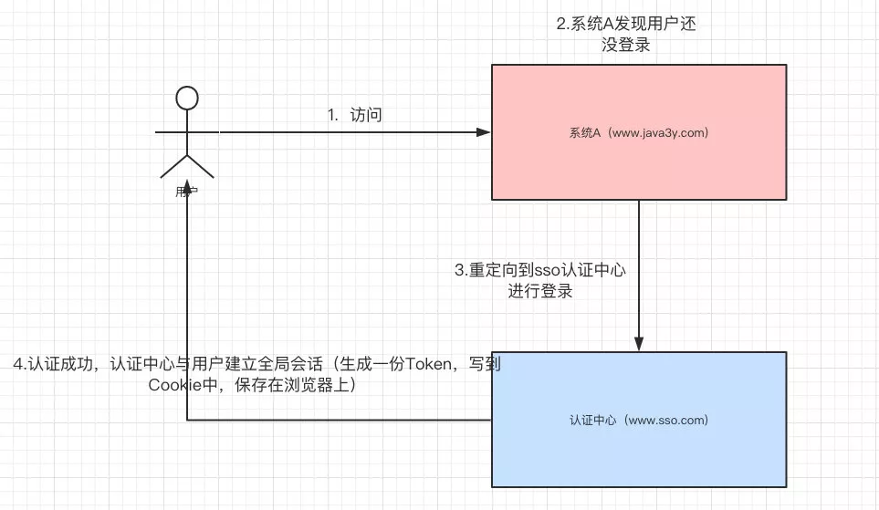
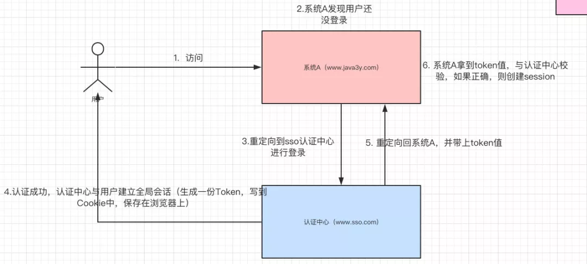
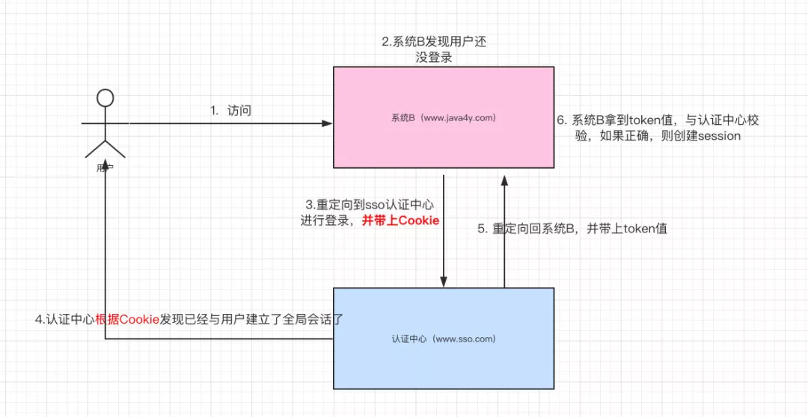

## 一、什么是单点登录？

单点登录的英文名叫做：Single Sign On（简称**SSO**）。

在**初学/以前**的时候，一般我们就**单系统**，所有的功能都在同一个系统上。

所有的功能都在同一个系统上

后来，我们为了**合理利用资源和降低耦合性**，于是把单系统**拆分**成多个子系统。

- 回顾：[分布式基础知识](https://mp.weixin.qq.com/s?__biz=MzI4Njg5MDA5NA==&mid=2247484335&idx=1&sn=a871bf871fcaffda0be40e1388a69d7d&scene=21#wechat_redirect)

拆分成多个子系统

比如阿里系的**淘宝和天猫**，很明显地我们可以知道这是两个系统，但是你在使用的时候，登录了天猫，淘宝也会自动登录。

登录了天猫，淘宝也登录了

简单来说，单点登录就是**在多个系统中，用户只需一次登录，各个系统即可感知该用户已经登录。**

## 二、回顾单系统登录

在我初学JavaWeb的时候，登录和注册是我做得最多的一个功能了（初学Servlet的时候做过、学SpringMVC的时候做过、跟着做项目的时候做过…），反正我也数不清我做了多少次登录和注册的功能了…这里简单讲述一下我们初学时是怎么做登录功能的。

众所周知，HTTP是**无状态**的协议，这意味着**服务器无法确认用户的信息**。于是乎，W3C就提出了：给每一个用户都发一个通行证，无论谁访问的时候都需要携带通行证，这样服务器就可以从通行证上确认用户的信息。通行证就是**Cookie**。

如果说Cookie是检查用户身上的”通行证“来确认用户的身份，那么Session就是通过检查服务器上的”客户明细表“来确认用户的身份的。**Session相当于在服务器中建立了一份“客户明细表”**。

HTTP协议是无状态的，Session不能依据HTTP连接来判断是否为同一个用户。于是乎：服务器向用户浏览器发送了一个名为JESSIONID的Cookie，它的值是Session的id值。**其实Session是依据Cookie来识别是否是同一个用户**。

所以，一般我们单系统实现登录会这样做：

- **登录**：将用户信息保存在Session对象中

- - 如果在Session对象中能查到，说明已经登录
  - 如果在Session对象中查不到，说明没登录（或者已经退出了登录）

- **注销（退出登录）**：从Session中删除用户的信息

- **记住我（关闭掉浏览器后，重新打开浏览器还能保持登录状态）**：配合Cookie来用

我之前Demo的代码，可以参考一下：

```
 /**
 * 用户登陆
 */
@PostMapping(value = "/user/session", produces = {"application/json;charset=UTF-8"})
public Result login(String mobileNo, String password, String inputCaptcha, HttpSession session, HttpServletResponse response) {

    //判断验证码是否正确
    if (WebUtils.validateCaptcha(inputCaptcha, "captcha", session)) {

        //判断有没有该用户
        User user = userService.userLogin(mobileNo, password);
        if (user != null) {
            /*设置自动登陆，一个星期.  将token保存在数据库中*/
            String loginToken = WebUtils.md5(new Date().toString() + session.getId());
            user.setLoginToken(loginToken);
            User user1 = userService.userUpload(user);

            session.setAttribute("user", user1);

            CookieUtil.addCookie(response,"loginToken",loginToken,604800);

            return ResultUtil.success(user1);

        } else {
            return ResultUtil.error(ResultEnum.LOGIN_ERROR);
        }
    } else {
        return ResultUtil.error(ResultEnum.CAPTCHA_ERROR);
    }

}

/**
 * 用户退出
 */
@DeleteMapping(value = "/session", produces = {"application/json;charset=UTF-8"})
public Result logout(HttpSession session,HttpServletRequest request,HttpServletResponse response ) {

    //删除session和cookie
    session.removeAttribute("user");

    CookieUtil.clearCookie(request, response, "loginToken");

    return ResultUtil.success();
}
/**
* @author ozc
* @version 1.0
* <p>
* 拦截器；实现自动登陆功能
*/
public class UserInterceptor implements HandlerInterceptor {


@Autowired
private UserService userService;

public boolean preHandle(HttpServletRequest request, HttpServletResponse response, Object o) throws Exception {
    User sessionUser = (User) request.getSession().getAttribute("user");

    // 已经登陆了，放行
    if (sessionUser != null) {
        return true;
    } else {
        //得到带过来cookie是否存在
        String loginToken = CookieUtil.findCookieByName(request, "loginToken");
        if (StringUtils.isNotBlank(loginToken)) {
            //到数据库查询有没有该Cookie
            User user = userService.findUserByLoginToken(loginToken);
            if (user != null) {
                request.getSession().setAttribute("user", user);
                return true;
            } else {
                //没有该Cookie与之对应的用户(Cookie不匹配)
                CookieUtil.clearCookie(request, response, "loginToken");
                return false;
            }
        } else {

            //没有cookie、也没有登陆。是index请求获取用户信息，可以放行
            if (request.getRequestURI().contains("session")) {
                return true;
            }

            //没有cookie凭证
            response.sendRedirect("/login.html");
            return false;
        }
    }
}
}
```

总结一下上面代码的思路：

- 用户登录时，验证用户的账户和密码
- 生成一个Token保存在数据库中，将Token写到Cookie中
- 将用户数据保存在Session中
- 请求时都会带上Cookie，检查有没有登录，如果已经登录则放行

如果没看懂的同学，建议回顾Session和Cookie和HTTP：

- [介绍会话技术、Cookie的API、详解、应用](https://mp.weixin.qq.com/s?__biz=MzI4Njg5MDA5NA==&mid=2247484755&idx=6&sn=3a370551b0ee800f3bcad8ff37a72b9d&scene=21#wechat_redirect)
- [Session介绍、API、生命周期、应用、与Cookie区别](https://mp.weixin.qq.com/s?__biz=MzI4Njg5MDA5NA==&mid=2247484755&idx=7&sn=fb35232f3c15e2b4336498ac9f8804f1&scene=21#wechat_redirect)
- [什么是HTTP](https://mp.weixin.qq.com/s?__biz=MzI4Njg5MDA5NA==&mid=2247484979&idx=2&sn=abe78c7ce58c15cb8b2e26602802e096&scene=21#wechat_redirect)

## 三、多系统登录的问题与解决

### 3.1 Session不共享问题

单系统登录功能主要是用Session保存用户信息来实现的，但我们清楚的是：多系统即可能有多个Tomcat，而Session是依赖当前系统的Tomcat，所以系统A的Session和系统B的Session是**不共享**的。

系统A的Session和系统B的Session是不共享的

解决系统之间Session不共享问题有一下几种方案：

- Tomcat集群Session全局复制（集群内每个tomcat的session完全同步）【会影响集群的性能呢，不建议】

- 根据请求的IP进行**Hash映射**到对应的机器上（这就相当于请求的IP一直会访问同一个服务器）【如果服务器宕机了，会丢失了一大部分Session的数据，不建议】

- 把Session数据放在Redis中（使用Redis模拟Session）【**建议**】

- - 如果还不了解Redis的同学，建议移步（[Redis合集](https://mp.weixin.qq.com/s?__biz=MzI4Njg5MDA5NA==&mid=2247484609&idx=1&sn=4c053236699fde3c2db1241ab497487b&scene=21#wechat_redirect)）

我们可以将登录功能**单独抽取**出来，做成一个子系统。

抽取出来成为子系统

SSO（登录系统）的逻辑如下：

```
// 登录功能(SSO单独的服务)
@Override
public TaotaoResult login(String username, String password) throws Exception {

    //根据用户名查询用户信息
    TbUserExample example = new TbUserExample();
    Criteria criteria = example.createCriteria();
    criteria.andUsernameEqualTo(username);
    List<TbUser> list = userMapper.selectByExample(example);
    if (null == list || list.isEmpty()) {
        return TaotaoResult.build(400, "用户不存在");
    }
    //核对密码
    TbUser user = list.get(0);
    if (!DigestUtils.md5DigestAsHex(password.getBytes()).equals(user.getPassword())) {
        return TaotaoResult.build(400, "密码错误");
    }
    //登录成功，把用户信息写入redis
    //生成一个用户token
    String token = UUID.randomUUID().toString();
    jedisCluster.set(USER_TOKEN_KEY + ":" + token, JsonUtils.objectToJson(user));
    //设置session过期时间
    jedisCluster.expire(USER_TOKEN_KEY + ":" + token, SESSION_EXPIRE_TIME);
    return TaotaoResult.ok(token);
}
```

其他子系统登录时，**请求SSO（登录系统）进行登录，将返回的token写到Cookie中**，下次访问时则把Cookie带上：

```
public TaotaoResult login(String username, String password, 
        HttpServletRequest request, HttpServletResponse response) {
    //请求参数
    Map<String, String> param = new HashMap<>();
    param.put("username", username);
    param.put("password", password);
    //登录处理
    String stringResult = HttpClientUtil.doPost(REGISTER_USER_URL + USER_LOGIN_URL, param);
    TaotaoResult result = TaotaoResult.format(stringResult);
    //登录出错
    if (result.getStatus() != 200) {
        return result;
    }
    //登录成功后把取token信息，并写入cookie
    String token = (String) result.getData();
    //写入cookie
    CookieUtils.setCookie(request, response, "TT_TOKEN", token);
    //返回成功
    return result;

}
```

总结：

- SSO系统生成一个token，并将用户信息存到Redis中，并设置过期时间
- 其他系统请求SSO系统进行登录，得到SSO返回的token，写到Cookie中
- 每次请求时，Cookie都会带上，拦截器得到token，判断是否已经登录

到这里，其实我们会发现其实就两个变化：

- **将登陆功能抽取为一个系统（SSO），其他系统请求SSO进行登录**
- **本来将用户信息存到Session，现在将用户信息存到Redis**

### 3.2 Cookie跨域的问题

上面我们解决了Session不能共享的问题，但其实还有另一个问题。**Cookie是不能跨域的**

比如说，我们请求`<https://www.google.com/>`时，浏览器会自动把`google.com`的Cookie带过去给`google`的服务器，而不会把`<https://www.baidu.com/>`的Cookie带过去给`google`的服务器。

这就意味着，**由于域名不同**，用户向系统A登录后，系统A返回给浏览器的Cookie，用户再请求系统B的时候不会将系统A的Cookie带过去。

针对Cookie存在跨域问题，有几种解决方案：

1. 服务端将Cookie写到客户端后，客户端对Cookie进行解析，将Token解析出来，此后请求都把这个Token带上就行了
2. 多个域名共享Cookie，在写到客户端的时候设置Cookie的domain。
3. 将Token保存在SessionStroage中（不依赖Cookie就没有跨域的问题了）

到这里，我们已经可以实现单点登录了。

### 3.3 CAS原理

说到单点登录，就肯定会见到这个名词：CAS （Central Authentication Service），下面说说CAS是怎么搞的。

**如果已经将登录单独抽取成系统出来**，我们还能这样玩。现在我们有两个系统，分别是`www.java3y.com`和`www.java4y.com`，一个SSO`www.sso.com`

现在我们有三个系统

首先，用户想要访问系统A`www.java3y.com`受限的资源(比如说购物车功能，购物车功能需要登录后才能访问)，系统A`www.java3y.com`发现用户并没有登录，于是**重定向到sso认证中心，并将自己的地址作为参数**。请求的地址如下：

- `www.sso.com?service=www.java3y.com`

sso认证中心发现用户未登录，将用户引导至登录页面，用户进行输入用户名和密码进行登录，用户与认证中心建立**全局会话（生成一份Token，写到Cookie中，保存在浏览器上）**

4步过程

随后，认证中心**重定向回系统A**，并把Token携带过去给系统A，重定向的地址如下：

- `www.java3y.com?token=xxxxxxx`

接着，系统A去sso认证中心验证这个Token是否正确，如果正确，则系统A和用户建立局部会话（**创建Session**）。到此，系统A和用户已经是登录状态了。

第五步和第六步

此时，用户想要访问系统B`www.java4y.com`受限的资源(比如说订单功能，订单功能需要登录后才能访问)，系统B`www.java4y.com`发现用户并没有登录，于是**重定向到sso认证中心，并将自己的地址作为参数**。请求的地址如下：

- `www.sso.com?service=www.java4y.com`

注意，因为之前用户与认证中心`www.sso.com`已经建立了全局会话（当时已经把Cookie保存到浏览器上了），所以这次系统B**重定向**到认证中心`www.sso.com`是可以带上Cookie的。

认证中心**根据带过来的Cookie**发现已经与用户建立了全局会话了，认证中心**重定向回系统B**，并把Token携带过去给系统B，重定向的地址如下：

- `www.java4y.com?token=xxxxxxx`

接着，系统B去sso认证中心验证这个Token是否正确，如果正确，则系统B和用户建立局部会话（**创建Session**）。到此，系统B和用户已经是登录状态了。

系统B的流程图

看到这里，其实SSO认证中心就类似一个**中转站**。