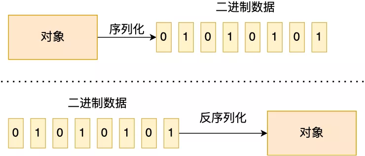
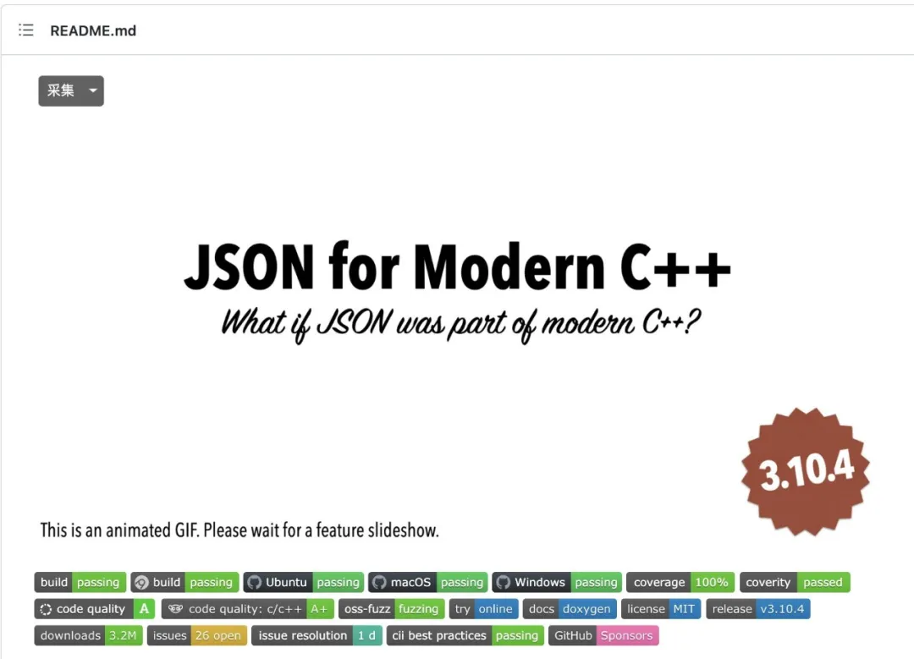
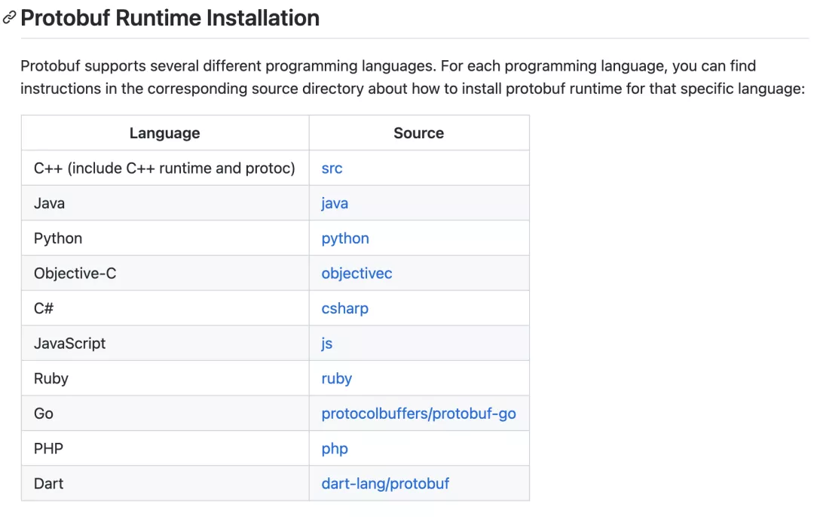

不管是 RPC 或者 HTTP，只要传输的内容是「对象」，要想在接收方还原出一摸一样的「对象」，那就需要序列化和反序列化。

> 那什么是序列化和反序列化呢？

RPC 能帮助我们的应用透明地完成远程调用，即调用其他服务器的函数就像调用本地方法一样。发起调用请求的那一方叫做调用方，被调用的一方叫做服务提供方。

调用方和服务提供方一般是不同的服务器，所以就需要通过网络来传输数据，并且 RPC 常用于业务系统之间的数据交互，需要保证其可靠性，所以 RPC 一般默认采用 TCP 协议来传输。同时， HTTP 协议也是建立在 TCP 之上的。

网络传输的数据必须是二进制数据，但调用方请求的出入参数都是对象，而对象是肯定没法直接在网络中传输的，需要提前把「对象转成二进制数据」进行网络传输，这个转换过程就做序列化。相反，服务提供方收到网络数据后，需要将「二进制数据转成对象」，这个转换过程就叫做反序列化。



总结来说，**序列化就是将对象转换成二进制数据的过程，以方便传输或存储。而反序列就是将二进制转换为对象的过程。**

> 为什么 RPC 经常提到序列化呢？

因为网络传输的数据必须是二进制数据，所以在 RPC 调用中，对入参对象与返回值对象进行序列化与反序列化是一个必须的过程。

> HTTP 什么时候需要序列化呢？

举个例子。

当客户端和服务端交互的数据是 JSON，这时候发送方需要将 JSON 对象转换成二进制数据发送到网络，接收方需要将接收到的二进制数据转换成 JSON 对象。

说了，这么多概念，接下来跟大家说说有哪些常用的序列化方式？


我这里说个 C++ 的 JSON 第三方库：JSON for Modern C++。



使用起来很方便，仅需要包含一个头文件“json.hpp”，没有外部依赖，也不需要额外的安装、编译、链接工作，适合快速上手开发。

因为 JSON 是 Key-Value 形式，所以 JSON for Modern C++ 的操作和标准容器 map 一样，用关联数组的“[]”来添加任意数据。

这里贴几个例子：

```
// 给 JSON for Modern C++ 的 json 类取个别名
using json_t = nlohmann::json;  
// JSON对象
json_t j;                                   

// "age":18
j["age"] = 18;
// "name":"xiaolin"
j["name"] = "xiaolin";    
// "gear":{"suits":"2099"}
j["gear"]["suits"] = "2099"; 
// "jobs":["superhero"]  
j["jobs"] = {"superhero"};                  

vector<int> v = {1,2,3};  
// "numbers":[1,2,3]
j["numbers"] = v;                          

map<string, int> m =                       
    {{"one", 1}, {"two", 2}};    
// "kv":{"one":1,"two":2}
j["kv"] = m;                               
```

添加完 JSON 数据后，就可以调用成员函数 dump() 进行初始化，得到 JSON 文本形式，也就是 JSON 字符串：

```
cout << j.dump() << endl;
```

反序列化也很简单，只要调用静态成员函数 parse() 就行，直接得到 JSON 对象：

```
// JSON文本，原始字符串
string jsonStr = R"({               
    "name": "xiaolin",
    "age" : 18
})";

// 从字符串反序列化
json_t j = json_t::parse(jsonStr);    

// 验证序列化是否正确
assert(j["age"] == 18);        
assert(j["name"] == "xiaolin");
```

对于通常的应用来说，掌握了基本的序列化和反序列化就够用了，如果想要了解 JSON for Modern C++ 其他特性，可以去看它的 Github。

JSON 进行序列化存在的问题，因为 JSON 进行序列化的额外空间开销比较大，对于大数据量服务这意味着需要巨大的内存和磁盘开销，所以如果在传输数据量比较小的场景，就可以采用 JSON 序列化的方式。

### ProtoBuffer

ProtoBuf 是由 Google 出品的，是一种轻便、高效的结构化数据存储格式，可以用于结构化数据序列化，支持 Java、Python、C++、Go 等语言。

Protobuf 使用的时候必须写一个 IDL（Interface description language）文件，在里面定义好数据结构，只有预先定义了的数据结构，才能被序列化和反序列化。

下面是一个简单的 IDl 文件格式：

```
syntax = "proto2";  // 使用第2版
package sample;   // 定义名字空间

message Person {            // 定义消息
  required string name = 1;  // required表示必须字段
  required int32 id = 2;
  optional string email = 3;  // optional字段可以没有
}
```

写完 IDL 文件后，然后使用不同语言的 IDL 编译器，生成序列化工具类。

Protobuf 在 Github 有文档介绍了不同语言是怎么使用编译器生成序列化工具类了，我在这里就不介绍了。



这里贴 C++ 和 Java 语言使用 Protobuf 相关接口进行序列化和反序列化的例子。

C++ 进行序列化和反序列化的例子：

```
// 类型别名
using person_t = sample::Person;        

// 声明一个Protobuf对象
person_t p;                             

// 设置每个字段的值 
p.set_id(1);                           
p.set_name("xiaolin");
p.set_email("xiaolincoding@163.com");

// 序列化到字符串 
string enc;
p.SerializeToString(&enc);

// 反序列化
person_t p2; 
p2.ParseFromString(enc);
```