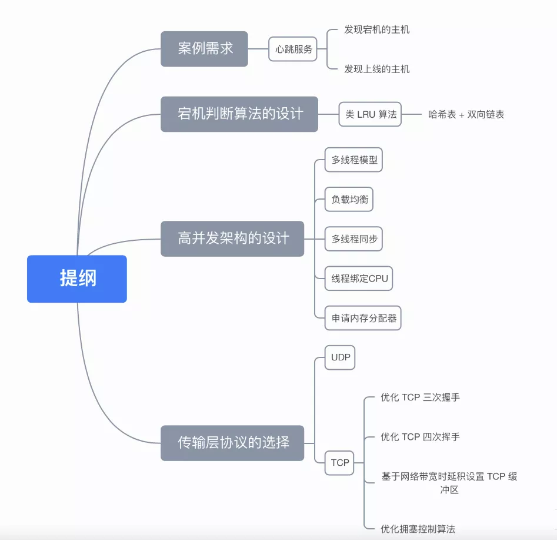
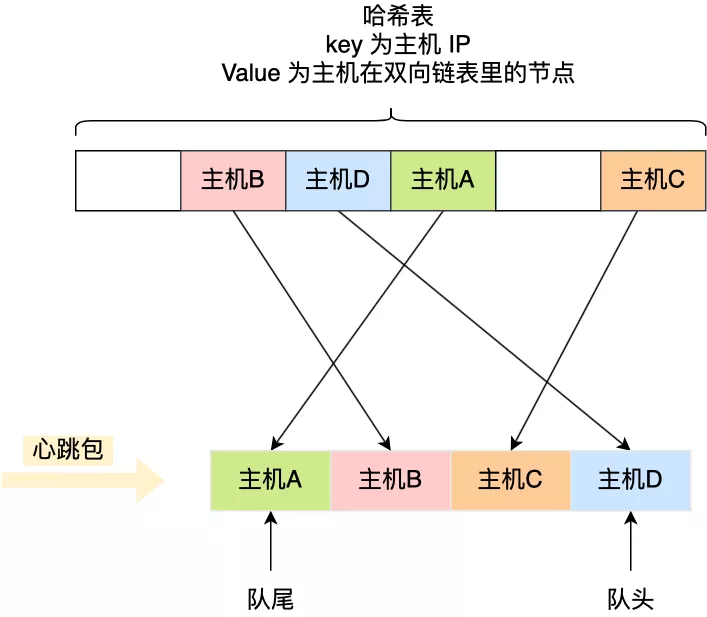
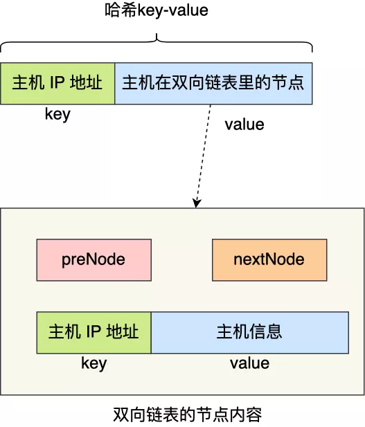
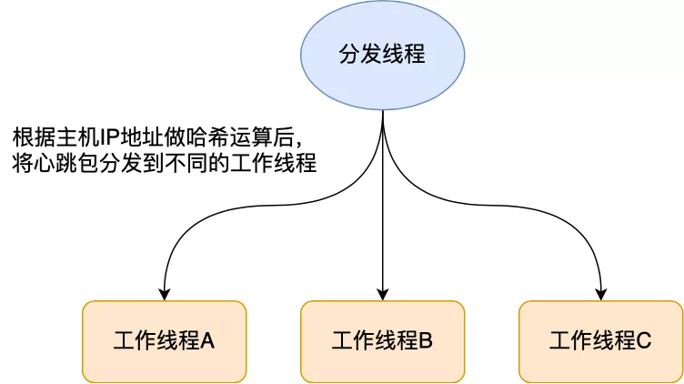
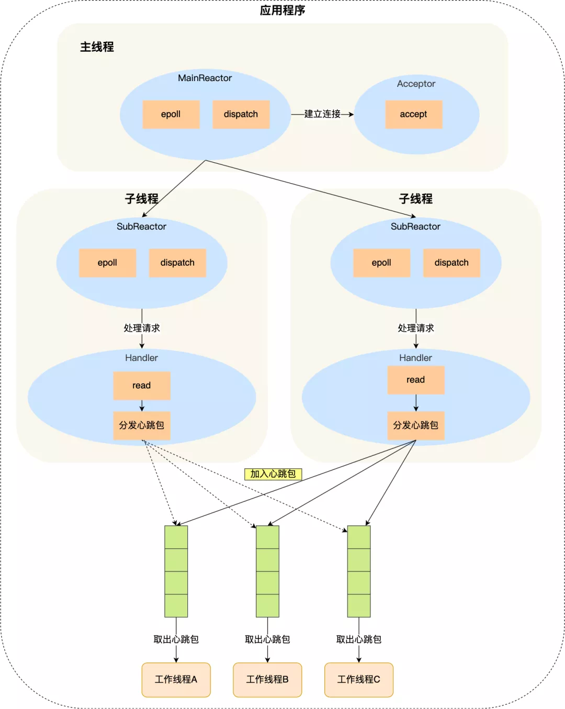
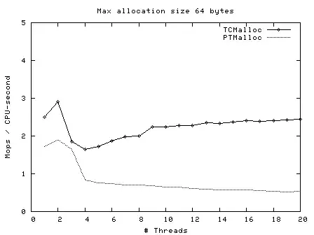
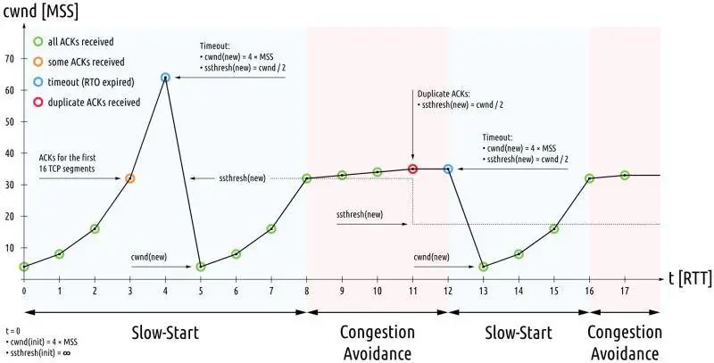
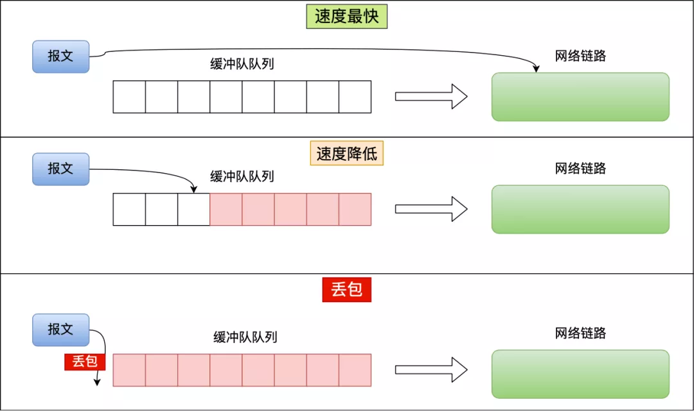

**我以如何设计一个「\*高性能的单机管理主机的心跳服务\*」的方式，让大家感受计算基础之美，这里会涉及到数据结构与算法 + 操作系统 + 计算机组成 + 计算机网络这些知识。**



大家耐心看下去，你会发现原来计算机基础知识的用处，相信我，你会感触很深刻。

------

### 案例需求

后台通常是由多台服务器对外提供服务的，也就是所谓的集群。


如果集群中的某一台主机宕机了，我们必须要感知到这台主机宕机了，这样才做容灾处理，比如该宕机的主机的业务迁移到另外一台主机等等。

那如何感知呢？那就需要**心跳服务**了。


要求每台主机都要向一台主机上报心跳包，这样我们就能在这台主机上看到每台主机的在线情况了。

心跳服务主要做两件事情：

- **发现宕机的主机**；
- **发现上线的主机**。

看上去感觉很简单，但是**当集群达到十万，甚至百万台的时候，要实现一个可以能管理这样规模的集群的心跳服务进程，没点底层知识是无法做到的。**

接下来，将从三个维度来设计这个心跳服务：

- 宕机判断算法的设计
- 高并发架构的设计
- 传输层协议的选择

### 宕机判断算法的设计

这个心跳服务最关键是判断宕机的算法。

如果采用暴力遍历所有主机的方式来找到超时的主机，在面对只有几百台主机的场景是没问题，但是这个算法会随着主机越多，算法复杂度也会上升，程序的性能也就会急剧下降。

所以，我们应该设计一个可以应对超大集群规模的宕机判断算法。

我们先来思考下，心跳包应该有什么数据结构来管理？

心跳包里的内容是有主机上报的时间信息的，也就是有时间关系的，那么可以**用「双向链表」构成先入先出的队列**，这样就保存了心跳包的时序关系。


**由于采用的数据结构是双向链表，所以队尾插入和队头删除操作的时间复杂度是 O(1)。**

如果有新的心跳包，则将其插入到双向链表的尾部，那么最老的心跳包就是在双向链表的头部，这样在寻找宕机的主机时，只要看双向链表头部最老的心跳包，距现在是否超过 5 秒，如果超过 5秒 则认为该主机宕机，然后将其从双向链表中删除。

细心的同学肯定发现了个问题，就是如果一个主机的心跳包已经在队列中，那么下次该主机的心跳包要怎么处理呢？

为了维持队列里的心跳包是主机最新上报的，所以要先找到该主机旧的心跳包，然后将其删除，再把新的心跳包插入到双向链表的队尾。

问题来了，在队列找到该主机旧的心跳包，**由于数据结构是双向链表，所以这个查询过程的时间复杂度时 O(N)**，也就是说随着队列里的元素越多，会越影响程序的性能，这一点我们必须优化。

**查询效率最好的数据结构就是「哈希表」了，时间复杂度只有 O(1)**，因此我们可以加入这个数据结构来优化。

哈希表的 Key 是主机的 IP 地址，Value 包含**主机在双向链表里的节点**，这样我们就可以通过哈希表轻松找到该主机在双向链表中的位置。



这样，每当收到心跳包时，先判断其在不在哈希表里。

- 如果不存在哈希表里，说明是新主机上线，**先将其插入到双向链表的尾部，然后将该主机的 IP 作为 Key，主机在双向链表的节点作为 Value 插入到哈希表**。
- 如果存在哈希表里，说明主机已经上线过，**先通过查询哈希表，找到该主机在双向链表里旧的心跳包的节点，然后就可以通过该节点将其从双向链表中删除，最后将新的心跳包插入到双向链表的队尾，同时更新哈希表**。

可以看到，上面这些操作全都是 O(1)，不管集群规模多大，时间复杂度都不会增加，但是代价就是内存占用会越多，这个就是以**空间换时间**的方式。

有个细节的问题，不知道大家发现了没有，就是为什么队列的数据结构采用双向链表，而不是单向链表？

因为双向链表比单向链表多了个 pre 的指针，可以通过其找到上一个节点，那么在删除中间节点的时候，就可以直接删除，而**如果是单向链表在删除中间的时候，我们得先通过遍历找到需被删除节点的上一个节点，才能完成删除操作，这里中间多了个遍历操作**。

既然引入哈希表，那我们在判断出有主机宕机了（检查双向链表队头的主机是否超时），**除了要将其从双向链表中删除，也要从哈希表中删除**。要将主机从哈希表删除，首先我们要知道主机的 IP，因为这是哈希表的 Key。

双向链表存储的内容必须包含主机的 IP 信息，那**为了更快查询到主机的 IP，双向链表存储的内容可以是一个键值对（Key-Value），其 Key 就是主机的 IP，Value 就是主机的信息。**



这样，在发现双向链表中头部的节点超时了，由于节点的内容是键值对，于是就能快速地从该节点获取主机的 IP ，知道了主机的 IP 信息，就能把哈希表中该主机信息删除。

至此，就设计出了一个高性能的宕机判断算法，主要用了数据结构：哈希表 + 双向链表，通过这个组合，查询 + 删除 + 插入操作的时间复杂度都是 O(1)，以空间换时间的思想，这就是**数据结构与算法之美**！

熟悉算法的同学应该感受出来了，上面这个算法就是**类 LRU 算法**，用于**淘汰最近最久使用的元素**的场景，该算法应用范围很广的，操作系统、Redis、MySQL 都有使用该算法。

在很多大厂面试的时候，经常会考察 LRU 算法，甚至会要求手写出来，后面我在写一篇 LRU 算法实现的文章。

### 高并发架构的设计

设计完高效的宕机判断算法后，我们来设计个能充分利用服务器资源的架构，以应对高并发的场景。

首先第一个问题，选用单线程还是多线程模式？

选用单线程的话，意味着程序只能利用一个 CPU 的算力，如果 CPU 是一颗 1GHZ 主频的 CPU，意味着一秒钟只有 10 亿个时钟周期可以工作，如果要让心跳服务程序每秒接收到 100 万心跳包，那么就要求它必须在 1000 个时时钟周期内处理完一个心跳包。

这是无法做到的，因为一个汇编指令的执行需要多个时钟周期，更何况高级语言的一条语句是由多个汇编指令构成的，而且这个 1000 个时钟周期还要包含内核从网卡上读取报文，以及协议栈的报文分析。

因此，采用单线程模式会出现算力不足的情况，意味着在百万级的心跳场景下，容易出现内核缓冲区的数据无法被即使取出而导致溢出的现象，然后就会出现大量的丢包。

所以，我们要选择多进程或者多线程的模式，来充分利用多核的 CPU 资源。多进程的优势是进程间互不干扰，但是内存不共享，进程间通信比较麻烦，**因此采用多线程模式开发会更好一些，多线程间可以共享数据。**

多线程体现在「分发线程是多线程和工作线程是多线程」，决定了多线程开发模式后，我们还需要解决五个问题。

###### 第一个多路复用

我们应该使用多路复用技术来服务多个客户端，而且是要**使用 epoll**。

因为 select 和 poll 的缺陷在于，当客户端越多，也就是 Socket 集合越大，Socket 集合的遍历和拷贝会带来很大的开销；

而 epoll 的方式即使监听的 Socket 数量越多的时候，效率不会大幅度降低，能够同时监听的 Socket 的数目也非常的多了。

多路复用更详细的介绍，可以看之前这篇文章：[这次答应我，一举拿下 I/O 多路复用！](https://mp.weixin.qq.com/s?__biz=MzUxODAzNDg4NQ==&mid=2247489558&idx=1&sn=7a96604032d28b8843ca89cb8c129154&scene=21#wechat_redirect)

###### 第二个负载均衡

在收到心跳包后，我们应该要将心跳包均匀分发到不同的工作线程上处理。

分发的规则可以用哈希函数，这样在接收到心跳包后，解析出主机的 IP 地址，然后通过哈希函数分发给工作线程处理。



于是**每个工作线程只会处理特定主机的心跳包，多个工作线程间互不干扰，不用在多个工作线程间加锁，从而实现了无锁编程**。

###### 第三个多线程同步

分发线程和工作线程之间可以加个消息队列，形成「生产者 - 消费者」模型。

分发线程负责将接收到的心跳包加入到队列里，工作线程负责从队列取出心跳包做进一步的处理。

除此之外，还需要做如下两点。

第一点，工作线程一般是多于分发线程，**给每一个工作线程都创建独立的缓冲队列**。

第二点，缓冲队列是会被分发线程和工作线程同时操作，所以在操作该队列要加锁，为了避免线程获取锁失而主动放弃 CPU，可以**选择自旋锁，因为自旋锁在获取锁失败后，CPU 还在执行该线程，只不过 CPU 在空转，效率比互斥锁高**。



更多关于锁的讲解可以看这篇：「[互斥锁、自旋锁、读写锁、悲观锁、乐观锁的应用场景](https://mp.weixin.qq.com/s?__biz=MzUxODAzNDg4NQ==&mid=2247485583&idx=1&sn=412546e55f9f5cf394bdda633fcc2b1c&scene=21#wechat_redirect)」

###### 第四个线程绑定 CPU

现代 CPU 都是多核心的，线程可能在不同 CPU 核心来回切换执行，这对 CPU Cache 不是有利的，虽然 L3 Cache 是多核心之间共享的，但是 L1 和 L2 Cache 都是每个核心独有的。

**如果一个线程在不同核心来回切换，各个核心的缓存命中率就会受到影响**，相反如果线程都在同一个核心上执行，那么其数据的 L1 和 L2 Cache 的缓存命中率可以得到有效提高，缓存命中率高就意味着 CPU 可以减少访问 内存的频率。

当有多个同时执行「计算密集型」的线程，为了防止因为切换到不同的核心，而导致缓存命中率下降的问题，我们可以把**线程绑定在某一个 CPU 核心上**，这样性能可以得到非常可观的提升。

在 Linux 上提供了 `sched_setaffinity` 方法，来实现将线程绑定到某个 CPU 核心这一功能。


更多关于 CPU Cache 的介绍，可以看这篇：「[如何写出让 CPU 跑得更快的代码？](https://mp.weixin.qq.com/s?__biz=MzUxODAzNDg4NQ==&mid=2247486022&idx=1&sn=8bb5a066d81f77523a06cd09251055da&scene=21#wechat_redirect)」

###### 第五个内存分配器

Linux 默认的内存分配器是 PtMalloc2，它有一个缺点在申请小内存和多线程的情况下，申请内存的效率并不高。

后来，Google 开发的 TCMalloc 内存分配器就解决这个问题，**它在多线程下分配小内存的速度要快很多**，所以对于心跳服务应当改用 TCMalloc 申请内存。

下图是 TCMalloc 作者给出的性能测试数据，可以看到线程数越多，二者的速度差距越大，**显然 TCMalloc 更具有优势。**



我暂时就想到这么多了，**这里每一个点都跟「计算机组成和操作系统」知识密切相关**。

### 传输层协议的选择

心跳包的传输层协议应该是选 TCP 和 UDP 呢？

对于传输层协议的选择，我们要看**心跳包的长度大小**。

如果长度小于 MTU，那么可以选择 UDP 协议，因为 UDP 协议没那么复杂，而且心跳包也不是一定要完全可靠传输，如果中途发生丢包，下一次心跳包能收到就行。

如果长度大于 MTU，就要选择 TCP 了，因为 UDP 在传送大于 1500 字节的报文，IP 协议就会把报文拆包后再发到网络中，并在接收方组装回原来的报文，然而，IP 协议并不擅长做这件事，拆包组包的效率很低。

所以，**TCP 协议就选择自己做拆包组包的事情，当心跳包的长度大于 MSS 时就会在 TCP 层拆包，且保证 TCP 层拆包的报文长度不会 MTU**。

MTU 与 MSS

选择了 TCP 协议后，我们还要解决一些事情，因为 TCP 协议是复杂的。

首先，要让服务器能支持更多的 TCP 连接，TCP 连接是通过**四元组**唯一确认的，也就是**「 源 IP、目的 IP、源端口、目的端口 」**。

那么当服务器 IP 地址（目的 IP）和监听端口（目标端口）固定时，变化的只有源 IP（2^32） 和源端口（2^16），因此理论上服务器最大能连接 `2^(32+16)` 个客户端。

这只是理论值，实际上服务器的资源肯定达不到那么多连接。Linux 系统一切皆文件，所以 TCP 连接也是文件，那么服务器要增大下面这两个地方的最大文件句柄数：

- 通过 `ulimit` 命令增大单进程允许最大文件句柄数；
- 通过 `/proc/sys/fs/file-nr` 增大系统允许最大文件句柄数。

另外， TCP 协议的默认内核参数并不适应高并发的场景，所以我们还得在下面这四个方向通过调整内核参数来优化 TCP 协议：

- 三次握手过程需要优化；
- 四次挥手过程需要优化：
- TCP 缓冲区要根据网络带宽时延积设置；
- 需要优化；

前三个的优化的思路，我在之前的文章写过，详见：「[面试官：换人！他连 TCP 这几个参数都不懂](https://mp.weixin.qq.com/s?__biz=MzUxODAzNDg4NQ==&mid=2247484774&idx=1&sn=fa9e67e60c5f9d2e9d2aa6ea8ab2a441&scene=21#wechat_redirect)」

这里简单说一下优化拥塞控制算法的思路。

传统的拥塞控制分为四个部分：慢启动、拥塞避免、快速重传、快速恢复，如下图：

TCP 拥塞控制

当 TCP 连接建立成功后，拥塞控制算法就会发生作用，首先进入慢启动阶段。决定连接此时网速的是初始拥塞窗口，默认值是 `10 MSS`。

在带宽时延积较大的网络中，应当调高初始拥塞窗口，比如 `20 MSS` 或 `30 MSS`，Linux 上可以通过 `route ip change` 命令修改它。

**传统的拥塞控制算法是基于丢包作为判断拥塞的依据**。不过实际上，网络刚出现拥塞时并不会丢包，而真的出现丢包时，拥塞已经非常严重了，比如像理由器里都有缓冲队列应对突发流量：



上图中三种情况：

- 当缓冲队列为空时，传输速度最快；
- 当缓冲队列开始有报文挤压，那么网速就开始变慢了，也就是网络延时变高了；
- 当缓冲队列溢出时，就出现了丢包现象。

传统的拥塞控制算法就是在第三步这个时间点进入拥塞避免阶段，显然已经很晚了。

其实进行拥塞控制的最佳时间点，是缓冲队列刚出现积压的时刻，也就是第二步。

Google 推出的 **BBR 算法是以测量带宽、时延来确定拥塞的拥塞控制算法**，能提高网络环境的质量，减少网络延迟和降低丢包率。

Linux 4.9 版本之后都支持 BBR 算法，开启 BBR 算法的方式：

```
net.ipv4.tcp_congestion_control=bbr
```

这里的每一个知识都涉及到了计算机网络，这就是**计算机网络之美**！

### 总结

掌握好数据结构与算法，才能设计出高效的宕机判断算法，本文我们采用哈希表 + 双向链表实现了类 LRU 算法。

掌握好计算组成 + 操作系统，才能设计出高性能的架构，本文我们采用多线程模式来充分利用 CPU 资源，还需要考虑 IO 多路服用的选择，锁的选择，消息队列的引入，内存分配器的选择等等。

掌握好计算机网络，才能选择契合场景的传输协议，如果心跳包长度大于 MTU，那么选择 TCP 更有利，但是 TCP 是个复杂的协议，在高并发的场景下，需要对 TCP的每一个阶段需要优化。如果如果心跳包长度小于 MTU，且不要求可靠传输时，UDP 协议是更好的选择。

怎么样？

是不是感动到了计算机基础之美。