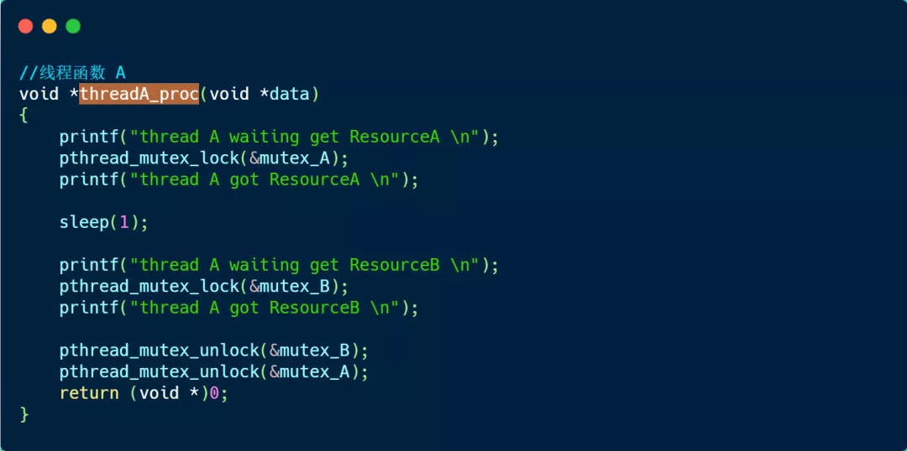
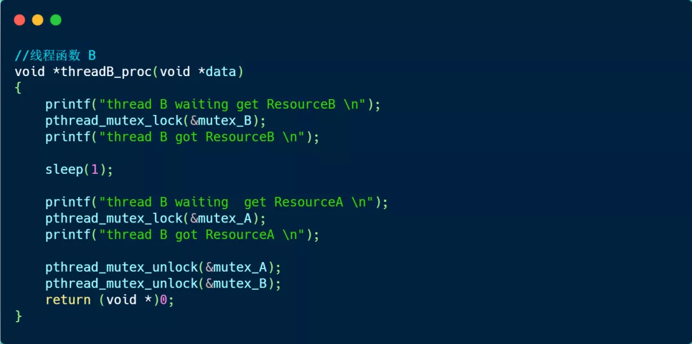
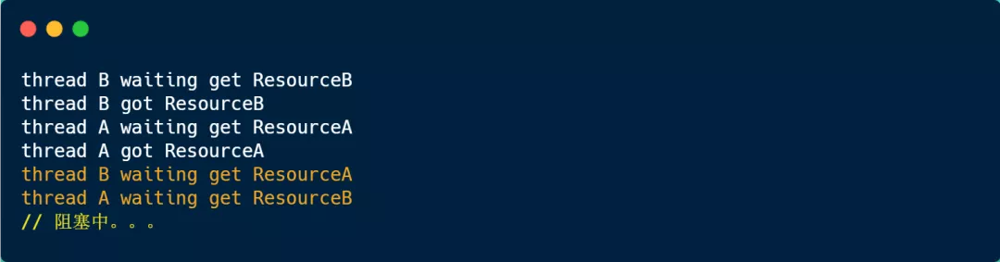

### 模拟死锁问题的产生

Talk is cheap. Show me the code.

下面，我们用代码来模拟死锁问题的产生。

首先，我们先创建 2 个线程，分别为线程 A 和 线程 B，然后有两个互斥锁，分别是 mutex_A 和 mutex_B，代码如下：

接下来，我们看下线程 A 函数做了什么。

可以看到，线程 A 函数的过程：

- 先获取互斥锁 A，然后睡眠 1 秒；
- 再获取互斥锁 B，然后释放互斥锁 B；
- 最后释放互斥锁 A；

然后，我们看看线程 B。

可以看到，线程 B 函数的过程：

- 先获取互斥锁 B，然后睡眠 1 秒；
- 再获取互斥锁 A，然后释放互斥锁 A；
- 最后释放互斥锁 B；

然后，我们运行这个程序，运行结果如下：

可以看到线程 B 在等待互斥锁 A 的释放，线程 A 在等待互斥锁 B 的释放，双方都在等待对方资源的释放，很明显，产生了死锁问题。