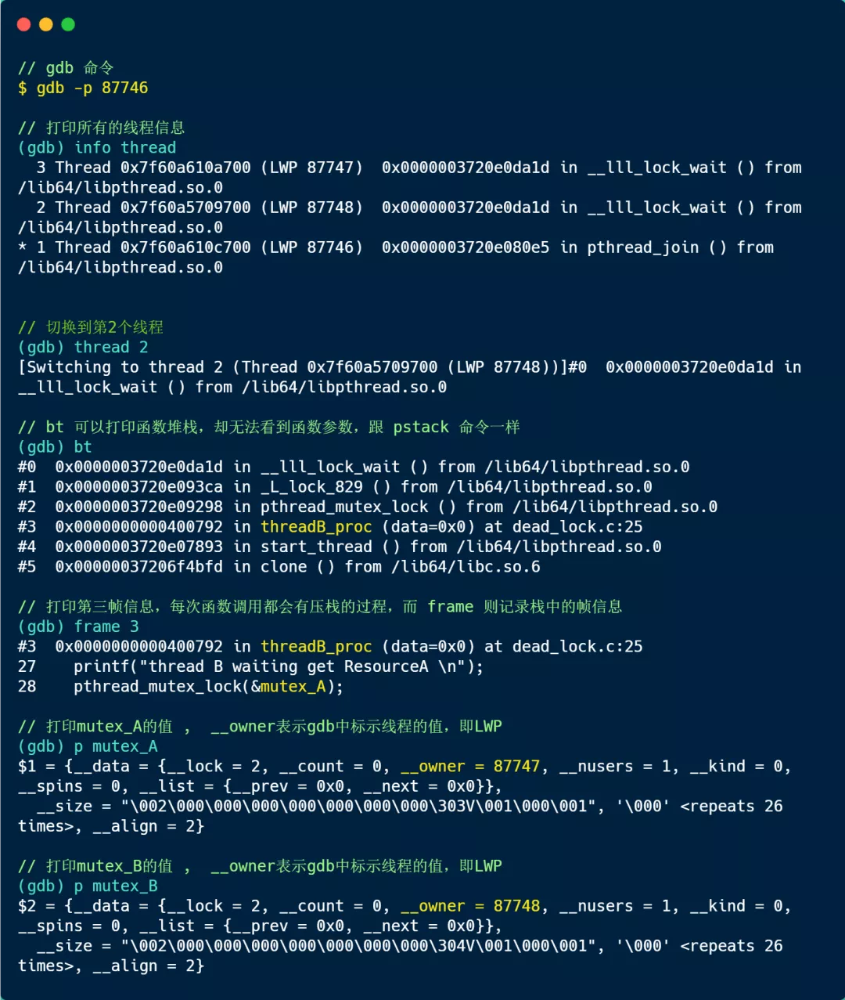

### 利用工具排查死锁问题

如果你想排查你的 Java 程序是否死锁，则可以使用 `jstack` 工具，它是 jdk 自带的线程堆栈分析工具。

由于小林的死锁代码例子是 C 写的，在 Linux 下，我们可以使用 `pstack` + `gdb` 工具来定位死锁问题。

pstack 命令可以显示每个线程的栈跟踪信息（函数调用过程），它的使用方式也很简单，只需要 `pstack <pid>` 就可以了。

那么，在定位死锁问题时，我们可以多次执行 pstack 命令查看线程的函数调用过程，多次对比结果，确认哪几个线程一直没有变化，且是因为在等待锁，那么大概率是由于死锁问题导致的。

我用 pstack 输出了我前面模拟死锁问题的进程的所有线程的情况，我多次执行命令后，其结果都一样，如下：

可以看到，Thread 2 和 Thread 3 一直阻塞获取锁（*pthread_mutex_lock*）的过程，而且 pstack 多次输出信息都没有变化，那么可能大概率发生了死锁。

但是，还不能够确认这两个线程是在互相等待对方的锁的释放，因为我们看不到它们是等在哪个锁对象，于是我们可以使用 gdb 工具进一步确认。

整个 gdb 调试过程，如下：

我来解释下，上面的调试过程：

1. 通过 `info thread` 打印了所有的线程信息，可以看到有 3 个线程，一个是主线程（LWP 87746），另外两个都是我们自己创建的线程（LWP 87747 和 87748）；
2. 通过 `thread 2`，将切换到第 2 个线程（LWP 87748）；
3. 通过 `bt`，打印线程的调用栈信息，可以看到有 threadB_proc 函数，说明这个是线程 B 函数，也就说 LWP 87748 是线程 B;
4. 通过 `frame 3`，打印调用栈中的第三个帧的信息，可以看到线程 B 函数，在获取互斥锁 A 的时候阻塞了；
5. 通过 `p mutex_A`，打印互斥锁 A 对象信息，可以看到它被 LWP 为 87747（线程 A） 的线程持有着；
6. 通过 `p mutex_B`，打印互斥锁 A 对象信息，可以看到他被 LWP 为 87748 （线程 B） 的线程持有着；

因为线程 B 在等待线程 A 所持有的 mutex_A, 而同时线程 A 又在等待线程 B 所拥有的mutex_B, 所以可以断定该程序发生了死锁。