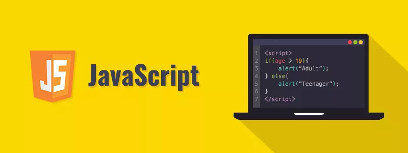
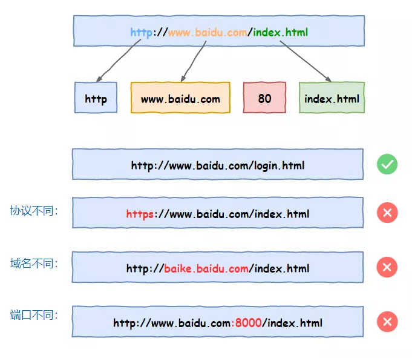
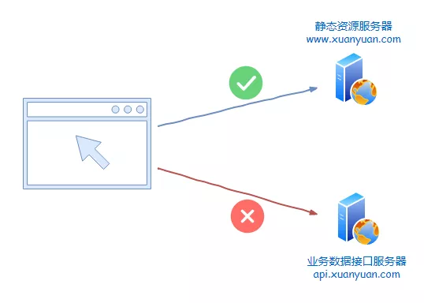
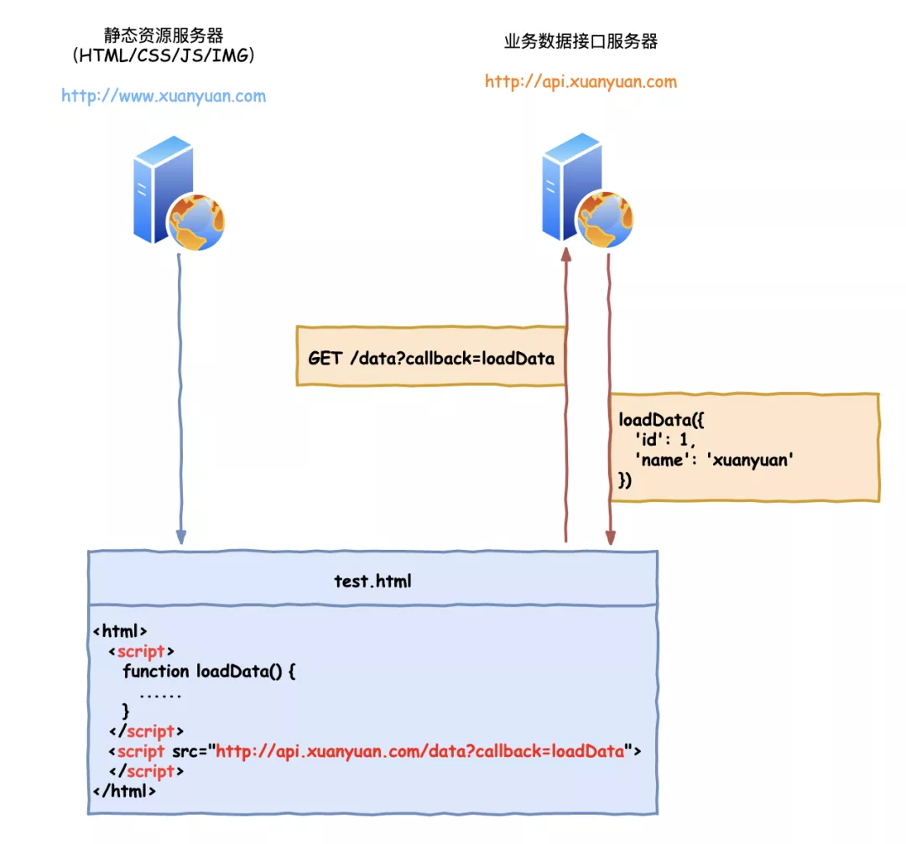
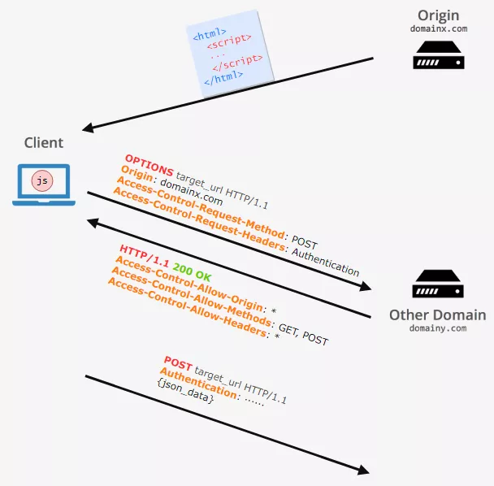

## **浏览器基本原理**

我叫小风，是Windows帝国一个普通的上班族。

今天，我入职了一家浏览器公司，公司的主营业务是为人类提供Internet上网服务，我的岗位是负责执行**JavaScript**代码。

上午的晨会上，认识了负责网络连接的老白，所有网络请求都得找他帮忙，还有负责存储管理的小黑，什么`Cookie`，`LocalStorage`，`SessionStorage`之类的都归他管。哦，差点忘了，还有一个妹子小雪，她负责网页渲染。

随后主管安排了我的工作：老白从网络取回网页之后交给小雪来解析渲染，遇到网页中的JavaScript代码的时候，就由我来处理执行这些代码。

听完主管的安排，我心里美滋滋，因为工作上需要密切配合，主管把我和小雪妹子的工位安排在了一起，想想都开心^_^||

坐下不久，我主动和小雪聊了起来。

“小雪，你平时工作都做些什么啊？”

小雪转过身来，“我呀，就负责把老白给我的HTML文件进行解析，构建DOM树，然后再拿到CSS文件，构建CSSOM树，最后把网页给画出来”

我似懂非懂的点了点头，正想继续找话题，这时，老白过来了。

“小雪，来活了，这是刚刚拿到的网页文件，快处理一下”

小雪转过身去开始忙碌了起来，不一会儿，她就停下来说到：“小风哥，有 **<script>** 标签了，该你上了”

看来该是我露一手的机会了，我拿到 **<script>** 中的代码，开始忙活起来，很快就完成了，继续交给小雪完成下面的工作。

就这样你来我往了几个回合，我有些嫌麻烦：“小雪，要不你先一次处理完，我最后再来统一执行所有的 **<script>** 标签中的代码，这样不是省事一点嘛”

“那可不行，你在执行JavaScript的时候有可能会去修改我构建的DOM树的内容，咱俩必须按顺序来，不然会出乱子的”，小雪一本正经的说到。

没办法，只好听她的。

就这样，我们一直配合的有条不紊，还时不时去找老白发送下数据，找小黑索要Cookie，很快就和大家混熟了。就这样过了几天，没想到平静的工作起了波澜······

## **跨域禁止**

这天我拿到了一段代码，需要去请求一段数据，老规矩，我准备好了请求参数找到老白，准备让他给我发出去。

没想到老白一看大惊：“这是一个**跨域请求**啊，不能发出去！”

我愣了一下，“跨域请求？什么鬼”

老白指着我给的请求参数说到：“你看你给的这个请求URL，和你现在处理的这个网页URL，不是一家人啊，域名不一样”

“你管人家是不是一家人，发出去不就得了，快点，我还等着要呢”

“不行，知道你这个岗位之前那位怎么走的不？就是因为他在一个山寨网银网站里面执行JavaScript的时候向真正的银行网站发起了转账请求，把人家的钱给搞丢了。就因为这个被老板开了，我要不是平日里跟老板走得近，说不定也要连坐。”

听了老白的话，我吓得不轻，差点饭碗就不保了，不过我心里还是有一些疑问。

“老白，为什么真正的银行网站会信任这个山寨网站的请求呢？”

“因为这人之前刚好也打开了真实的银行网站，还设置了Cookie让小黑保存着。这后面山寨网站的请求发出去时，Cookie也一并带上了，网站那端还以为是正常的请求呢，这不就遭了吗。这种攻击方式被叫做`CSRF，跨站请求伪造`”，老白说到。

“那后来呢？后来怎么样了？”，我继续问到。

“后来，后来就把那小子炒掉了啊，这不才给你腾了个坑吗！不过公司为了防止以后此类事情再次发生，就制定了一个禁止跨域请求的规定！”

老白一边说，一边给我讲了起来什么是禁止跨域请求。

我这才知道，原来请求的目标URL和所在网页的URL的协议、域名、端口有一个不同，就算是跨域了。

今天幸好有老白，要不然我好不容易得来的工作就要丢了。告别了老白，回到工位，我抛了一个禁止跨域请求的错误就没管了。

------

不过，没过多久，公司就收到了很多投诉，说我们打开的网页排版格式全部错乱了，有时候甚至连图片都加载不出来。

最后追责到了小雪妹子这里，小雪很委屈的说到：“这不能怪我啊，他们好多网页都引用了外部的css和js文件，尤其那个叫`jQuery`的最多。但是每次找到老白要这些文件，老白都以公司的禁止跨域请求的规定拒绝给我，我也没有办法啊”

没办法，公司只好对跨域请求的规定作了一轮修订，规定了以后通过HTML标签引入外部文件的时候予以放行，具体来说有：

- ：引入外部图片
- **<link>**：引入外部css
- <script>：引入外部javascript
- ......

规则修订后，投诉总算变少了，渲染的网页也逐渐恢复了正常。

## **跨域：JSONP**

然而太平日子没过多久，投诉又多了起来。我一打听才知道，原来现在开始流行什么前后端分离技术，数据和展示解耦，数据不再直接放在网页文件里，而是需要单独通过JavaScript去从服务器拿回来动态展示。

问题出在这些网站的前端网页和业务数据接口服务器常常不在一起，分属不同的域名或者使用不同的端口，违反了我们的跨域禁令，导致数据请求不到，页面经常一片空白，没有数据。

领导为这事儿左右为难，既想尽快处理这些投诉，又不想放弃安全原则放开这些跨域的请求。

就在这时，经验老道的老白献了一策：“**既然规则中允许从外部JS文件，我们何不就利用它来实现外部接口的请求呢？**”

我们几个都满脸问号，不解其意。老白接着说到：“我画个图你们就明白了”

我看着老白画的图，才明白他说的什么意思，“老白，好计策啊，**利用规则中对<script>标签请求的放行将请求发出去，然后让服务器返回经过callback函数包装的JS代码，最后实现数据的加载！**”

“小风你很聪明哦”，老白得意的点点头。

“不过人家服务器凭什么返回你需要的格式？”，小雪问到。

老白挠了挠头，“额，这个嘛，就需要服务器那边配合咱们一下啦”

“你这个好像只能支持GET请求吧，遇到`POST`、`PUT`、`DELETE`这些请求咋办呢？”，我也提了一个问题。

老白的脸一下就变色了，“这个，这个，好像是有这个问题，不过先凑合用着嘛，他们天天投诉你们不嫌烦嘛”

经过讨论，我们还是打算把这套方案先推出去，因为需要这些网站后台的配合，他们大部分都不太情愿，不过迫于没有其他方案，在我们的游说之下还是勉强同意了。

为了方便推广，我们还给这门技术取了一个名字：`JSONP`，就是`JSON with Padding`的意思。

## **跨域：CORS**

渐渐地，投诉变少了，不过奇怪的是，公司的上网业务也变少了。一打听才知道，人类都不用我们了，用上了隔壁的Chrome浏览器。

负责打探消息的老白回来了，“不好了，咱们的JSONP技术大家都不用了，转投隔壁Chrome浏览器的`CORS`技术了”

领导一听急了，“这是啥技术，能比我们的JSONP还好？”

老白激动的说到，“是啊，领导，这CORS全称叫`跨域资源共享(Cross-origin resource sharing)`，不像咱们那样投机取巧实现，走得是正规路子，而且还解决了只支持GET请求的问题，什么请求都能发”

“你快说说，他们到底怎么搞的？”

老白来到画板前，开始画起图来，一边画一边给大家讲解：“他们在正式的跨域请求之前，先发送了一个`OPTIONS`请求去询问服务器是否允许接下来的跨域请求”

“OPTIONS？你要不说我都忘记HTTP协议里还有这么一种请求了”，我笑着说道。

“这怎么个询问法呢？”，领导邹着眉头问。

老白继续说到，“他们和那些网站服务器商定了一下，在OPTIONS请求里新增了几个字段：”

- `Origin`：发起请求原来的域
- `Access-Control-Request-Method`：将要发起的跨域请求方式（GET/PUT/POST/DELETE/······）
- `Access-Control-Request-Headers`：将要发起的跨域请求中包含的请求头字段

“服务器在响应字段中来表明是否允许这个跨域请求，浏览器收到后检查如果不符合要求，就拒绝后面的请求”

- `Access-Control-Allow-Origin`：允许哪些域来访问（*表示允许所有域的请求）
- `Access-Control-Allow-Methods`：允许哪些请求方式
- `Access-Control-Allow-Headers`：允许哪些请求头字段
- `Access-Control-Allow-Credentials`：是否允许携带Cookie

老白说完，图也画完了：

“每次都要发起询问，好费事哦”，小雪看着图说到。

老白摇头说到：“唉，小雪说到点上了，为了避免每次都要询问，他们还做了两个重要的优化呢”

见我们都伸直了脖子等待答案，老白缓了缓才继续说到：“第一，如果是一个简单请求，那就直接发起请求，只需在请求中加入**Origin**字段表明自己来源，在响应中检查Access-Control-Allow-Origin，如果不符合要求就报错，不需要再单独询问了”

“那什么是简单请求呢？”，我问到。

“简单请求就是请求方式属于HEAD、GET、POST三者之一，请求头只有下面这些，不符合要求的就是非简单请求，就得询问了”

- Accept
- Accept-Language
- Content-Language
- Last-Event-ID
- Content-Type：(application/x-www-form-urlencoded、multipart/form-data、text/plain)

“那第二个优化又是什么呢？”

“前面的服务器响应字段中我少说了一个，还有一个**Access-Control-Max-Age**，它表明了这个询问结果的有效期，后面浏览器在有效期内也可以不必再次询问”

听完老白的讲解，大家都纷纷点赞，这比我们的JSONP方式不知道高到哪里去了。

领导当即决定咱们也要支持这种跨域方式，尽快减少公司的损失。

我们几个赶紧行动，加了几天班总算把这套方案给实现了。功夫不负有心人，咱们的业务又慢慢有了起色。

**未完待续······**

## **彩蛋**

> 早上，我刚到公司，小雪妹子就转过头告诉我：“风哥，主管让你去趟他的办公室，他好像不太高兴，你当心点”
>
> “你知道是什么事情吗？”
>
> “我也不太清楚，只听说你执行了什么错误的JavaScript代码”
>
> 我心里一紧，感觉大事不妙
>
> *预知后事如何，请关注后续精彩······*